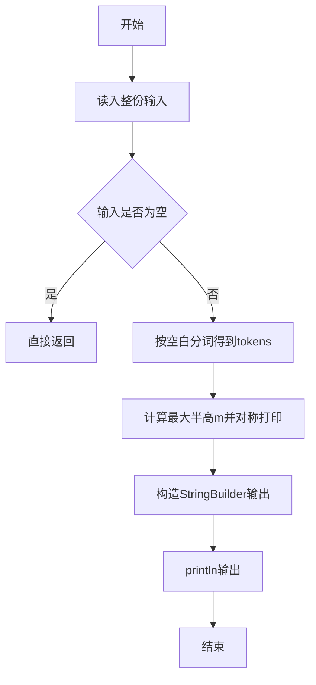
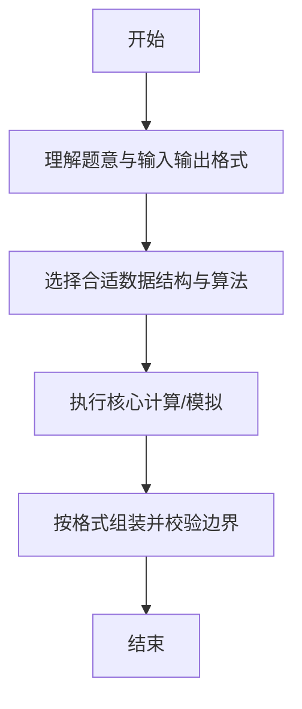

# L1-002 - 打印沙漏（20 分）

- **时间限制**: 400 ms
- **内存限制**: 65536 KB
- **代码长度限制**: 16 KB

---

## 题目描述


本题要求你写个程序把给定的符号打印成沙漏的形状。例如给定17个“*”，要求按下列格式打印
```
*****
 ***
  *
 ***
*****
```

所谓“沙漏形状”，是指每行输出奇数个符号；各行符号中心对齐；相邻两行符号数差2；符号数先从大到小顺序递减到1，再从小到大顺序递增；首尾符号数相等。

给定任意N个符号，不一定能正好组成一个沙漏。要求打印出的沙漏能用掉尽可能多的符号。

### 输入格式:

输入在一行给出1个正整数N（$$\le$$1000）和一个符号，中间以空格分隔。

### 输出格式:

首先打印出由给定符号组成的最大的沙漏形状，最后在一行中输出剩下没用掉的符号数。

### 输入样例:
```in
19 *
```

### 输出样例:
```out
*****
 ***
  *
 ***
*****
2
```

## 示例

### 示例 1

**输入:**
```
19 *
```

**输出:**
```
*****
 ***
  *
 ***
*****
2
```

--

### 解题思路

#### 题目分析
题目“L1-002 - 打印沙漏（20 分）”的任务是：本题要求你写个程序把给定的符号打印成沙漏的形状。例如给定17个“ ”，要求按下列格式打印        所谓“沙漏形状”，是指每行输出奇数个符号；各行符号中心对齐；相邻两行符号数差2；符号数先从大到小顺序递减到1，再从小到大顺序递增；首尾符。输入需考虑空行、首尾空白以及多空格分隔的容错；输出要求严格按样例格式，数字、空格与换行均不可偏差。边界上要处理 空输入直接返回、非法字符过滤 等情况，仓颉实现中通过 `readToEnd` / `readln` 配合 `trimAscii` 与 `isEmpty` 提前返回来规避空指针。

#### 核心算法
利用公式 total=2*m*m-1 求最大半高 m，上下对称打印沙漏。使用 `StringBuilder` 缓冲拼接以减少重复分配。实现上先将整份输入按空白分词为 `tokens`/`lines`，用 `Int64.parse` 解析数值，随后按题意执行核心循环与条件分支。该思路与 L1-002 的仓颉源码逻辑一一对应，体现了从暴力到必要的剪枝。

#### 复杂度分析
- **时间复杂度**：O(m²)
- **空间复杂度**：O(m²)

### 代码流程说明

1. 通过 `getStdIn().readToEnd()`/`readln` 读入全部输入，`trimAscii` 判空，若为空则直接 `return`。
2. 按空白符（空格、换行、制表）遍历 `toRuneArray()` 切分得到 `tokens`/`lines`，并过滤空串。
3. 用 `Int64.parse` 解析首个或多个数值（视题目而定），初始化计数器、集合或累加变量。
4. 执行核心逻辑——计算最大半高m并对称打印：对应源码中的主循环/条件（如 `while`/`for`、`if` 分支、集合查表或公式计算）。
5. 将结果按题面要求的格式组装到 `StringBuilder`，处理对齐、分隔符与多行换行。
6. 调用 `println` 一次性输出最终字符串并结束 `main`。

### 代码实现

仓颉代码实现如下：

```cangjie
// L1-002 打印沙漏
// approach: total=2*m*m-1 <=N, hourglass rows=2*m-1
import std.env.*
import std.collection.*
import std.convert.*
import std.math.*

main() {
    let cin = getStdIn()
    let all = cin.readToEnd() ?? ""
    let trimmed = all.trimAscii()
    if (trimmed.isEmpty()) { return }
    var tokens = ArrayList<String>()
    var cur = StringBuilder()
    for (r in all.toRuneArray()) {
        let rs = r.toString()
        if (rs == " " || rs == "\n" || rs == "\r" || rs == "\t") {
            if (cur.size > 0) {
                tokens.add(cur.toString())
                cur = StringBuilder()
            }
        } else {
            cur.append(rs)
        }
    }
    if (cur.size > 0) { tokens.add(cur.toString()) }
    if (tokens.size < 2) { return }
    let n = Int64.parse(tokens[0])
    let sym = tokens[1]
    var m: Int64 = 0
    var k: Int64 = 1
    while (2*k*k - 1 <= n) {
        m = k
        k += 1
    }
    if (m == 0) {
        println(n)
        return
    }
    let used = 2*m*m - 1
    let remain = n - used
    let sb = StringBuilder()
    for (i in 0..m) {
        let stars = 2*(m - i) - 1
        if (stars < 1) { continue }
        let spaces = i
        for (_ in 0..spaces) { sb.append(" ") }
        for (_ in 0..stars) { sb.append(sym) }
        sb.append("\n")
    }
    for (i in 2..=m) {
        let stars = 2*i - 1
        let spaces = m - i
        for (_ in 0..spaces) { sb.append(" ") }
        for (_ in 0..stars) { sb.append(sym) }
        sb.append("\n")
    }
    sb.append("${remain}")
    println(sb.toString())
}
```

### 代码流程图



### 解题流程图



