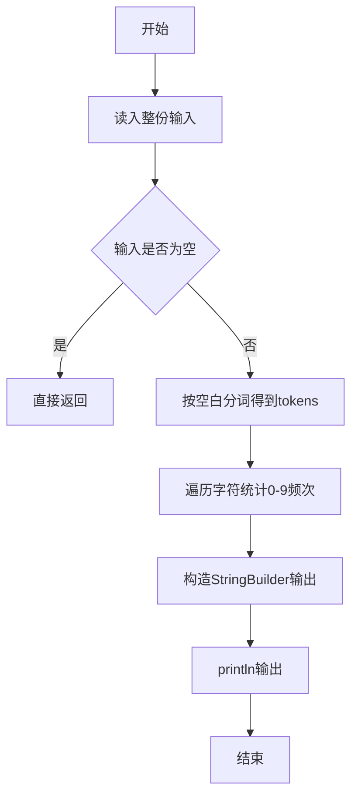
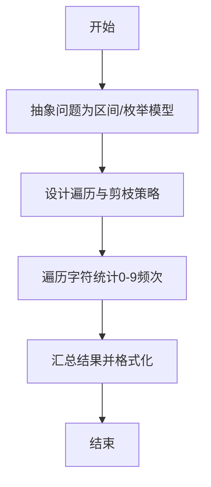

# L1-003 - 个位数统计（15 分）

- **时间限制**: 400 ms
- **内存限制**: 65536 KB
- **代码长度限制**: 16 KB

---

## 题目描述


给定一个 $$k$$ 位整数 $$N = d_{k-1}10^{k-1} + \cdots + d_1 10^1 + d_0$$ ($$0\le d_i \le 9$$, $$i=0,\cdots ,k-1$$, $$d_{k-1}>0$$)，请编写程序统计每种不同的个位数字出现的次数。例如：给定 $$N = 100311$$，则有 2 个 0，3 个 1，和 1 个 3。

### 输入格式:

每个输入包含 1 个测试用例，即一个不超过 1000 位的正整数 $$N$$。

### 输出格式:

对 $$N$$ 中每一种不同的个位数字，以 `D:M` 的格式在一行中输出该位数字 `D` 及其在 $$N$$ 中出现的次数 `M`。要求按 `D` 的升序输出。

### 输入样例:
```in
100311
```

### 输出样例:
```out
0:2
1:3
3:1
```

## 示例

### 示例 1

**输入:**
```
100311
```

**输出:**
```
0:2
1:3
3:1
```

--

### 解题思路

#### 题目分析
题目“L1-003 - 个位数统计（15 分）”的任务是：给定一个  k  位整数  N = d {k-1}10^{k-1} + \cdots + d 1 10^1 + d 0  ( 0\le d i \le 9 ,  i=0,\cdots ,k-1 ,  d {k-1}>0 )，请编写程序统计每。输入需考虑空行、首尾空白以及多空格分隔的容错；输出要求严格按样例格式，数字、空格与换行均不可偏差。边界上要处理 空输入直接返回、非法字符过滤 等情况，仓颉实现中通过 `readToEnd` / `readln` 配合 `trimAscii` 与 `isEmpty` 提前返回来规避空指针。

#### 核心算法
将超长整数按字符串读入，用大小10的计数数组统计0-9出现次数。以 `toRuneArray` 按 Rune 遍历，确保多字节字符安全。实现上先将整份输入按空白分词为 `tokens`/`lines`，用 `Int64.parse` 解析数值，随后按题意执行核心循环与条件分支。该思路与 L1-003 的仓颉源码逻辑一一对应，体现了从暴力到必要的剪枝。

#### 复杂度分析
- **时间复杂度**：O(n)
- **空间复杂度**：O(1)

### 代码流程说明

1. 通过 `getStdIn().readToEnd()`/`readln` 读入全部输入，`trimAscii` 判空，若为空则直接 `return`。
2. 按空白符（空格、换行、制表）遍历 `toRuneArray()` 切分得到 `tokens`/`lines`，并过滤空串。
3. 用 `Int64.parse` 解析首个或多个数值（视题目而定），初始化计数器、集合或累加变量。
4. 执行核心逻辑——遍历字符统计0-9频次：对应源码中的主循环/条件（如 `while`/`for`、`if` 分支、集合查表或公式计算）。
5. 将结果按题面要求的格式组装到 `StringBuilder`，处理对齐、分隔符与多行换行。
6. 调用 `println` 一次性输出最终字符串并结束 `main`。

### 代码实现

仓颉代码实现如下：

```cangjie
// L1-003 个位数统计
// approach: count digits 0-9 in up to 1000-digit number
import std.env.*
import std.convert.*

main() {
    let cin = getStdIn()
    let all = cin.readToEnd() ?? ""
    let s = all.trimAscii()
    if (s.isEmpty()) { return }
    var cnt = Array<Int64>(10, repeat: 0)
    for (r in s.toRuneArray()) {
        let rs = r.toString()
        if (rs >= "0" && rs <= "9") {
            let d = Int64.parse(rs)
            cnt[d] = cnt[d] + 1
        }
    }
    for (i in 0..10) {
        if (cnt[i] > 0) {
            println("${i}:${cnt[i]}")
        }
    }
}
```

### 代码流程图



### 解题流程图



