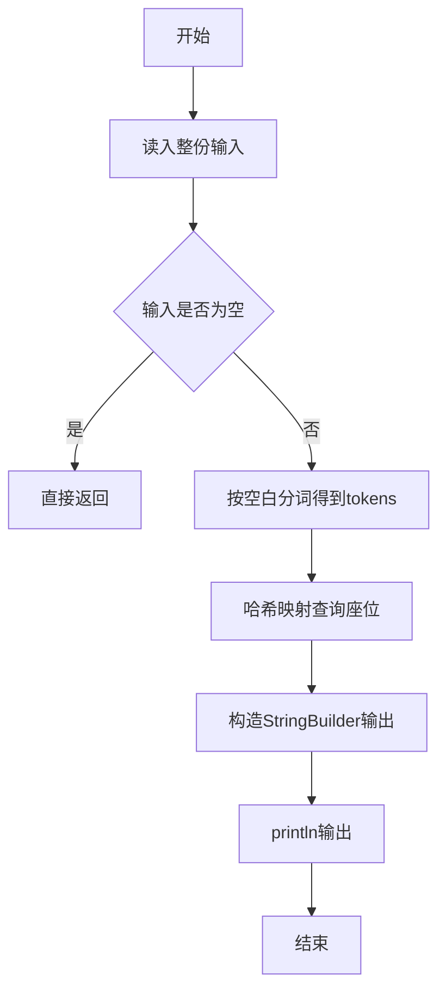
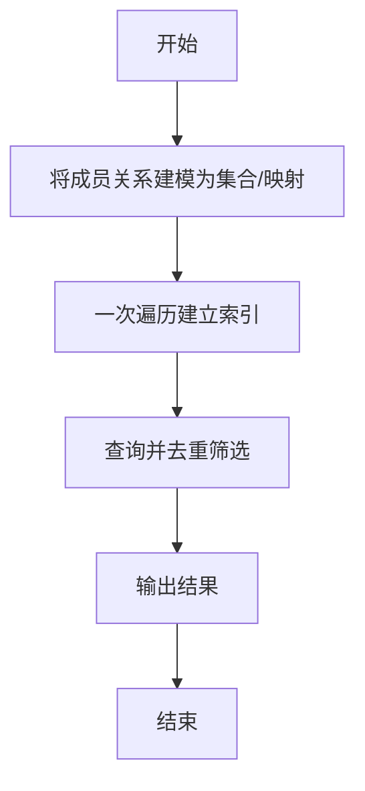

# L1-005 - 考试座位号（15 分）

- **时间限制**: 200 ms
- **内存限制**: 65536 KB
- **代码长度限制**: 16 KB

---

## 题目描述


每个 PAT 考生在参加考试时都会被分配两个座位号，一个是试机座位，一个是考试座位。正常情况下，考生在入场时先得到试机座位号码，入座进入试机状态后，系统会显示该考生的考试座位号码，考试时考生需要换到考试座位就座。但有些考生迟到了，试机已经结束，他们只能拿着领到的试机座位号码求助于你，从后台查出他们的考试座位号码。

### 输入格式:

输入第一行给出一个正整数 $$N$$（$$\le 1000$$），随后 $$N$$ 行，每行给出一个考生的信息：`准考证号 试机座位号 考试座位号`。其中`准考证号`由 16 位数字组成，座位从 1 到 $$N$$ 编号。输入保证每个人的准考证号都不同，并且任何时候都不会把两个人分配到同一个座位上。

考生信息之后，给出一个正整数 $$M$$（$$\le N$$），随后一行中给出 $$M$$ 个待查询的试机座位号码，以空格分隔。

### 输出格式:

对应每个需要查询的试机座位号码，在一行中输出对应考生的准考证号和考试座位号码，中间用 1 个空格分隔。

### 输入样例:
```in
4
3310120150912233 2 4
3310120150912119 4 1
3310120150912126 1 3
3310120150912002 3 2
2
3 4
```

### 输出样例:
```out
3310120150912002 2
3310120150912119 1
```

## 示例

### 示例 1

**输入:**
```
4
3310120150912233 2 4
3310120150912119 4 1
3310120150912126 1 3
3310120150912002 3 2
2
3 4
```

**输出:**
```
3310120150912002 2
3310120150912119 1
```

--

### 解题思路

#### 题目分析
题目“L1-005 - 考试座位号（15 分）”的任务是：每个 PAT 考生在参加考试时都会被分配两个座位号，一个是试机座位，一个是考试座位。正常情况下，考生在入场时先得到试机座位号码，入座进入试机状态后，系统会显示该考生的考试座位号码，考试时考生需要换到考试座位就座。但有些考生迟到了，试机已经结。输入需考虑空行、首尾空白以及多空格分隔的容错；输出要求严格按样例格式，数字、空格与换行均不可偏差。边界上要处理 空输入直接返回、非法字符过滤 等情况，仓颉实现中通过 `readToEnd` / `readln` 配合 `trimAscii` 与 `isEmpty` 提前返回来规避空指针。

#### 核心算法
建立准考证号到考场座位号的映射，按查询逐一输出。使用 `StringBuilder` 缓冲拼接以减少重复分配。实现上先将整份输入按空白分词为 `tokens`/`lines`，用 `Int64.parse` 解析数值，随后按题意执行核心循环与条件分支。该思路与 L1-005 的仓颉源码逻辑一一对应，体现了从暴力到必要的剪枝。

#### 复杂度分析
- **时间复杂度**：O(n)
- **空间复杂度**：O(n)

### 代码流程说明

1. 通过 `getStdIn().readToEnd()`/`readln` 读入全部输入，`trimAscii` 判空，若为空则直接 `return`。
2. 按空白符（空格、换行、制表）遍历 `toRuneArray()` 切分得到 `tokens`/`lines`，并过滤空串。
3. 用 `Int64.parse` 解析首个或多个数值（视题目而定），初始化计数器、集合或累加变量。
4. 执行核心逻辑——哈希映射查询座位：对应源码中的主循环/条件（如 `while`/`for`、`if` 分支、集合查表或公式计算）。
5. 将结果按题面要求的格式组装到 `StringBuilder`，处理对齐、分隔符与多行换行。
6. 调用 `println` 一次性输出最终字符串并结束 `main`。

### 代码实现

仓颉代码实现如下：

```cangjie
// L1-005 考试座位号
// approach: map trial seat -> (id, exam seat)
import std.env.*
import std.collection.*
import std.convert.*

main() {
    let cin = getStdIn()
    let all = cin.readToEnd() ?? ""
    if (all.trimAscii().isEmpty()) { return }
    var tokens = ArrayList<String>()
    var cur = StringBuilder()
    for (r in all.toRuneArray()) {
        let rs = r.toString()
        if (rs == " " || rs == "\n" || rs == "\r" || rs == "\t") {
            if (cur.size > 0) { tokens.add(cur.toString()); cur = StringBuilder() }
        } else { cur.append(rs) }
    }
    if (cur.size > 0) { tokens.add(cur.toString()) }
    if (tokens.size == 0) { return }
    let n = Int64.parse(tokens[0])
    var ids = Array<String>(n + 1, repeat: "")
    var exams = Array<Int64>(n + 1, repeat: 0)
    var idx: Int64 = 1
    for (_ in 0..n) {
        let id = tokens[idx]
        let trial = Int64.parse(tokens[idx+1])
        let exam = Int64.parse(tokens[idx+2])
        ids[trial] = id
        exams[trial] = exam
        idx += 3
    }
    let m = Int64.parse(tokens[idx])
    idx += 1
    for (i in 0..m) {
        let seat = Int64.parse(tokens[idx+i])
        println("${ids[seat]} ${exams[seat]}")
    }
}
```

### 代码流程图



### 解题流程图



