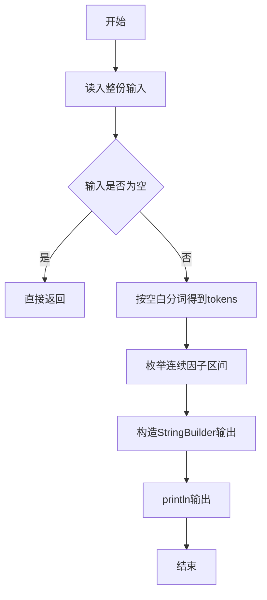
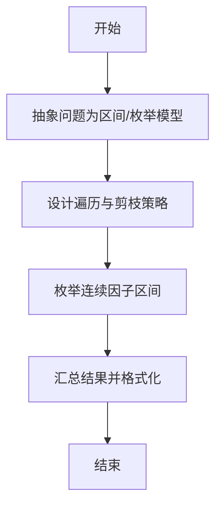

# L1-006 - 连续因子（20 分）

- **时间限制**: 400 ms
- **内存限制**: 65536 KB
- **代码长度限制**: 16 KB

---

## 题目描述


一个正整数 $$N$$ 的因子中可能存在若干连续的数字。例如 630 可以分解为 3$$\times$$5$$\times$$6$$\times$$7，其中 5、6、7 就是 3 个连续的数字。给定任一正整数 $$N$$，要求编写程序求出最长连续因子的个数，并输出最小的连续因子序列。

### 输入格式:

输入在一行中给出一个正整数 $$N$$（$$1<N<2^{31}$$）。

### 输出格式:

首先在第 1 行输出最长连续因子的个数；然后在第 2 行中按 `因子1*因子2*……*因子k` 的格式输出最小的连续因子序列，其中因子按递增顺序输出，1 不算在内。

### 输入样例:
```in
630
```

### 输出样例:
```out
3
5*6*7
```

## 示例

### 示例 1

**输入:**
```
630
```

**输出:**
```
3
5*6*7
```

--

### 解题思路

#### 题目分析
题目“L1-006 - 连续因子（20 分）”的任务是：一个正整数  N  的因子中可能存在若干连续的数字。例如 630 可以分解为 3 \times 5 \times 6 \times 7，其中 5、6、7 就是 3 个连续的数字。给定任一正整数  N ，要求编写程序求出最长连续因子的个数，并。输入需考虑空行、首尾空白以及多空格分隔的容错；输出要求严格按样例格式，数字、空格与换行均不可偏差。边界上要处理 空输入直接返回、非法字符过滤 等情况，仓颉实现中通过 `readToEnd` / `readln` 配合 `trimAscii` 与 `isEmpty` 提前返回来规避空指针。

#### 核心算法
枚举起点 start 在 [2, sqrt(N)]，向后累乘并检查整除，维护最长区间。使用 `StringBuilder` 缓冲拼接以减少重复分配。实现上先将整份输入按空白分词为 `tokens`/`lines`，用 `Int64.parse` 解析数值，随后按题意执行核心循环与条件分支。该思路与 L1-006 的仓颉源码逻辑一一对应，体现了从暴力到必要的剪枝。

#### 复杂度分析
- **时间复杂度**：O(sqrt(N)·k)
- **空间复杂度**：O(1)

### 代码流程说明

1. 通过 `getStdIn().readToEnd()`/`readln` 读入全部输入，`trimAscii` 判空，若为空则直接 `return`。
2. 按空白符（空格、换行、制表）遍历 `toRuneArray()` 切分得到 `tokens`/`lines`，并过滤空串。
3. 用 `Int64.parse` 解析首个或多个数值（视题目而定），初始化计数器、集合或累加变量。
4. 执行核心逻辑——枚举连续因子区间：对应源码中的主循环/条件（如 `while`/`for`、`if` 分支、集合查表或公式计算）。
5. 循环内部进行整除/取模/试除判定，维护最优解的起点与长度。
6. 将结果按题面要求的格式组装到 `StringBuilder`，处理对齐、分隔符与多行换行。
7. 调用 `println` 一次性输出最终字符串并结束 `main`。

### 代码实现

仓颉代码实现如下：

```cangjie
// L1-006 连续因子
// approach: brute force longest consecutive product dividing N
import std.env.*
import std.convert.*
import std.math.*
import std.collection.*

main() {
    let cin = getStdIn()
    let all = cin.readToEnd() ?? ""
    let t = all.trimAscii()
    if (t.isEmpty()) { return }
    var tokens = ArrayList<String>()
    var cur = StringBuilder()
    for (r in all.toRuneArray()) {
        let rs = r.toString()
        if (rs == " " || rs == "\n" || rs == "\r" || rs == "\t") {
            if (cur.size > 0) { tokens.add(cur.toString()); cur = StringBuilder() }
        } else { cur.append(rs) }
    }
    if (cur.size > 0) { tokens.add(cur.toString()) }
    if (tokens.size == 0) { return }
    let n = Int64.parse(tokens[0])
    var bestLen: Int64 = 0
    var bestStart: Int64 = 0
    let sq = Int64(sqrt(Float64(n))) + 1
    var start: Int64 = 2
    while (start <= sq) {
        var prod: Int64 = 1
        var end = start
        while (true) {
            if (prod > n / end) { break }
            prod *= end
            if (n % prod != 0) { break }
            let len = end - start + 1
            if (len > bestLen) {
                bestLen = len
                bestStart = start
            }
            end += 1
            if (end > n) { break }
            if (prod > n) { break }
        }
        start += 1
    }
    if (bestLen == 0) {
        println(1)
        println(n)
    } else {
        println(bestLen)
        var sb = StringBuilder()
        for (k in 0..bestLen) {
            if (k > 0) { sb.append("*") }
            sb.append("${bestStart + k}")
        }
        println(sb.toString())
    }
}
```

### 代码流程图



### 解题流程图



