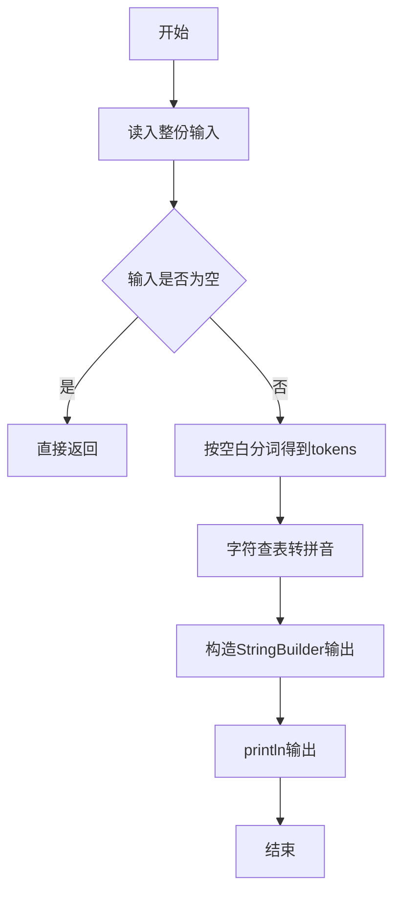
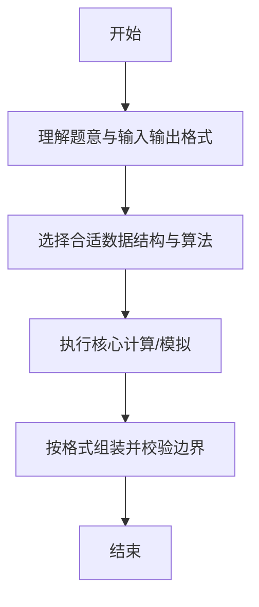

# L1-007 - 念数字（10 分）

- **时间限制**: 400 ms
- **内存限制**: 65536 KB
- **代码长度限制**: 16 KB

---

## 题目描述


输入一个整数，输出每个数字对应的拼音。当整数为负数时，先输出`fu`字。十个数字对应的拼音如下：
```
0: ling
1: yi
2: er
3: san
4: si
5: wu
6: liu
7: qi
8: ba
9: jiu
```

### 输入格式:

输入在一行中给出一个整数，如：`1234`。

<b>提示：整数包括负数、零和正数。</b>

### 输出格式:

在一行中输出这个整数对应的拼音，每个数字的拼音之间用空格分开，行末没有最后的空格。如
`yi er san si`。

### 输入样例:
```in
-600
```

### 输出样例:
```out
fu liu ling ling
```

## 示例

### 示例 1

**输入:**
```
-600
```

**输出:**
```
fu liu ling ling
```

--

### 解题思路

#### 题目分析
题目“L1-007 - 念数字（10 分）”的任务是：输入一个整数，输出每个数字对应的拼音。当整数为负数时，先输出 fu 字。十个数字对应的拼音如下： 0: ling 1: yi 2: er 3: san 4: si 5: wu 6: liu 7: qi 8: ba 9: jiu。输入需考虑空行、首尾空白以及多空格分隔的容错；输出要求严格按样例格式，数字、空格与换行均不可偏差。边界上要处理 空输入直接返回、非法字符过滤 等情况，仓颉实现中通过 `readToEnd` / `readln` 配合 `trimAscii` 与 `isEmpty` 提前返回来规避空指针。

#### 核心算法
首字符为'-'则输出fu，其余数字字符查表映射为拼音。使用 `StringBuilder` 缓冲拼接以减少重复分配。实现上先将整份输入按空白分词为 `tokens`/`lines`，用 `Int64.parse` 解析数值，随后按题意执行核心循环与条件分支。该思路与 L1-007 的仓颉源码逻辑一一对应，体现了从暴力到必要的剪枝。

#### 复杂度分析
- **时间复杂度**：O(n)
- **空间复杂度**：O(n)

### 代码流程说明

1. 通过 `getStdIn().readToEnd()`/`readln` 读入全部输入，`trimAscii` 判空，若为空则直接 `return`。
2. 按空白符（空格、换行、制表）遍历 `toRuneArray()` 切分得到 `tokens`/`lines`，并过滤空串。
3. 用 `Int64.parse` 解析首个或多个数值（视题目而定），初始化计数器、集合或累加变量。
4. 执行核心逻辑——字符查表转拼音：对应源码中的主循环/条件（如 `while`/`for`、`if` 分支、集合查表或公式计算）。
5. 将结果按题面要求的格式组装到 `StringBuilder`，处理对齐、分隔符与多行换行。
6. 调用 `println` 一次性输出最终字符串并结束 `main`。

### 代码实现

仓颉代码实现如下：

```cangjie
// L1-007 念数字
import std.convert.*
// approach: map digits to pinyin
import std.env.*
import std.collection.*

main() {
    let cin = getStdIn()
    let all = cin.readToEnd() ?? ""
    let s = all.trimAscii()
    if (s.isEmpty()) { return }
    let pinyin: Array<String> = ["ling","yi","er","san","si","wu","liu","qi","ba","jiu"]
    var res = ArrayList<String>()
    var startIdx: Int64 = 0
    if (s.startsWith("-")) {
        res.add("fu")
        startIdx = 1
    }
    let runes = s.toRuneArray()
    for (i in startIdx..Int64(runes.size)) {
        let rs = runes[i].toString()
        if (rs >= "0" && rs <= "9") {
            let d = Int64.parse(rs)
            res.add(pinyin[d])
        }
    }
    var sb = StringBuilder()
    for (i in 0..Int64(res.size)) {
        if (i > 0) { sb.append(" ") }
        sb.append(res[i])
    }
    println(sb.toString())
}
```

### 代码流程图



### 解题流程图



