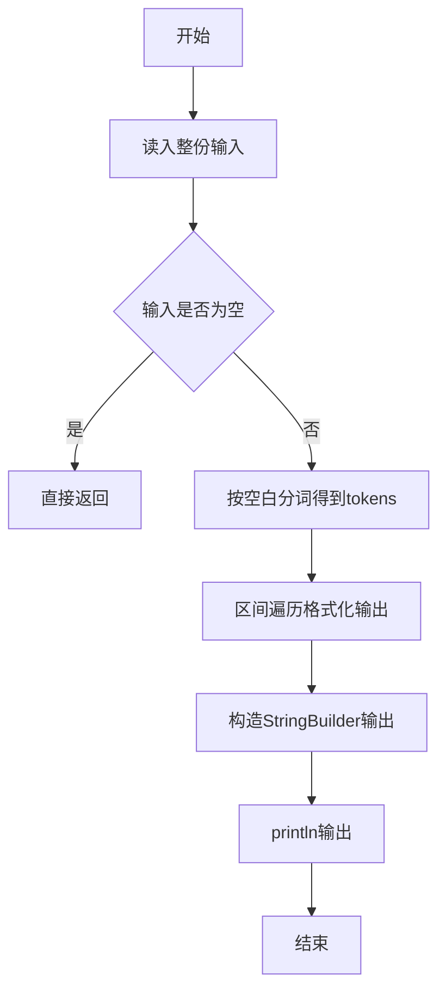
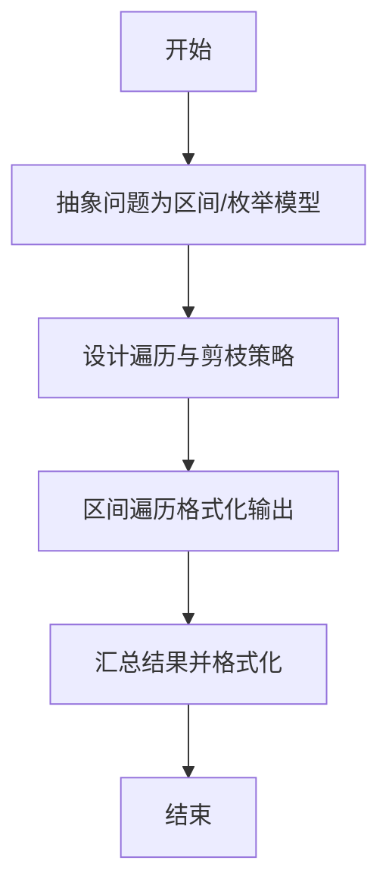

# L1-008 - 求整数段和（10 分）

- **时间限制**: 400 ms
- **内存限制**: 65536 KB
- **代码长度限制**: 16 KB

---

## 题目描述


给定两个整数$$A$$和$$B$$，输出从$$A$$到$$B$$的所有整数以及这些数的和。

### 输入格式:

输入在一行中给出2个整数$$A$$和$$B$$，其中$$-100\le A\le B\le 100$$，其间以空格分隔。

### 输出格式:

首先顺序输出从$$A$$到$$B$$的所有整数，每5个数字占一行，每个数字占5个字符宽度，向右对齐。最后在一行中按`Sum = X`的格式输出全部数字的和`X`。

### 输入样例:
```in
-3 8
```

### 输出样例:
```out
-3   -2   -1    0    1
    2    3    4    5    6
    7    8
Sum = 30
```

## 示例

### 示例 1

**输入:**
```
-3 8
```

**输出:**
```
-3   -2   -1    0    1
    2    3    4    5    6
    7    8
Sum = 30
```

--

### 解题思路

#### 题目分析
题目“L1-008 - 求整数段和（10 分）”的任务是：给定两个整数 A 和 B ，输出从 A 到 B 的所有整数以及这些数的和。。输入需考虑空行、首尾空白以及多空格分隔的容错；输出要求严格按样例格式，数字、空格与换行均不可偏差。边界上要处理 空输入直接返回、非法字符过滤 等情况，仓颉实现中通过 `readToEnd` / `readln` 配合 `trimAscii` 与 `isEmpty` 提前返回来规避空指针。

#### 核心算法
从 A 到 B 累加遍历，每满5个换行并按宽度5右对齐。使用 `StringBuilder` 缓冲拼接以减少重复分配。实现上先将整份输入按空白分词为 `tokens`/`lines`，用 `Int64.parse` 解析数值，随后按题意执行核心循环与条件分支。该思路与 L1-008 的仓颉源码逻辑一一对应，体现了从暴力到必要的剪枝。

#### 复杂度分析
- **时间复杂度**：O(B-A)
- **空间复杂度**：O(B-A)

### 代码流程说明

1. 通过 `getStdIn().readToEnd()`/`readln` 读入全部输入，`trimAscii` 判空，若为空则直接 `return`。
2. 按空白符（空格、换行、制表）遍历 `toRuneArray()` 切分得到 `tokens`/`lines`，并过滤空串。
3. 用 `Int64.parse` 解析首个或多个数值（视题目而定），初始化计数器、集合或累加变量。
4. 执行核心逻辑——区间遍历格式化输出：对应源码中的主循环/条件（如 `while`/`for`、`if` 分支、集合查表或公式计算）。
5. 将结果按题面要求的格式组装到 `StringBuilder`，处理对齐、分隔符与多行换行。
6. 调用 `println` 一次性输出最终字符串并结束 `main`。

### 代码实现

仓颉代码实现如下：

```cangjie
// L1-008 求整数段和
// approach: print A..B each width 5 right aligned, 5 per line, sum
import std.env.*
import std.convert.*
import std.collection.*

main() {
    let cin = getStdIn()
    let all = cin.readToEnd() ?? ""
    if (all.trimAscii().isEmpty()) { return }
    var tokens = ArrayList<String>()
    var cur = StringBuilder()
    for (r in all.toRuneArray()) {
        let rs = r.toString()
        if (rs == " " || rs == "\n" || rs == "\r" || rs == "\t") {
            if (cur.size > 0) { tokens.add(cur.toString()); cur = StringBuilder() }
        } else { cur.append(rs) }
    }
    if (cur.size > 0) { tokens.add(cur.toString()) }
    let a = Int64.parse(tokens[0])
    let b = Int64.parse(tokens[1])
    var sum: Int64 = 0
    var lineCnt: Int64 = 0
    var sb = StringBuilder()
    var num = a
    while (num <= b) {
        sum += num
        let s = "${num}"
        let pad = 5 - Int64(s.size)
        for (_ in 0..pad) { sb.append(" ") }
        sb.append(s)
        lineCnt += 1
        if (lineCnt % 5 == 0) {
            sb.append("\n")
        }
        num += 1
    }
    if (lineCnt % 5 != 0) { sb.append("\n") }
    sb.append("Sum = ${sum}")
    println(sb.toString())
}
```

### 代码流程图



### 解题流程图



