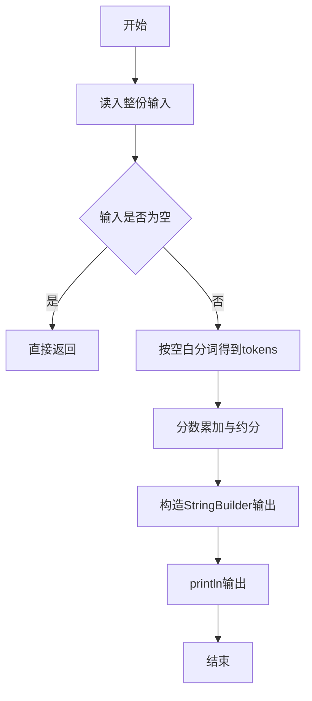
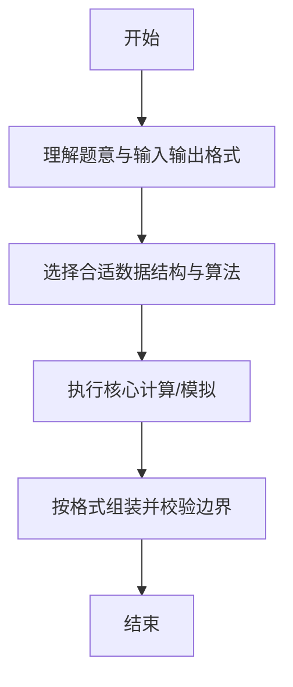

# L1-009 - N个数求和（20 分）

- **时间限制**: 400 ms
- **内存限制**: 65536 KB
- **代码长度限制**: 16 KB

---

## 题目描述


本题的要求很简单，就是求`N`个数字的和。麻烦的是，这些数字是以有理数`分子/分母`的形式给出的，你输出的和也必须是有理数的形式。

### 输入格式:

输入第一行给出一个正整数`N`（$$\le$$100）。随后一行按格式`a1/b1 a2/b2 ...`给出`N`个有理数。题目保证所有分子和分母都在长整型范围内。另外，负数的符号一定出现在分子前面。

### 输出格式:

输出上述数字和的最简形式 —— 即将结果写成`整数部分 分数部分`，其中分数部分写成`分子/分母`，要求分子小于分母，且它们没有公因子。如果结果的整数部分为0，则只输出分数部分。

### 输入样例 1：
```in
5
2/5 4/15 1/30 -2/60 8/3
```

### 输出样例 1：
```out
3 1/3
```

### 输入样例 2：
```in
2
4/3 2/3
```

### 输出样例 2：
```out
2
```

### 输入样例 3：
```in
3
1/3 -1/6 1/8
```

### 输出样例 3：
```out
7/24
```

## 示例

### 示例 1

**输入:**
```
5
2/5 4/15 1/30 -2/60 8/3
```

**输出:**
```
3 1/3
```

### 示例 2

**输入:**
```
2
4/3 2/3
```

**输出:**
```
2
```

### 示例 3

**输入:**
```
3
1/3 -1/6 1/8
```

**输出:**
```
7/24
```

--

### 解题思路

#### 题目分析
题目“L1-009 - N个数求和（20 分）”的任务是：本题的要求很简单，就是求 N 个数字的和。麻烦的是，这些数字是以有理数 分子/分母 的形式给出的，你输出的和也必须是有理数的形式。。输入需考虑空行、首尾空白以及多空格分隔的容错；输出要求严格按样例格式，数字、空格与换行均不可偏差。边界上要处理 空输入直接返回、非法字符过滤 等情况，仓颉实现中通过 `readToEnd` / `readln` 配合 `trimAscii` 与 `isEmpty` 提前返回来规避空指针。

#### 核心算法
分数相加用 gcd 求最小公倍数合并分子分母，每步约分保持最简。其中分数合并借助辗转相除法 `gcd` 保持最简，避免溢出时先除后乘。实现上先将整份输入按空白分词为 `tokens`/`lines`，用 `Int64.parse` 解析数值，随后按题意执行核心循环与条件分支。该思路与 L1-009 的仓颉源码逻辑一一对应，体现了从暴力到必要的剪枝。

#### 复杂度分析
- **时间复杂度**：O(n log M)
- **空间复杂度**：O(1)

### 代码流程说明

1. 通过 `getStdIn().readToEnd()`/`readln` 读入全部输入，`trimAscii` 判空，若为空则直接 `return`。
2. 按空白符（空格、换行、制表）遍历 `toRuneArray()` 切分得到 `tokens`/`lines`，并过滤空串。
3. 用 `Int64.parse` 解析首个或多个数值（视题目而定），初始化计数器、集合或累加变量。
4. 执行核心逻辑——分数累加与约分：对应源码中的主循环/条件（如 `while`/`for`、`if` 分支、集合查表或公式计算）。
5. 将结果按题面要求的格式组装到 `StringBuilder`，处理对齐、分隔符与多行换行。
6. 调用 `println` 一次性输出最终字符串并结束 `main`。

### 代码实现

仓颉代码实现如下：

```cangjie
// L1-009 N个数求和
// approach: fraction sum with gcd reduction
import std.env.*
import std.collection.*
import std.convert.*

func gcd(a: Int64, b: Int64): Int64 {
    var x: Int64 = if (a < 0) { -a } else { a }
    var y: Int64 = if (b < 0) { -b } else { b }
    while (y != 0) {
        let t = y
        y = x % y
        x = t
    }
    return x
}

main() {
    let cin = getStdIn()
    let all = cin.readToEnd() ?? ""
    if (all.trimAscii().isEmpty()) { return }
    var tokens = ArrayList<String>()
    var cur = StringBuilder()
    for (r in all.toRuneArray()) {
        let rs = r.toString()
        if (rs == " " || rs == "\n" || rs == "\r" || rs == "\t") {
            if (cur.size > 0) { tokens.add(cur.toString()); cur = StringBuilder() }
        } else { cur.append(rs) }
    }
    if (cur.size > 0) { tokens.add(cur.toString()) }
    let n = Int64.parse(tokens[0])
    var num: Int64 = 0
    var den: Int64 = 1
    for (i in 0..n) {
        let frac = tokens[1+i]
        var slashIdx: Int64 = -1
        let ra = frac.toRuneArray()
        for (k in 0..Int64(ra.size)) {
            if (ra[k].toString() == "/") { slashIdx = k; break }
        }
        var aStr = ""
        var bStr = ""
        if (slashIdx >= 0) {
            aStr = frac[0..slashIdx]
            bStr = frac[(slashIdx+1)..Int64(frac.size)]
        }
        let a = Int64.parse(aStr)
        let b = Int64.parse(bStr)
        let g = gcd(den, b)
        let lcm = den / g * b
        let newNum = num * (b / g) + a * (den / g)
        num = newNum
        den = lcm
        if (num != 0) {
            let gg = gcd(num, den)
            num /= gg
            den /= gg
        } else {
            den = 1
        }
        if (den < 0) { den = -den; num = -num }
    }
    if (num == 0) {
        println(0)
        return
    }
    let intPart = num / den
    let rem = num % den
    var absRem: Int64 = if (rem < 0) { -rem } else { rem }
    if (intPart != 0 && absRem != 0) {
        println("${intPart} ${absRem}/${den}")
    } else if (intPart != 0) {
        println(intPart)
    } else {
        if (num < 0) {
            println("-${absRem}/${den}")
        } else {
            println("${absRem}/${den}")
        }
    }
}
```

### 代码流程图



### 解题流程图



