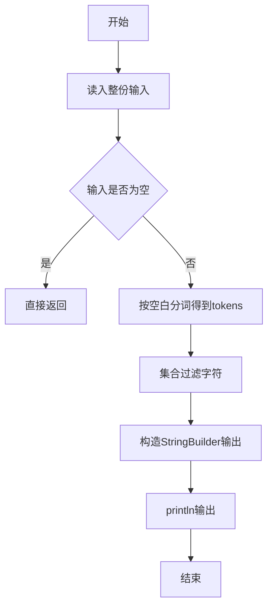
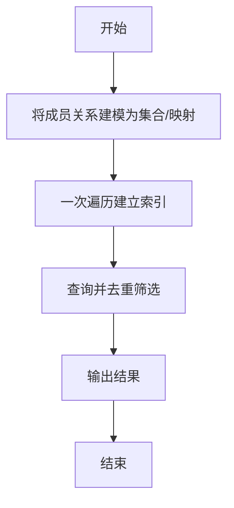

# L1-011 - A-B（20 分）

- **时间限制**: 150 ms
- **内存限制**: 65536 KB
- **代码长度限制**: 16 KB

---

## 题目描述


本题要求你计算$$A-B$$。不过麻烦的是，$$A$$和$$B$$都是字符串 —— 即从字符串$$A$$中把字符串$$B$$所包含的字符全删掉，剩下的字符组成的就是字符串$$A-B$$。

### 输入格式:

输入在2行中先后给出字符串$$A$$和$$B$$。两字符串的长度都不超过$$10^4$$，并且保证每个字符串都是由可见的ASCII码和空白字符组成，最后以换行符结束。

### 输出格式:

在一行中打印出$$A-B$$的结果字符串。

### 输入样例:
```in
I love GPLT!  It's a fun game!
aeiou
```

### 输出样例:
```out
I lv GPLT!  It's  fn gm!
```

## 示例

### 示例 1

**输入:**
```
I love GPLT!  It's a fun game!
aeiou
```

**输出:**
```
I lv GPLT!  It's  fn gm!
```

--

### 解题思路

#### 题目分析
题目“L1-011 - A-B（20 分）”的任务是：本题要求你计算 A-B 。不过麻烦的是， A 和 B 都是字符串 —— 即从字符串 A 中把字符串 B 所包含的字符全删掉，剩下的字符组成的就是字符串 A-B 。。输入需考虑空行、首尾空白以及多空格分隔的容错；输出要求严格按样例格式，数字、空格与换行均不可偏差。边界上要处理 极值、零值与符号位 等情况，仓颉实现中通过 `readToEnd` / `readln` 配合 `trimAscii` 与 `isEmpty` 提前返回来规避空指针。

#### 核心算法
用 HashSet 存储 B 的字符，遍历 A 过滤掉集合中存在的字符。利用 `HashSet` 实现 O(1) 成员判定与去重。实现上先将整份输入按空白分词为 `tokens`/`lines`，用 `Int64.parse` 解析数值，随后按题意执行核心循环与条件分支。该思路与 L1-011 的仓颉源码逻辑一一对应，体现了从暴力到必要的剪枝。

#### 复杂度分析
- **时间复杂度**：O(|A|+|B|)
- **空间复杂度**：O(|B|)

### 代码流程说明

1. 通过 `getStdIn().readToEnd()`/`readln` 读入全部输入，`trimAscii` 判空，若为空则直接 `return`。
2. 按空白符（空格、换行、制表）遍历 `toRuneArray()` 切分得到 `tokens`/`lines`，并过滤空串。
3. 用 `Int64.parse` 解析首个或多个数值（视题目而定），初始化计数器、集合或累加变量。
4. 执行核心逻辑——集合过滤字符：对应源码中的主循环/条件（如 `while`/`for`、`if` 分支、集合查表或公式计算）。
5. 将结果按题面要求的格式组装到 `StringBuilder`，处理对齐、分隔符与多行换行。
6. 调用 `println` 一次性输出最终字符串并结束 `main`。

### 代码实现

仓颉代码实现如下：

```cangjie
// L1-011 A-B
// approach: remove chars of B from A
import std.env.*
import std.collection.*

main() {
    let cin = getStdIn()
    var lines = ArrayList<String>()
    while (let Some(line) <- cin.readln()) {
        lines.add(line)
    }
    let a = if (lines.size > 0) { lines[0] } else { "" }
    let b = if (lines.size > 1) { lines[1] } else { "" }
    var set = HashSet<Rune>()
    for (r in b.toRuneArray()) { set.add(r) }
    var sb = StringBuilder()
    for (r in a.toRuneArray()) {
        if (!set.contains(r)) { sb.append(r.toString()) }
    }
    println(sb.toString())
}
```

### 代码流程图



### 解题流程图



