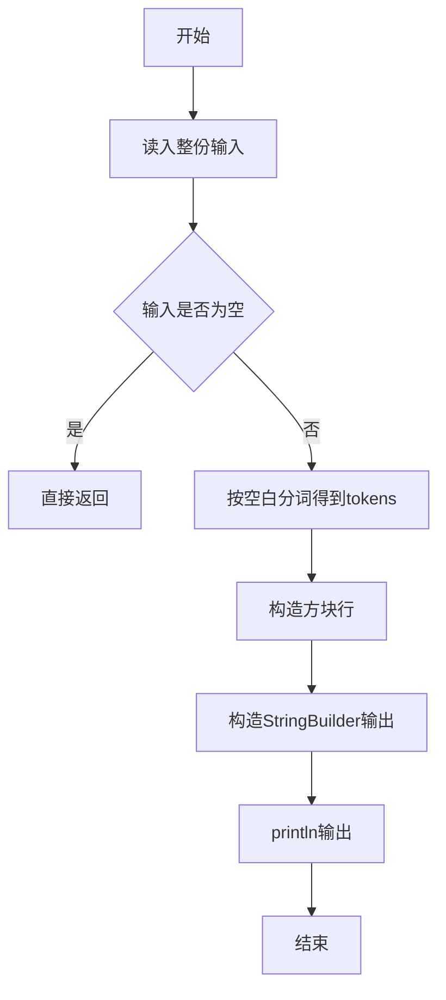
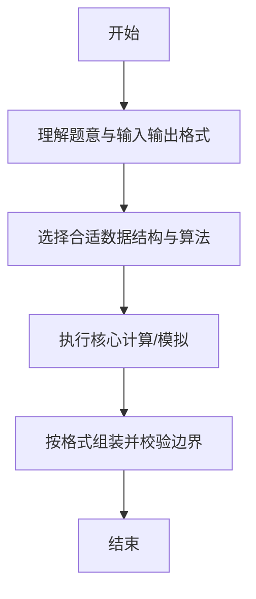

# L1-015 - 跟奥巴马一起画方块（15 分）

- **时间限制**: 400 ms
- **内存限制**: 65536 KB
- **代码长度限制**: 16 KB

---

## 题目描述


美国总统奥巴马不仅呼吁所有人都学习编程，甚至以身作则编写代码，成为美国历史上首位编写计算机代码的总统。2014年底，为庆祝“计算机科学教育周”正式启动，奥巴马编写了很简单的计算机代码：在屏幕上画一个正方形。现在你也跟他一起画吧！

### 输入格式:

输入在一行中给出正方形边长$$N$$（$$3\le N\le 21$$）和组成正方形边的某种字符`C`，间隔一个空格。

### 输出格式:

输出由给定字符`C`画出的正方形。但是注意到行间距比列间距大，所以为了让结果看上去更像正方形，我们输出的行数实际上是列数的50%（四舍五入取整）。

### 输入样例:
```in
10 a
```

### 输出样例:
```out
aaaaaaaaaa
aaaaaaaaaa
aaaaaaaaaa
aaaaaaaaaa
aaaaaaaaaa
```

## 示例

### 示例 1

**输入:**
```
10 a
```

**输出:**
```
aaaaaaaaaa
aaaaaaaaaa
aaaaaaaaaa
aaaaaaaaaa
aaaaaaaaaa
```

--

### 解题思路

#### 题目分析
题目“L1-015 - 跟奥巴马一起画方块（15 分）”的任务是：美国总统奥巴马不仅呼吁所有人都学习编程，甚至以身作则编写代码，成为美国历史上首位编写计算机代码的总统。2014年底，为庆祝“计算机科学教育周”正式启动，奥巴马编写了很简单的计算机代码：在屏幕上画一个正方形。现在你也跟他一起画吧！。输入需考虑空行、首尾空白以及多空格分隔的容错；输出要求严格按样例格式，数字、空格与换行均不可偏差。边界上要处理 空输入直接返回、非法字符过滤 等情况，仓颉实现中通过 `readToEnd` / `readln` 配合 `trimAscii` 与 `isEmpty` 提前返回来规避空指针。

#### 核心算法
行数 rows=(N+1)/2，构造长度 N 的行字符串重复输出。使用 `StringBuilder` 缓冲拼接以减少重复分配。实现上先将整份输入按空白分词为 `tokens`/`lines`，用 `Int64.parse` 解析数值，随后按题意执行核心循环与条件分支。该思路与 L1-015 的仓颉源码逻辑一一对应，体现了从暴力到必要的剪枝。

#### 复杂度分析
- **时间复杂度**：O(N·rows)
- **空间复杂度**：O(N)

### 代码流程说明

1. 通过 `getStdIn().readToEnd()`/`readln` 读入全部输入，`trimAscii` 判空，若为空则直接 `return`。
2. 按空白符（空格、换行、制表）遍历 `toRuneArray()` 切分得到 `tokens`/`lines`，并过滤空串。
3. 用 `Int64.parse` 解析首个或多个数值（视题目而定），初始化计数器、集合或累加变量。
4. 执行核心逻辑——构造方块行：对应源码中的主循环/条件（如 `while`/`for`、`if` 分支、集合查表或公式计算）。
5. 将结果按题面要求的格式组装到 `StringBuilder`，处理对齐、分隔符与多行换行。
6. 调用 `println` 一次性输出最终字符串并结束 `main`。

### 代码实现

仓颉代码实现如下：

```cangjie
// L1-015 跟奥巴马一起画方块
// approach: rows = round(N/2) = (N+1)/2
import std.env.*
import std.convert.*
import std.collection.*

main() {
    let cin = getStdIn()
    let all = cin.readToEnd() ?? ""
    if (all.trimAscii().isEmpty()) { return }
    var tokens = ArrayList<String>()
    var cur = StringBuilder()
    for (r in all.toRuneArray()) {
        let rs = r.toString()
        if (rs == " " || rs == "\n" || rs == "\r" || rs == "\t") {
            if (cur.size > 0) { tokens.add(cur.toString()); cur = StringBuilder() }
        } else { cur.append(rs) }
    }
    if (cur.size > 0) { tokens.add(cur.toString()) }
    let n = Int64.parse(tokens[0])
    let ch = tokens[1]
    let c = ch[0..1]
    let rows = (n + 1) / 2
    var line = StringBuilder()
    for (_ in 0..n) { line.append(c) }
    let ls = line.toString()
    for (_ in 0..rows) { println(ls) }
}
```

### 代码流程图



### 解题流程图



