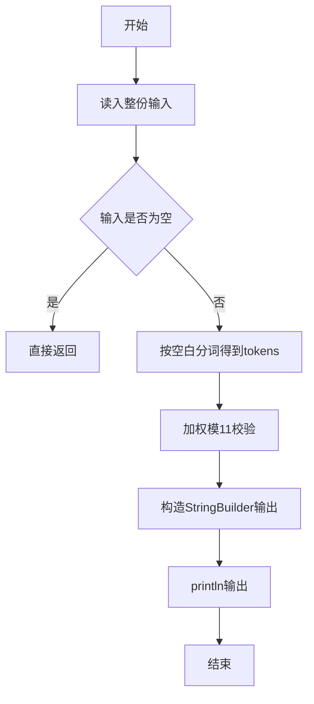
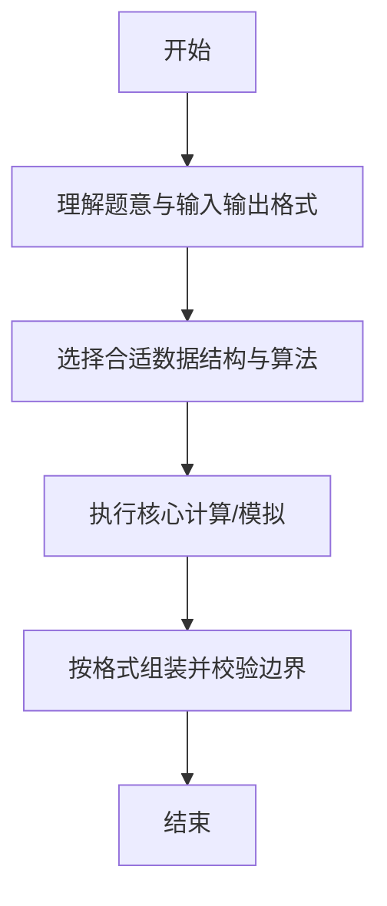

# L1-016 - 查验身份证（15 分）

- **时间限制**: 400 ms
- **内存限制**: 65536 KB
- **代码长度限制**: 16 KB

---

## 题目描述


一个合法的身份证号码由17位地区、日期编号和顺序编号加1位校验码组成。校验码的计算规则如下：

首先对前17位数字加权求和，权重分配为：{7，9，10，5，8，4，2，1，6，3，7，9，10，5，8，4，2}；然后将计算的和对11取模得到值`Z`；最后按照以下关系对应`Z`值与校验码`M`的值：
```
Z：0 1 2 3 4 5 6 7 8 9 10
M：1 0 X 9 8 7 6 5 4 3 2
```
现在给定一些身份证号码，请你验证校验码的有效性，并输出有问题的号码。

### 输入格式:

输入第一行给出正整数$$N$$（$$\le 100$$）是输入的身份证号码的个数。随后$$N$$行，每行给出1个18位身份证号码。

### 输出格式:

按照输入的顺序每行输出1个有问题的身份证号码。这里并不检验前17位是否合理，只检查前17位是否全为数字且最后1位校验码计算准确。如果所有号码都正常，则输出`All passed`。

### 输入样例 1：
```in
4
320124198808240056
12010X198901011234
110108196711301866
37070419881216001X
```

### 输出样例 1：
```out
12010X198901011234
110108196711301866
37070419881216001X
```

### 输入样例 2：
```in
2
320124198808240056
110108196711301862
```

### 输出样例 2：
```out
All passed
```

## 示例

### 示例 1

**输入:**
```
4
320124198808240056
12010X198901011234
110108196711301866
37070419881216001X
```

**输出:**
```
12010X198901011234
110108196711301866
37070419881216001X
```

### 示例 2

**输入:**
```
2
320124198808240056
110108196711301862
```

**输出:**
```
All passed
```

--

### 解题思路

#### 题目分析
题目“L1-016 - 查验身份证（15 分）”的任务是：一个合法的身份证号码由17位地区、日期编号和顺序编号加1位校验码组成。校验码的计算规则如下： 首先对前17位数字加权求和，权重分配为：{7，9，10，5，8，4，2，1，6，3，7，9，10，5，8，4，2}；然后将计算的和对11取模得到值。输入需考虑空行、首尾空白以及多空格分隔的容错；输出要求严格按样例格式，数字、空格与换行均不可偏差。边界上要处理 空输入直接返回、非法字符过滤 等情况，仓颉实现中通过 `readToEnd` / `readln` 配合 `trimAscii` 与 `isEmpty` 提前返回来规避空指针。

#### 核心算法
加权求和 sum mod 11 查表校验，第 18 位与期望码比对。以 `toRuneArray` 按 Rune 遍历，确保多字节字符安全。实现上先将整份输入按空白分词为 `tokens`/`lines`，用 `Int64.parse` 解析数值，随后按题意执行核心循环与条件分支。该思路与 L1-016 的仓颉源码逻辑一一对应，体现了从暴力到必要的剪枝。

#### 复杂度分析
- **时间复杂度**：O(n)
- **空间复杂度**：O(1)

### 代码流程说明

1. 通过 `getStdIn().readToEnd()`/`readln` 读入全部输入，`trimAscii` 判空，若为空则直接 `return`。
2. 按空白符（空格、换行、制表）遍历 `toRuneArray()` 切分得到 `tokens`/`lines`，并过滤空串。
3. 用 `Int64.parse` 解析首个或多个数值（视题目而定），初始化计数器、集合或累加变量。
4. 执行核心逻辑——加权模11校验：对应源码中的主循环/条件（如 `while`/`for`、`if` 分支、集合查表或公式计算）。
5. 涉及集合/映射/矩阵结构时，预先分配 `Array`/`HashSet`/`HashMap` 并填充数据。
6. 将结果按题面要求的格式组装到 `StringBuilder`，处理对齐、分隔符与多行换行。
7. 调用 `println` 一次性输出最终字符串并结束 `main`。

### 代码实现

仓颉代码实现如下：

```cangjie
// L1-016 查验身份证
// approach: weighted sum mod 11
import std.env.*
import std.collection.*
import std.convert.*

main() {
    let cin = getStdIn()
    var lines = ArrayList<String>()
    while (let Some(line) <- cin.readln()) {
        let t = line.trimAscii()
        // preserve even empty? but IDs are not empty; skip leading empty
        if (t.isEmpty()) { continue }
        lines.add(t)
    }
    if (lines.size == 0) { return }
    let n = Int64.parse(lines[0])
    let weights: Array<Int64> = [7,9,10,5,8,4,2,1,6,3,7,9,10,5,8,4,2]
    let codes: Array<String> = ["1","0","X","9","8","7","6","5","4","3","2"]
    var anyInvalid = false
    var invalids = ArrayList<String>()
    for (i in 1..=n) {
        if (i >= Int64(lines.size)) { break }
        let id = lines[i]
        var ok = true
        var sum: Int64 = 0
        if (Int64(id.size) != 18) {
            ok = false
        } else {
            let runes = id.toRuneArray()
            for (j in 0..17) {
                let rs = runes[j].toString()
                if (rs < "0" || rs > "9") { ok = false; break }
                let d = Int64.parse(rs)
                sum += d * weights[j]
            }
            if (ok) {
                let z = sum % 11
                let expected = codes[z]
                let actual = runes[17].toString()
                if (expected != actual) { ok = false }
            }
        }
        if (!ok) {
            invalids.add(id)
            anyInvalid = true
        }
    }
    if (!anyInvalid) {
        println("All passed")
    } else {
        for (s in invalids) { println(s) }
    }
}
```

### 代码流程图



### 解题流程图



