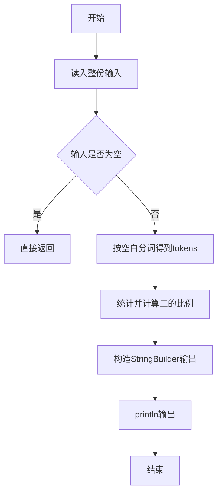
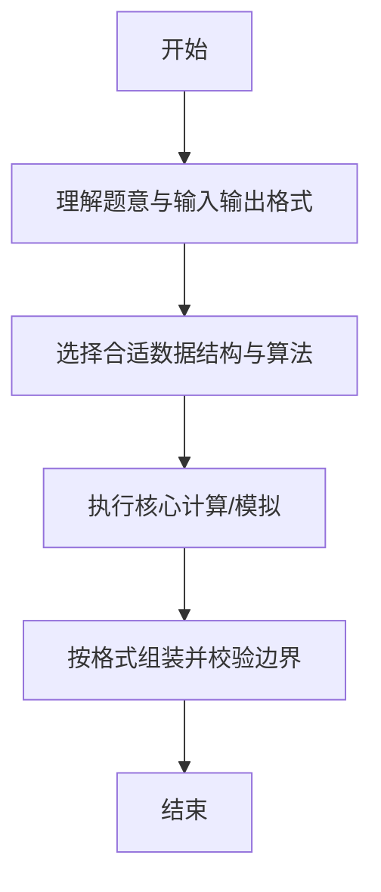

# L1-017 - 到底有多二（15 分）

- **时间限制**: 400 ms
- **内存限制**: 65536 KB
- **代码长度限制**: 16 KB

---

## 题目描述


一个整数“**犯二的程度**”定义为该数字中包含2的个数与其位数的比值。如果这个数是负数，则程度增加0.5倍；如果还是个偶数，则再增加1倍。例如数字`-13142223336`是个11位数，其中有3个2，并且是负数，也是偶数，则它的犯二程度计算为：$$3/11\times 1.5\times 2\times 100\%$$，约为81.82%。本题就请你计算一个给定整数到底有多二。

### 输入格式:

输入第一行给出一个不超过50位的整数`N`。

### 输出格式:

在一行中输出`N`犯二的程度，保留小数点后两位。

### 输入样例:
```in
-13142223336
```

### 输出样例:
```out
81.82%
```

## 示例

### 示例 1

**输入:**
```
-13142223336
```

**输出:**
```
81.82%
```

--

### 解题思路

#### 题目分析
题目“L1-017 - 到底有多二（15 分）”的任务是：一个整数“ 犯二的程度 ”定义为该数字中包含2的个数与其位数的比值。如果这个数是负数，则程度增加0.5倍；如果还是个偶数，则再增加1倍。例如数字 -13142223336 是个11位数，其中有3个2，并且是负数，也是偶数，则它的犯二程度计算。输入需考虑空行、首尾空白以及多空格分隔的容错；输出要求严格按样例格式，数字、空格与换行均不可偏差。边界上要处理 空输入直接返回、非法字符过滤 等情况，仓颉实现中通过 `readToEnd` / `readln` 配合 `trimAscii` 与 `isEmpty` 提前返回来规避空指针。

#### 核心算法
统计各位含2的数量并结合正负、奇偶调整系数计算比例。以 `toRuneArray` 按 Rune 遍历，确保多字节字符安全。实现上先将整份输入按空白分词为 `tokens`/`lines`，用 `Int64.parse` 解析数值，随后按题意执行核心循环与条件分支。该思路与 L1-017 的仓颉源码逻辑一一对应，体现了从暴力到必要的剪枝。

#### 复杂度分析
- **时间复杂度**：O(n)
- **空间复杂度**：O(1)

### 代码流程说明

1. 通过 `getStdIn().readToEnd()`/`readln` 读入全部输入，`trimAscii` 判空，若为空则直接 `return`。
2. 按空白符（空格、换行、制表）遍历 `toRuneArray()` 切分得到 `tokens`/`lines`，并过滤空串。
3. 用 `Int64.parse` 解析首个或多个数值（视题目而定），初始化计数器、集合或累加变量。
4. 执行核心逻辑——统计并计算二的比例：对应源码中的主循环/条件（如 `while`/`for`、`if` 分支、集合查表或公式计算）。
5. 将结果按题面要求的格式组装到 `StringBuilder`，处理对齐、分隔符与多行换行。
6. 调用 `println` 一次性输出最终字符串并结束 `main`。

### 代码实现

仓颉代码实现如下：

```cangjie
// L1-017 到底有多二
import std.convert.*
// approach: integer arithmetic to two decimals
import std.env.*

main() {
    let cin = getStdIn()
    let all = cin.readToEnd() ?? ""
    let s = all.trimAscii()
    if (s.isEmpty()) { return }
    var cnt2: Int64 = 0
    for (r in s.toRuneArray()) {
        if (r.toString() == "2") { cnt2 += 1 }
    }
    let isNeg = s.startsWith("-")
    var len: Int64 = Int64(s.size)
    if (isNeg) { len -= 1 }
    let runes = s.toRuneArray()
    let lastStr = runes[Int64(runes.size)-1].toString()
    let lastDigit = Int64.parse(lastStr)
    let isEven = (lastDigit % 2 == 0)
    var numer: Int64 = 1
    var denom: Int64 = 1
    if (isNeg) { numer *= 3; denom *= 2 }
    if (isEven) { numer *= 2 }
    let totalNum = cnt2 * 10000 * numer
    let totalDen = len * denom
    var scaled = totalNum / totalDen
    let rem = totalNum % totalDen
    if (rem * 2 >= totalDen) { scaled += 1 }
    let intPart = scaled / 100
    let frac = scaled % 100
    let fracStr = if (frac < 10) { "0${frac}" } else { "${frac}" }
    println("${intPart}.${fracStr}%")
}
```

### 代码流程图



### 解题流程图



