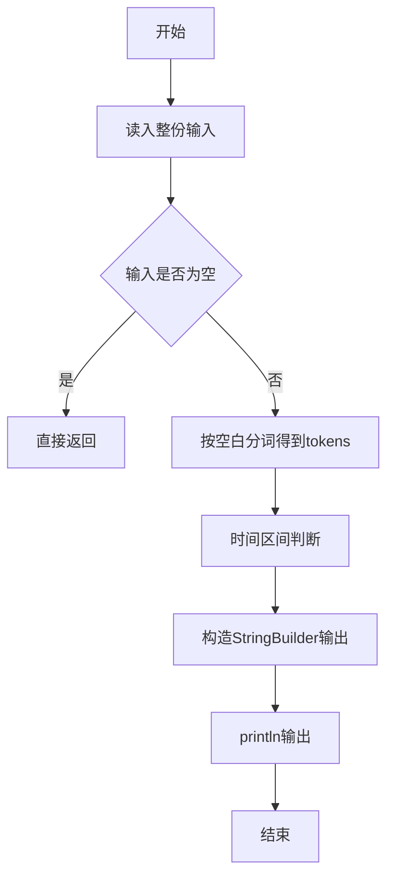
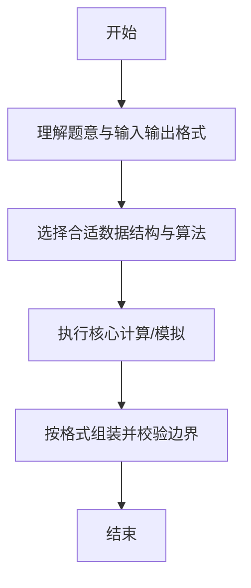

# L1-018 - 大笨钟（10 分）

- **时间限制**: 400 ms
- **内存限制**: 65536 KB
- **代码长度限制**: 16 KB

---

## 题目描述


微博上有个自称“大笨钟V”的家伙，每天敲钟催促码农们爱惜身体早点睡觉。不过由于笨钟自己作息也不是很规律，所以敲钟并不定时。一般敲钟的点数是根据敲钟时间而定的，如果正好在某个整点敲，那么“当”数就等于那个整点数；如果过了整点，就敲下一个整点数。另外，虽然一天有24小时，钟却是只在后半天敲1~12下。例如在23:00敲钟，就是“当当当当当当当当当当当”，而到了23:01就会是“当当当当当当当当当当当当”。在午夜00:00到中午12:00期间（端点时间包括在内），笨钟是不敲的。

下面就请你写个程序，根据当前时间替大笨钟敲钟。

### 输入格式:

输入第一行按照`hh:mm`的格式给出当前时间。其中`hh`是小时，在00到23之间；`mm`是分钟，在00到59之间。

### 输出格式:

根据当前时间替大笨钟敲钟，即在一行中输出相应数量个`Dang`。如果不是敲钟期，则输出：

```
Only hh:mm.  Too early to Dang.
```

其中`hh:mm`是输入的时间。

### 输入样例 1：
```in
19:05
```

### 输出样例 1：
```out
DangDangDangDangDangDangDangDang
```

### 输入样例 2：
```in
07:05
```

### 输出样例 2：
```out
Only 07:05.  Too early to Dang.
```

## 示例

### 示例 1

**输入:**
```
19:05
```

**输出:**
```
DangDangDangDangDangDangDangDang
```

### 示例 2

**输入:**
```
07:05
```

**输出:**
```
Only 07:05.  Too early to Dang.
```

--

### 解题思路

#### 题目分析
题目“L1-018 - 大笨钟（10 分）”的任务是：微博上有个自称“大笨钟V”的家伙，每天敲钟催促码农们爱惜身体早点睡觉。不过由于笨钟自己作息也不是很规律，所以敲钟并不定时。一般敲钟的点数是根据敲钟时间而定的，如果正好在某个整点敲，那么“当”数就等于那个整点数；如果过了整点，就敲下一个整点数。输入需考虑空行、首尾空白以及多空格分隔的容错；输出要求严格按样例格式，数字、空格与换行均不可偏差。边界上要处理 空输入直接返回、非法字符过滤 等情况，仓颉实现中通过 `readToEnd` / `readln` 配合 `trimAscii` 与 `isEmpty` 提前返回来规避空指针。

#### 核心算法
解析时间 hh:mm:ss，判断是否在 00:00:00-12:00:00 区间并输出提醒。使用 `StringBuilder` 缓冲拼接以减少重复分配。实现上先将整份输入按空白分词为 `tokens`/`lines`，用 `Int64.parse` 解析数值，随后按题意执行核心循环与条件分支。该思路与 L1-018 的仓颉源码逻辑一一对应，体现了从暴力到必要的剪枝。

#### 复杂度分析
- **时间复杂度**：O(1)
- **空间复杂度**：O(1)

### 代码流程说明

1. 通过 `getStdIn().readToEnd()`/`readln` 读入全部输入，`trimAscii` 判空，若为空则直接 `return`。
2. 按空白符（空格、换行、制表）遍历 `toRuneArray()` 切分得到 `tokens`/`lines`，并过滤空串。
3. 用 `Int64.parse` 解析首个或多个数值（视题目而定），初始化计数器、集合或累加变量。
4. 执行核心逻辑——时间区间判断：对应源码中的主循环/条件（如 `while`/`for`、`if` 分支、集合查表或公式计算）。
5. 将结果按题面要求的格式组装到 `StringBuilder`，处理对齐、分隔符与多行换行。
6. 调用 `println` 一次性输出最终字符串并结束 `main`。

### 代码实现

仓颉代码实现如下：

```cangjie
// L1-018 大笨钟
// approach: hh:mm, count Dangs after 12:00
import std.env.*
import std.convert.*
import std.collection.*

main() {
    let cin = getStdIn()
    let all = cin.readToEnd() ?? ""
    let t = all.trimAscii()
    if (t.isEmpty()) { return }
    var tokens = ArrayList<String>()
    var cur = StringBuilder()
    for (r in all.toRuneArray()) {
        let rs = r.toString()
        if (rs == " " || rs == "\n" || rs == "\r" || rs == "\t") {
            if (cur.size > 0) { tokens.add(cur.toString()); cur = StringBuilder() }
        } else { cur.append(rs) }
    }
    if (cur.size > 0) { tokens.add(cur.toString()) }
    if (tokens.size == 0) { return }
    let token = tokens[0]
    var slashIdx: Int64 = -1
    let ra = token.toRuneArray()
    for (k in 0..Int64(ra.size)) {
        if (ra[k].toString() == ":") { slashIdx = k; break }
    }
    var hh: Int64 = 0
    var mm: Int64 = 0
    if (slashIdx >= 0) {
        let hStr = token[0..slashIdx]
        let mStr = token[(slashIdx+1)..Int64(token.size)]
        hh = Int64.parse(hStr)
        mm = Int64.parse(mStr)
    }
    if (hh < 12 || (hh == 12 && mm == 0)) {
        println("Only ${token}.  Too early to Dang.")
    } else {
        var cnt = hh - 12
        if (mm > 0) { cnt += 1 }
        var sb = StringBuilder()
        for (_ in 0..cnt) { sb.append("Dang") }
        println(sb.toString())
    }
}
```

### 代码流程图



### 解题流程图



