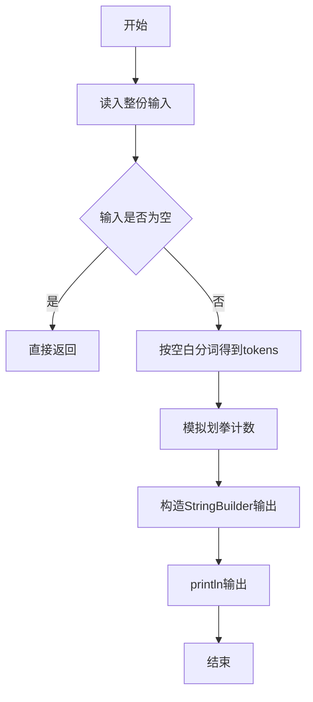
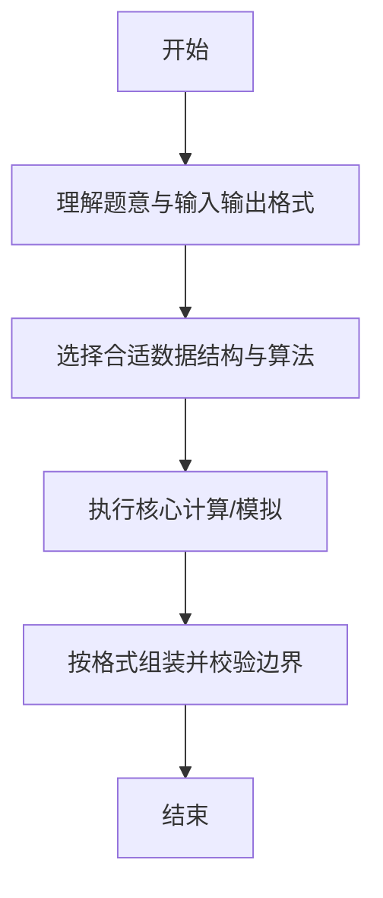

# L1-019 - 谁先倒（15 分）

- **时间限制**: 400 ms
- **内存限制**: 65536 KB
- **代码长度限制**: 16 KB

---

## 题目描述


划拳是古老中国酒文化的一个有趣的组成部分。酒桌上两人划拳的方法为：每人口中喊出一个数字，同时用手比划出一个数字。如果谁比划出的数字正好等于两人喊出的数字之和，谁就输了，输家罚一杯酒。两人同赢或两人同输则继续下一轮，直到唯一的赢家出现。

下面给出甲、乙两人的酒量（最多能喝多少杯不倒）和划拳记录，请你判断两个人谁先倒。

### 输入格式:

输入第一行先后给出甲、乙两人的酒量（不超过100的非负整数），以空格分隔。下一行给出一个正整数`N`（$$\le 100$$），随后`N`行，每行给出一轮划拳的记录，格式为：

```
甲喊 甲划 乙喊 乙划
```

其中`喊`是喊出的数字，`划`是划出的数字，均为不超过100的正整数（两只手一起划）。

### 输出格式:

在第一行中输出先倒下的那个人：`A`代表甲，`B`代表乙。第二行中输出没倒的那个人喝了多少杯。题目保证有一个人倒下。注意程序处理到有人倒下就终止，后面的数据不必处理。

### 输入样例:
```in
1 1
6
8 10 9 12
5 10 5 10
3 8 5 12
12 18 1 13
4 16 12 15
15 1 1 16
```

### 输出样例:
```out
A
1
```

## 示例

### 示例 1

**输入:**
```
1 1
6
8 10 9 12
5 10 5 10
3 8 5 12
12 18 1 13
4 16 12 15
15 1 1 16
```

**输出:**
```
A
1
```

--

### 解题思路

#### 题目分析
题目“L1-019 - 谁先倒（15 分）”的任务是：划拳是古老中国酒文化的一个有趣的组成部分。酒桌上两人划拳的方法为：每人口中喊出一个数字，同时用手比划出一个数字。如果谁比划出的数字正好等于两人喊出的数字之和，谁就输了，输家罚一杯酒。两人同赢或两人同输则继续下一轮，直到唯一的赢家出现。 下面。输入需考虑空行、首尾空白以及多空格分隔的容错；输出要求严格按样例格式，数字、空格与换行均不可偏差。边界上要处理 空输入直接返回、非法字符过滤 等情况，仓颉实现中通过 `readToEnd` / `readln` 配合 `trimAscii` 与 `isEmpty` 提前返回来规避空指针。

#### 核心算法
记录甲乙喝酒杯数，依次比对酒量阈值，累计倒下次数。使用 `StringBuilder` 缓冲拼接以减少重复分配。实现上先将整份输入按空白分词为 `tokens`/`lines`，用 `Int64.parse` 解析数值，随后按题意执行核心循环与条件分支。该思路与 L1-019 的仓颉源码逻辑一一对应，体现了从暴力到必要的剪枝。

#### 复杂度分析
- **时间复杂度**：O(n)
- **空间复杂度**：O(1)

### 代码流程说明

1. 通过 `getStdIn().readToEnd()`/`readln` 读入全部输入，`trimAscii` 判空，若为空则直接 `return`。
2. 按空白符（空格、换行、制表）遍历 `toRuneArray()` 切分得到 `tokens`/`lines`，并过滤空串。
3. 用 `Int64.parse` 解析首个或多个数值（视题目而定），初始化计数器、集合或累加变量。
4. 执行核心逻辑——模拟划拳计数：对应源码中的主循环/条件（如 `while`/`for`、`if` 分支、集合查表或公式计算）。
5. 将结果按题面要求的格式组装到 `StringBuilder`，处理对齐、分隔符与多行换行。
6. 调用 `println` 一次性输出最终字符串并结束 `main`。

### 代码实现

仓颉代码实现如下：

```cangjie
// L1-019 谁先倒
// approach: simulate rounds
import std.env.*
import std.collection.*
import std.convert.*

main() {
    let cin = getStdIn()
    let all = cin.readToEnd() ?? ""
    if (all.trimAscii().isEmpty()) { return }
    var tokens = ArrayList<String>()
    var cur = StringBuilder()
    for (r in all.toRuneArray()) {
        let rs = r.toString()
        if (rs == " " || rs == "\n" || rs == "\r" || rs == "\t") {
            if (cur.size > 0) { tokens.add(cur.toString()); cur = StringBuilder() }
        } else { cur.append(rs) }
    }
    if (cur.size > 0) { tokens.add(cur.toString()) }
    let capA = Int64.parse(tokens[0])
    let capB = Int64.parse(tokens[1])
    let n = Int64.parse(tokens[2])
    var drunkA: Int64 = 0
    var drunkB: Int64 = 0
    var idx: Int64 = 3
    for (_ in 0..n) {
        let aCall = Int64.parse(tokens[idx])
        let aDraw = Int64.parse(tokens[idx+1])
        let bCall = Int64.parse(tokens[idx+2])
        let bDraw = Int64.parse(tokens[idx+3])
        idx += 4
        let sum = aCall + bCall
        let aLose = aDraw == sum
        let bLose = bDraw == sum
        if (aLose && !bLose) { drunkA += 1 }
        if (!aLose && bLose) { drunkB += 1 }
        if (drunkA > capA) {
            println("A")
            println(drunkB)
            return
        }
        if (drunkB > capB) {
            println("B")
            println(drunkA)
            return
        }
    }
}
```

### 代码流程图



### 解题流程图



