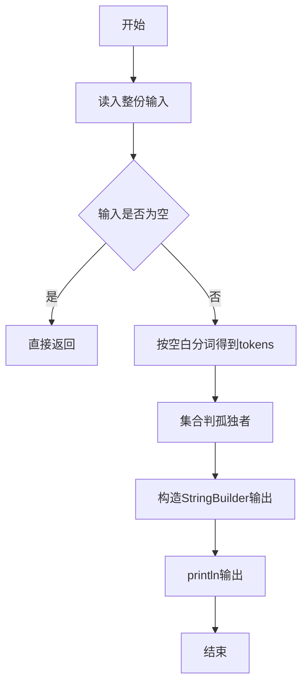
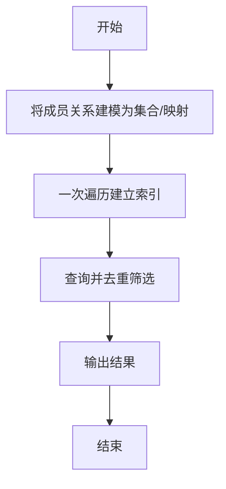

# L1-020 - 帅到没朋友（20 分）

- **时间限制**: 200 ms
- **内存限制**: 65536 KB
- **代码长度限制**: 16 KB

---

## 题目描述


当芸芸众生忙着在朋友圈中发照片的时候，总有一些人因为太帅而没有朋友。本题就要求你找出那些帅到没有朋友的人。

### 输入格式:

输入第一行给出一个正整数`N`（$$\le 100$$），是已知朋友圈的个数；随后`N`行，每行首先给出一个正整数`K`（$$\le 1000$$），为朋友圈中的人数，然后列出一个朋友圈内的所有人——为方便起见，每人对应一个ID号，为5位数字（从00000到99999），ID间以空格分隔；之后给出一个正整数`M`（$$\le 10000$$），为待查询的人数；随后一行中列出`M`个待查询的ID，以空格分隔。

注意：没有朋友的人可以是根本没安装“朋友圈”，也可以是只有自己一个人在朋友圈的人。虽然有个别自恋狂会自己把自己反复加进朋友圈，但题目保证所有`K`超过1的朋友圈里都至少有2个不同的人。

### 输出格式:

按输入的顺序输出那些帅到没朋友的人。ID间用1个空格分隔，行的首尾不得有多余空格。如果没有人太帅，则输出`No one is handsome`。

注意：同一个人可以被查询多次，但只输出一次。

### 输入样例 1：
```in
3
3 11111 22222 55555
2 33333 44444
4 55555 66666 99999 77777
8
55555 44444 10000 88888 22222 11111 23333 88888
```

### 输出样例 1：
```out
10000 88888 23333
```

### 输入样例 2：
```in
3
3 11111 22222 55555
2 33333 44444
4 55555 66666 99999 77777
4
55555 44444 22222 11111
```

### 输出样例 2：
```out
No one is handsome
```

## 示例

### 示例 1

**输入:**
```
3
3 11111 22222 55555
2 33333 44444
4 55555 66666 99999 77777
8
55555 44444 10000 88888 22222 11111 23333 88888
```

**输出:**
```
10000 88888 23333
```

### 示例 2

**输入:**
```
3
3 11111 22222 55555
2 33333 44444
4 55555 66666 99999 77777
4
55555 44444 22222 11111
```

**输出:**
```
No one is handsome
```

--

### 解题思路

#### 题目分析
题目“L1-020 - 帅到没朋友（20 分）”的任务是：当芸芸众生忙着在朋友圈中发照片的时候，总有一些人因为太帅而没有朋友。本题就要求你找出那些帅到没有朋友的人。。输入需考虑空行、首尾空白以及多空格分隔的容错；输出要求严格按样例格式，数字、空格与换行均不可偏差。边界上要处理 空输入直接返回、非法字符过滤 等情况，仓颉实现中通过 `readToEnd` / `readln` 配合 `trimAscii` 与 `isEmpty` 提前返回来规避空指针。

#### 核心算法
用 HashSet 记录所有出现过的朋友圈成员，查询时去重输出孤独者。利用 `HashSet` 实现 O(1) 成员判定与去重。实现上先将整份输入按空白分词为 `tokens`/`lines`，用 `Int64.parse` 解析数值，随后按题意执行核心循环与条件分支。该思路与 L1-020 的仓颉源码逻辑一一对应，体现了从暴力到必要的剪枝。

#### 复杂度分析
- **时间复杂度**：O(n)
- **空间复杂度**：O(n)

### 代码流程说明

1. 通过 `getStdIn().readToEnd()`/`readln` 读入全部输入，`trimAscii` 判空，若为空则直接 `return`。
2. 按空白符（空格、换行、制表）遍历 `toRuneArray()` 切分得到 `tokens`/`lines`，并过滤空串。
3. 用 `Int64.parse` 解析首个或多个数值（视题目而定），初始化计数器、集合或累加变量。
4. 执行核心逻辑——集合判孤独者：对应源码中的主循环/条件（如 `while`/`for`、`if` 分支、集合查表或公式计算）。
5. 涉及集合/映射/矩阵结构时，预先分配 `Array`/`HashSet`/`HashMap` 并填充数据。
6. 将结果按题面要求的格式组装到 `StringBuilder`，处理对齐、分隔符与多行换行。
7. 调用 `println` 一次性输出最终字符串并结束 `main`。

### 代码实现

仓颉代码实现如下：

```cangjie
// L1-020 帅到没朋友
// approach: set of people with friends
import std.env.*
import std.collection.*
import std.convert.*

main() {
    let cin = getStdIn()
    let all = cin.readToEnd() ?? ""
    if (all.trimAscii().isEmpty()) { return }
    var tokens = ArrayList<String>()
    var cur = StringBuilder()
    for (r in all.toRuneArray()) {
        let rs = r.toString()
        if (rs == " " || rs == "\n" || rs == "\r" || rs == "\t") {
            if (cur.size > 0) { tokens.add(cur.toString()); cur = StringBuilder() }
        } else { cur.append(rs) }
    }
    if (cur.size > 0) { tokens.add(cur.toString()) }
    var idx: Int64 = 0
    let n = Int64.parse(tokens[idx]); idx += 1
    var hasFriends = HashSet<String>()
    for (_ in 0..n) {
        let k = Int64.parse(tokens[idx]); idx += 1
        if (k > 1) {
            for (j in 0..k) {
                hasFriends.add(tokens[idx+j])
            }
        }
        idx += k
    }
    let m = Int64.parse(tokens[idx]); idx += 1
    var seen = HashSet<String>()
    var result = ArrayList<String>()
    for (i in 0..m) {
        let id = tokens[idx+i]
        if (!hasFriends.contains(id) && !seen.contains(id)) {
            result.add(id)
            seen.add(id)
        }
    }
    if (result.size == 0) {
        println("No one is handsome")
    } else {
        var sb = StringBuilder()
        for (i in 0..Int64(result.size)) {
            if (i > 0) { sb.append(" ") }
            sb.append(result[i])
        }
        println(sb.toString())
    }
}
```

### 代码流程图



### 解题流程图



