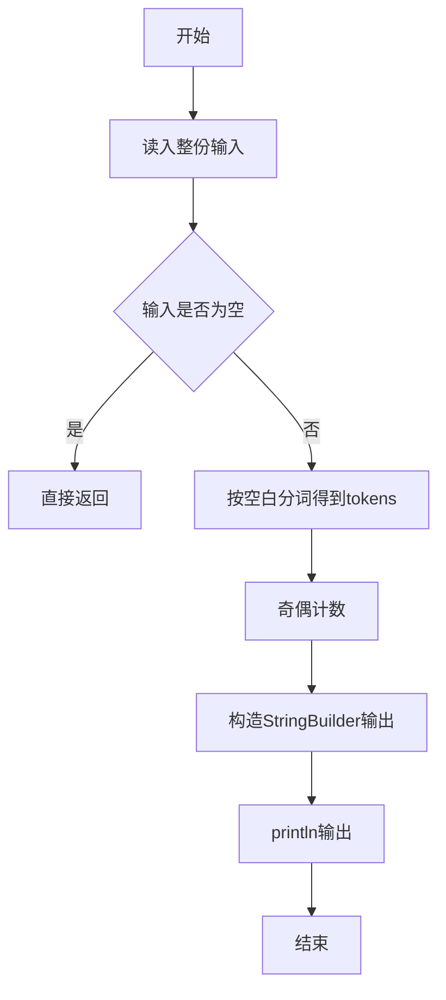
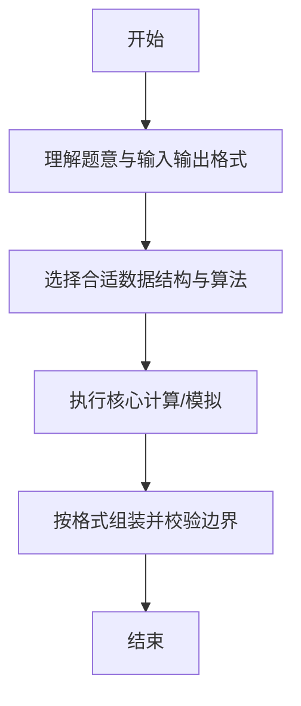

# L1-022 - 奇偶分家（10 分）

- **时间限制**: 400 ms
- **内存限制**: 65536 KB
- **代码长度限制**: 16 KB

---

## 题目描述


给定`N`个正整数，请统计奇数和偶数各有多少个？

### 输入格式:

输入第一行给出一个正整`N`（$$\le 1000$$）；第2行给出`N`个非负整数，以空格分隔。

### 输出格式:

在一行中先后输出奇数的个数、偶数的个数。中间以1个空格分隔。

### 输入样例:
```in
9
88 74 101 26 15 0 34 22 77
```

### 输出样例:
```out
3 6
```

## 示例

### 示例 1

**输入:**
```
9
88 74 101 26 15 0 34 22 77
```

**输出:**
```
3 6
```

--

### 解题思路

#### 题目分析
题目“L1-022 - 奇偶分家（10 分）”的任务是：给定 N 个正整数，请统计奇数和偶数各有多少个？。输入需考虑空行、首尾空白以及多空格分隔的容错；输出要求严格按样例格式，数字、空格与换行均不可偏差。边界上要处理 极值、零值与符号位 等情况，仓颉实现中通过 `readToEnd` / `readln` 配合 `trimAscii` 与 `isEmpty` 提前返回来规避空指针。

#### 核心算法
遍历数组按 %2 分别计数奇偶。以 `toRuneArray` 按 Rune 遍历，确保多字节字符安全。实现上先将整份输入按空白分词为 `tokens`/`lines`，用 `Int64.parse` 解析数值，随后按题意执行核心循环与条件分支。该思路与 L1-022 的仓颉源码逻辑一一对应，体现了从暴力到必要的剪枝。

#### 复杂度分析
- **时间复杂度**：O(n)
- **空间复杂度**：O(1)

### 代码流程说明

1. 通过 `getStdIn().readToEnd()`/`readln` 读入全部输入，`trimAscii` 判空，若为空则直接 `return`。
2. 按空白符（空格、换行、制表）遍历 `toRuneArray()` 切分得到 `tokens`/`lines`，并过滤空串。
3. 用 `Int64.parse` 解析首个或多个数值（视题目而定），初始化计数器、集合或累加变量。
4. 执行核心逻辑——奇偶计数：对应源码中的主循环/条件（如 `while`/`for`、`if` 分支、集合查表或公式计算）。
5. 将结果按题面要求的格式组装到 `StringBuilder`，处理对齐、分隔符与多行换行。
6. 调用 `println` 一次性输出最终字符串并结束 `main`。

### 代码实现

仓颉代码实现如下：

```cangjie
// L1-022 奇偶分家 - count odd/even
import std.env.*
import std.convert.*
main() {
    let cin = getStdIn()
    let all = cin.readToEnd() ?? ""
    var norm = ""
    for (c in all.toRuneArray()) {
        if (c == r'\n' || c == r'\r' || c == r'\t') {
            norm += " "
        } else {
            norm += c.toString()
        }
    }
    let parts = norm.split(" ")
    var tokens = Array<String>(0, repeat: "")
    // filter empties manually via iteration
    for (p in parts) {
        if (p.trimAscii().size > 0) {
            var tmp = Array<String>(tokens.size + 1, repeat: "")
            var i: Int64 = 0
            while (i < tokens.size) { tmp[i] = tokens[i]; i += 1 }
            tmp[tokens.size] = p.trimAscii()
            tokens = tmp
        }
    }
    if (tokens.size == 0) { return }
    let n = Int64.parse(tokens[0])
    var odd: Int64 = 0
    var even: Int64 = 0
    var idx: Int64 = 1
    var cnt: Int64 = 0
    while (cnt < n && idx < tokens.size) {
        let v = Int64.parse(tokens[idx])
        if (v % 2 == 0) { even += 1 } else { odd += 1 }
        cnt += 1
        idx += 1
    }
    println("${odd} ${even}")
}
```

### 代码流程图



### 解题流程图



