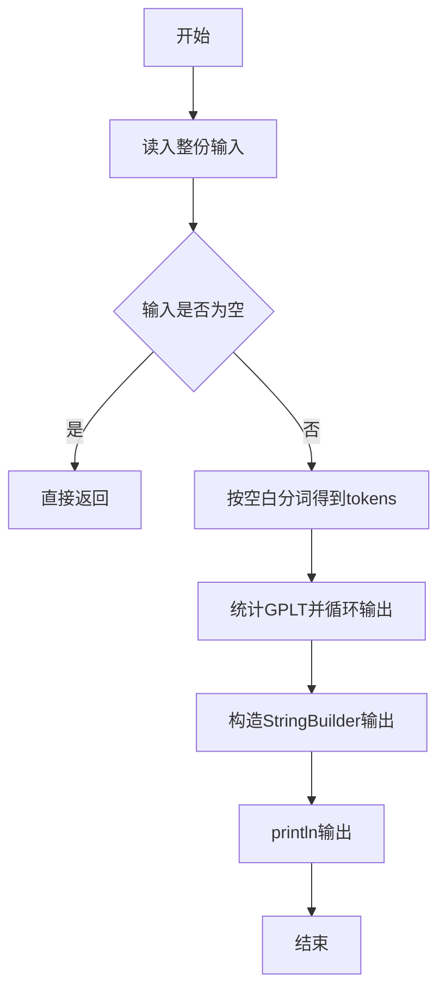
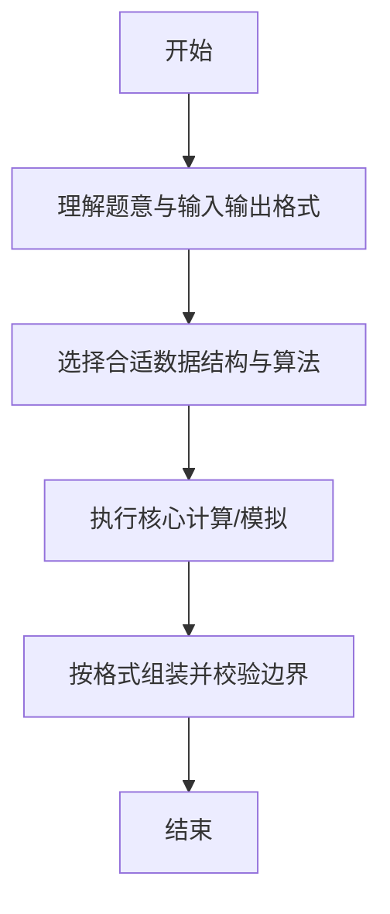

# L1-023 - 输出GPLT（20 分）

- **时间限制**: 150 ms
- **内存限制**: 65536 KB
- **代码长度限制**: 16 KB

---

## 题目描述


给定一个长度不超过10000的、仅由英文字母构成的字符串。请将字符重新调整顺序，按`GPLTGPLT....`这样的顺序输出，并忽略其它字符。当然，四种字符（不区分大小写）的个数不一定是一样多的，若某种字符已经输出完，则余下的字符仍按`GPLT`的顺序打印，直到所有字符都被输出。

### 输入格式:

输入在一行中给出一个长度不超过10000的、仅由英文字母构成的非空字符串。

### 输出格式:

在一行中按题目要求输出排序后的字符串。题目保证输出非空。

### 输入样例:
```in
pcTclnGloRgLrtLhgljkLhGFauPewSKgt
```

### 输出样例:
```out
GPLTGPLTGLTGLGLL
```

## 示例

### 示例 1

**输入:**
```
pcTclnGloRgLrtLhgljkLhGFauPewSKgt
```

**输出:**
```
GPLTGPLTGLTGLGLL
```

--

### 解题思路

#### 题目分析
题目“L1-023 - 输出GPLT（20 分）”的任务是：给定一个长度不超过10000的、仅由英文字母构成的字符串。请将字符重新调整顺序，按 GPLTGPLT.... 这样的顺序输出，并忽略其它字符。当然，四种字符（不区分大小写）的个数不一定是一样多的，若某种字符已经输出完，则余下的字符仍按 GP。输入需考虑空行、首尾空白以及多空格分隔的容错；输出要求严格按样例格式，数字、空格与换行均不可偏差。边界上要处理 极值、零值与符号位 等情况，仓颉实现中通过 `readToEnd` / `readln` 配合 `trimAscii` 与 `isEmpty` 提前返回来规避空指针。

#### 核心算法
大小写不敏感统计 GPLT 四字符频次，按 G>P>L>T 循环输出。使用 `StringBuilder` 缓冲拼接以减少重复分配。实现上先将整份输入按空白分词为 `tokens`/`lines`，用 `Int64.parse` 解析数值，随后按题意执行核心循环与条件分支。该思路与 L1-023 的仓颉源码逻辑一一对应，体现了从暴力到必要的剪枝。

#### 复杂度分析
- **时间复杂度**：O(n)
- **空间复杂度**：O(1)

### 代码流程说明

1. 通过 `getStdIn().readToEnd()`/`readln` 读入全部输入，`trimAscii` 判空，若为空则直接 `return`。
2. 按空白符（空格、换行、制表）遍历 `toRuneArray()` 切分得到 `tokens`/`lines`，并过滤空串。
3. 用 `Int64.parse` 解析首个或多个数值（视题目而定），初始化计数器、集合或累加变量。
4. 执行核心逻辑——统计GPLT并循环输出：对应源码中的主循环/条件（如 `while`/`for`、`if` 分支、集合查表或公式计算）。
5. 将结果按题面要求的格式组装到 `StringBuilder`，处理对齐、分隔符与多行换行。
6. 调用 `println` 一次性输出最终字符串并结束 `main`。

### 代码实现

仓颉代码实现如下：

```cangjie
// L1-023 输出GPLT - count G/P/L/T case-insensitive and interleave
import std.env.*
main() {
    let cin = getStdIn()
    let all = cin.readToEnd() ?? ""
    var line = ""
    for (c in all.toRuneArray()) {
        if (c == r'\n' || c == r'\r') { break }
        line += c.toString()
    }
    var s = line
    if (s.size == 0) { s = all.trimAscii() }
    s = s.trimAscii()
    var cntG: Int64 = 0
    var cntP: Int64 = 0
    var cntL: Int64 = 0
    var cntT: Int64 = 0
    for (c in s.toRuneArray()) {
        if (c == r'g' || c == r'G') { cntG += 1 }
        else if (c == r'p' || c == r'P') { cntP += 1 }
        else if (c == r'l' || c == r'L') { cntL += 1 }
        else if (c == r't' || c == r'T') { cntT += 1 }
    }
    var sb = StringBuilder()
    while (cntG > 0 || cntP > 0 || cntL > 0 || cntT > 0) {
        if (cntG > 0) { sb.append("G"); cntG -= 1 }
        if (cntP > 0) { sb.append("P"); cntP -= 1 }
        if (cntL > 0) { sb.append("L"); cntL -= 1 }
        if (cntT > 0) { sb.append("T"); cntT -= 1 }
    }
    println(sb.toString())
}
```

### 代码流程图



### 解题流程图



