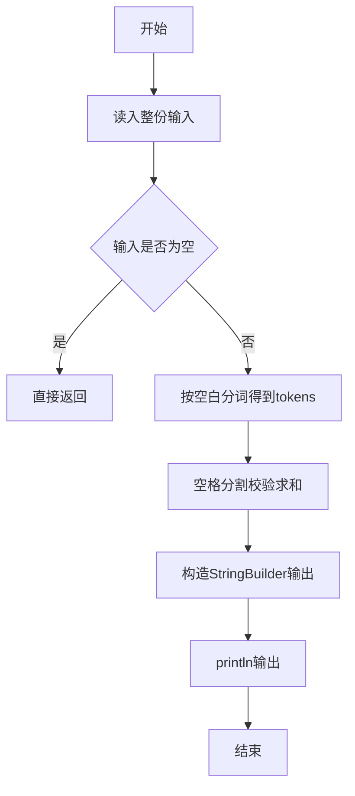
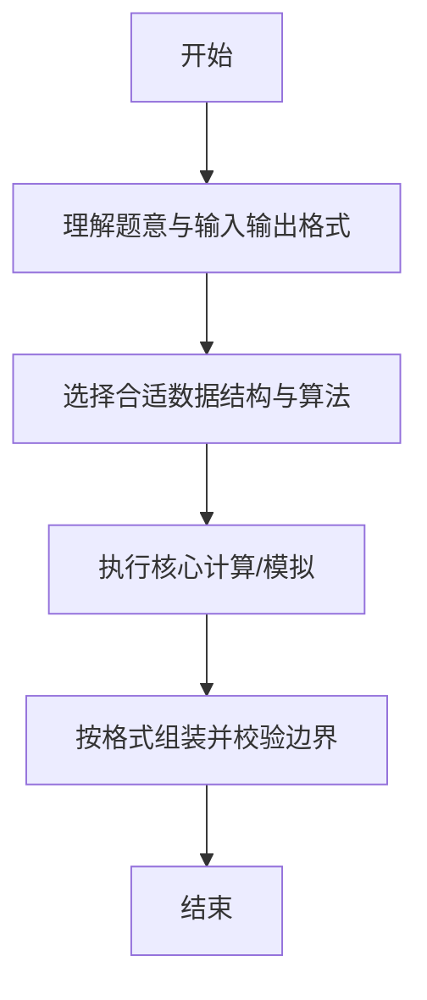

# L1-025 - 正整数A+B（15 分）

- **时间限制**: 400 ms
- **内存限制**: 65536 KB
- **代码长度限制**: 16 KB

---

## 题目描述


题的目标很简单，就是求两个正整数`A`和`B`的和，其中`A`和`B`都在区间[1,1000]。稍微有点麻烦的是，输入并不保证是两个正整数。

### 输入格式:

输入在一行给出`A`和`B`，其间以空格分开。问题是`A`和`B`不一定是满足要求的正整数，有时候可能是超出范围的数字、负数、带小数点的实数、甚至是一堆乱码。

注意：我们把输入中出现的第1个空格认为是`A`和`B`的分隔。题目保证至少存在一个空格，并且`B`不是一个空字符串。

### 输出格式:

如果输入的确是两个正整数，则按格式`A + B = 和`输出。如果某个输入不合要求，则在相应位置输出`?`，显然此时和也是`?`。

### 输入样例 1：
```in
123 456
```

### 输出样例 1：
```out
123 + 456 = 579
```

### 输入样例 2：
```in
22. 18
```

### 输出样例 2：
```out
? + 18 = ?
```

### 输入样例 3：
```in
-100 blabla bla...33
```

### 输出样例 3：
```out
? + ? = ?
```

## 示例

### 示例 1

**输入:**
```
123 456
```

**输出:**
```
123 + 456 = 579
```

### 示例 2

**输入:**
```
22. 18
```

**输出:**
```
? + 18 = ?
```

### 示例 3

**输入:**
```
-100 blabla bla...33
```

**输出:**
```
? + ? = ?
```

--

### 解题思路

#### 题目分析
题目“L1-025 - 正整数A+B（15 分）”的任务是：题的目标很简单，就是求两个正整数 A 和 B 的和，其中 A 和 B 都在区间[1,1000]。稍微有点麻烦的是，输入并不保证是两个正整数。。输入需考虑空行、首尾空白以及多空格分隔的容错；输出要求严格按样例格式，数字、空格与换行均不可偏差。边界上要处理 极值、零值与符号位 等情况，仓颉实现中通过 `readToEnd` / `readln` 配合 `trimAscii` 与 `isEmpty` 提前返回来规避空指针。

#### 核心算法
按首个空格分割 A、B 子串，分别按 1..1000 整数校验并格式化输出。以 `toRuneArray` 按 Rune 遍历，确保多字节字符安全。实现上先将整份输入按空白分词为 `tokens`/`lines`，用 `Int64.parse` 解析数值，随后按题意执行核心循环与条件分支。该思路与 L1-025 的仓颉源码逻辑一一对应，体现了从暴力到必要的剪枝。

#### 复杂度分析
- **时间复杂度**：O(n)
- **空间复杂度**：O(n)

### 代码流程说明

1. 通过 `getStdIn().readToEnd()`/`readln` 读入全部输入，`trimAscii` 判空，若为空则直接 `return`。
2. 按空白符（空格、换行、制表）遍历 `toRuneArray()` 切分得到 `tokens`/`lines`，并过滤空串。
3. 用 `Int64.parse` 解析首个或多个数值（视题目而定），初始化计数器、集合或累加变量。
4. 执行核心逻辑——空格分割校验求和：对应源码中的主循环/条件（如 `while`/`for`、`if` 分支、集合查表或公式计算）。
5. 将结果按题面要求的格式组装到 `StringBuilder`，处理对齐、分隔符与多行换行。
6. 调用 `println` 一次性输出最终字符串并结束 `main`。

### 代码实现

仓颉代码实现如下：

```cangjie
// L1-025 正整数A+B - validate A and B by first space split
import std.env.*
import std.convert.*
func isValid(s: String): Bool {
    if (s.size == 0) { return false }
    for (c in s.toRuneArray()) {
        if (c < r'0' || c > r'9') { return false }
    }
    let v = Int64.parse(s)
    if (v < 1 || v > 1000) { return false }
    return true
}
main() {
    let cin = getStdIn()
    let all = cin.readToEnd() ?? ""
    var line = ""
    for (c in all.toRuneArray()) {
        if (c == r'\n' || c == r'\r') { break }
        line += c.toString()
    }
    let runes = line.toRuneArray()
    var pos: Int64 = -1
    var i: Int64 = 0
    while (i < runes.size) {
        if (runes[i] == r' ') { pos = i; break }
        i += 1
    }
    var aStr = ""
    var bStr = ""
    if (pos == -1) {
        aStr = line
        bStr = ""
    } else {
        var j: Int64 = 0
        while (j < pos) { aStr += runes[j].toString(); j += 1 }
        j = pos + 1
        while (j < runes.size) { bStr += runes[j].toString(); j += 1 }
    }
    let aOk = isValid(aStr)
    let bOk = isValid(bStr)
    var outA: String = "?"
    var outB: String = "?"
    var outSum: String = "?"
    if (aOk) { outA = aStr }
    if (bOk) { outB = bStr }
    if (aOk && bOk) {
        let av = Int64.parse(aStr)
        let bv = Int64.parse(bStr)
        outSum = "${av + bv}"
    }
    println("${outA} + ${outB} = ${outSum}")
}
```

### 代码流程图



### 解题流程图



