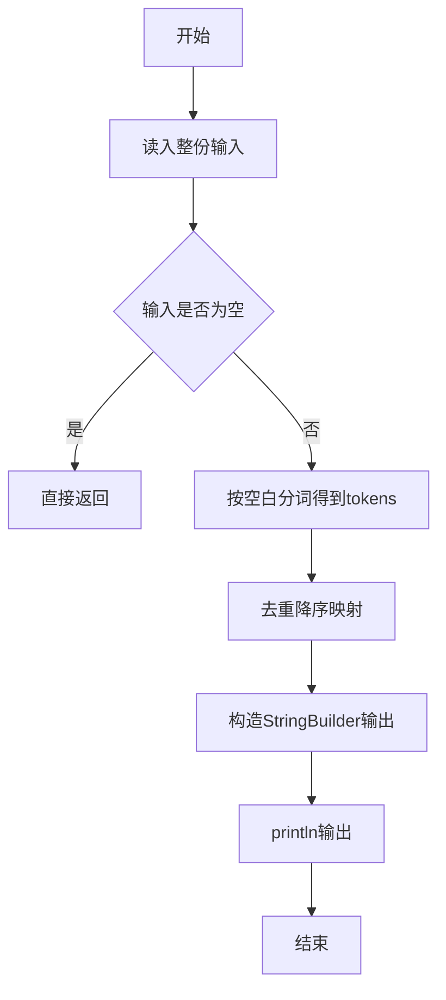
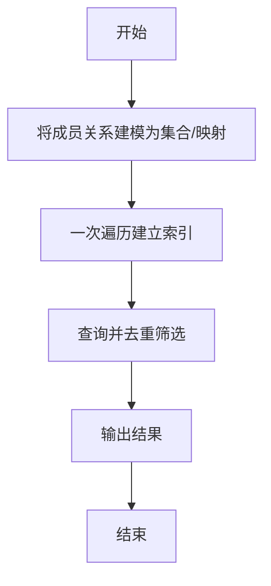

# L1-027 - 出租（20 分）

- **时间限制**: 400 ms
- **内存限制**: 65536 KB
- **代码长度限制**: 16 KB

---

## 题目描述


下面是新浪微博上曾经很火的一张图：


一时间网上一片求救声，急问这个怎么破。其实这段代码很简单，`index`数组就是`arr`数组的下标，`index[0]=2` 对应 `arr[2]=1`，`index[1]=0` 对应 `arr[0]=8`，`index[2]=3` 对应 `arr[3]=0`，以此类推…… 很容易得到电话号码是`18013820100`。

本题要求你编写一个程序，为任何一个电话号码生成这段代码 —— 事实上，只要生成最前面两行就可以了，后面内容是不变的。

### 输入格式:

输入在一行中给出一个由11位数字组成的手机号码。

### 输出格式:

为输入的号码生成代码的前两行，其中`arr`中的数字必须按递减顺序给出。

### 输入样例:
```in
18013820100
```

### 输出样例:
```out
int[] arr = new int[]{8,3,2,1,0};
int[] index = new int[]{3,0,4,3,1,0,2,4,3,4,4};
```

## 示例

### 示例 1

**输入:**
```
18013820100
```

**输出:**
```
int[] arr = new int[]{8,3,2,1,0};
int[] index = new int[]{3,0,4,3,1,0,2,4,3,4,4};
```

--

### 解题思路

#### 题目分析
题目“L1-027 - 出租（20 分）”的任务是：下面是新浪微博上曾经很火的一张图：  一时间网上一片求救声，急问这个怎么破。其实这段代码很简单， index 数组就是 arr 数组的下标， index[0]=2  对应  arr[2]=1 ， index[1]=0。输入需考虑空行、首尾空白以及多空格分隔的容错；输出要求严格按样例格式，数字、空格与换行均不可偏差。边界上要处理 极值、零值与符号位 等情况，仓颉实现中通过 `readToEnd` / `readln` 配合 `trimAscii` 与 `isEmpty` 提前返回来规避空指针。

#### 核心算法
电话号码去重后按数字大小降序映射为 0..n-1 索引并输出编码。使用 `StringBuilder` 缓冲拼接以减少重复分配。实现上先将整份输入按空白分词为 `tokens`/`lines`，用 `Int64.parse` 解析数值，随后按题意执行核心循环与条件分支。该思路与 L1-027 的仓颉源码逻辑一一对应，体现了从暴力到必要的剪枝。

#### 复杂度分析
- **时间复杂度**：O(n log n)
- **空间复杂度**：O(n)

### 代码流程说明

1. 通过 `getStdIn().readToEnd()`/`readln` 读入全部输入，`trimAscii` 判空，若为空则直接 `return`。
2. 按空白符（空格、换行、制表）遍历 `toRuneArray()` 切分得到 `tokens`/`lines`，并过滤空串。
3. 用 `Int64.parse` 解析首个或多个数值（视题目而定），初始化计数器、集合或累加变量。
4. 执行核心逻辑——去重降序映射：对应源码中的主循环/条件（如 `while`/`for`、`if` 分支、集合查表或公式计算）。
5. 将结果按题面要求的格式组装到 `StringBuilder`，处理对齐、分隔符与多行换行。
6. 调用 `println` 一次性输出最终字符串并结束 `main`。

### 代码实现

仓颉代码实现如下：

```cangjie
// L1-027 出租 - arr descending unique digits, index mapping
import std.env.*
main() {
    let cin = getStdIn()
    let all = cin.readToEnd() ?? ""
    var phone = ""
    for (c in all.toRuneArray()) {
        if (c >= r'0' && c <= r'9') { phone += c.toString() }
        else if (c == r'\n' || c == r'\r') {
            if (phone.size > 0) { break }
        }
    }
    if (phone.size == 0) { phone = all.trimAscii() }
    var present = Array<Bool>(10, repeat: false)
    for (c in phone.toRuneArray()) {
        if (c >= r'0' && c <= r'9') {
            // digit value via offset from '0'
            var d: Int64 = 0
            if (c == r'0') { d = 0 } else if (c == r'1') { d = 1 } else if (c == r'2') { d = 2 }
            else if (c == r'3') { d = 3 } else if (c == r'4') { d = 4 } else if (c == r'5') { d = 5 }
            else if (c == r'6') { d = 6 } else if (c == r'7') { d = 7 } else if (c == r'8') { d = 8 }
            else if (c == r'9') { d = 9 }
            present[d] = true
        }
    }
    var arrVals = Array<Int64>(0, repeat: 0)
    var d: Int64 = 9
    while (d >= 0) {
        if (present[d]) {
            var tmp = Array<Int64>(arrVals.size + 1, repeat: 0)
            var k: Int64 = 0
            while (k < arrVals.size) { tmp[k] = arrVals[k]; k += 1 }
            tmp[arrVals.size] = d
            arrVals = tmp
        }
        d -= 1
    }
    var digitToIdx = Array<Int64>(10, repeat: -1)
    var idx: Int64 = 0
    while (idx < arrVals.size) {
        let dig = arrVals[idx]
        digitToIdx[dig] = idx
        idx += 1
    }
    var sbArr = StringBuilder()
    sbArr.append("int[] arr = new int[]{")
    var k: Int64 = 0
    while (k < arrVals.size) {
        if (k > 0) { sbArr.append(",") }
        sbArr.append(arrVals[k])
        k += 1
    }
    sbArr.append("};")
    println(sbArr.toString())
    var sbIdx = StringBuilder()
    sbIdx.append("int[] index = new int[]{")
    let runes = phone.toRuneArray()
    var p: Int64 = 0
    while (p < runes.size) {
        if (p > 0) { sbIdx.append(",") }
        let c = runes[p]
        var dig: Int64 = 0
        if (c == r'0') { dig = 0 } else if (c == r'1') { dig = 1 } else if (c == r'2') { dig = 2 }
        else if (c == r'3') { dig = 3 } else if (c == r'4') { dig = 4 } else if (c == r'5') { dig = 5 }
        else if (c == r'6') { dig = 6 } else if (c == r'7') { dig = 7 } else if (c == r'8') { dig = 8 }
        else if (c == r'9') { dig = 9 }
        let id = digitToIdx[dig]
        sbIdx.append(id)
        p += 1
    }
    sbIdx.append("};")
    println(sbIdx.toString())
}
```

### 代码流程图



### 解题流程图



