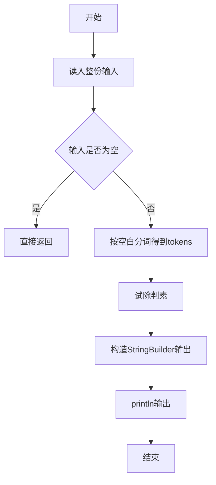
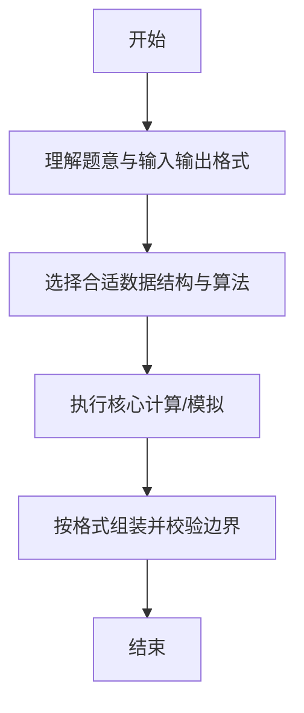

# L1-028 - 判断素数（10 分）

- **时间限制**: 400 ms
- **内存限制**: 65536 KB
- **代码长度限制**: 16 KB

---

## 题目描述


本题的目标很简单，就是判断一个给定的正整数是否素数。

### 输入格式:

输入在第一行给出一个正整数`N`（$$\le$$ 10），随后`N`行，每行给出一个小于$$2^{31}$$的需要判断的正整数。

### 输出格式:

对每个需要判断的正整数，如果它是素数，则在一行中输出`Yes`，否则输出`No`。

### 输入样例:
```in
2
11
111
```

### 输出样例:
```out
Yes
No
```

## 示例

### 示例 1

**输入:**
```
2
11
111
```

**输出:**
```
Yes
No
```

--

### 解题思路

#### 题目分析
题目“L1-028 - 判断素数（10 分）”的任务是：本题的目标很简单，就是判断一个给定的正整数是否素数。。输入需考虑空行、首尾空白以及多空格分隔的容错；输出要求严格按样例格式，数字、空格与换行均不可偏差。边界上要处理 极值、零值与符号位 等情况，仓颉实现中通过 `readToEnd` / `readln` 配合 `trimAscii` 与 `isEmpty` 提前返回来规避空指针。

#### 核心算法
试除至 sqrt(n) 判断素数，处理 0/1 边界。以 `toRuneArray` 按 Rune 遍历，确保多字节字符安全。实现上先将整份输入按空白分词为 `tokens`/`lines`，用 `Int64.parse` 解析数值，随后按题意执行核心循环与条件分支。该思路与 L1-028 的仓颉源码逻辑一一对应，体现了从暴力到必要的剪枝。

#### 复杂度分析
- **时间复杂度**：O(sqrt(n))
- **空间复杂度**：O(1)

### 代码流程说明

1. 通过 `getStdIn().readToEnd()`/`readln` 读入全部输入，`trimAscii` 判空，若为空则直接 `return`。
2. 按空白符（空格、换行、制表）遍历 `toRuneArray()` 切分得到 `tokens`/`lines`，并过滤空串。
3. 用 `Int64.parse` 解析首个或多个数值（视题目而定），初始化计数器、集合或累加变量。
4. 执行核心逻辑——试除判素：对应源码中的主循环/条件（如 `while`/`for`、`if` 分支、集合查表或公式计算）。
5. 循环内部进行整除/取模/试除判定，维护最优解的起点与长度。
6. 将结果按题面要求的格式组装到 `StringBuilder`，处理对齐、分隔符与多行换行。
7. 调用 `println` 一次性输出最终字符串并结束 `main`。

### 代码实现

仓颉代码实现如下：

```cangjie
// L1-028 判断素数 - trial division up to sqrt
import std.env.*
import std.convert.*
import std.math.*
func isPrime(n: Int64): Bool {
    if (n <= 1) { return false }
    if (n == 2) { return true }
    if (n % 2 == 0) { return false }
    let fn = Float64(n)
    let r = sqrt(fn)
    var limit = Int64(r) + 1
    var i: Int64 = 3
    while (i <= limit) {
        if (n % i == 0) { return false }
        i += 2
    }
    return true
}
main() {
    let cin = getStdIn()
    let all = cin.readToEnd() ?? ""
    var norm = ""
    for (c in all.toRuneArray()) {
        if (c == r'\n' || c == r'\r' || c == r'\t') { norm += " " } else { norm += c.toString() }
    }
    let parts = norm.split(" ")
    var toks = Array<String>(0, repeat: "")
    for (p in parts) {
        if (p.trimAscii().size > 0) {
            var tmp = Array<String>(toks.size + 1, repeat: "")
            var i: Int64 = 0
            while (i < toks.size) { tmp[i] = toks[i]; i += 1 }
            tmp[toks.size] = p.trimAscii()
            toks = tmp
        }
    }
    if (toks.size == 0) { return }
    let n = Int64.parse(toks[0])
    var i: Int64 = 1
    var cnt: Int64 = 0
    while (cnt < n && i < toks.size) {
        let v = Int64.parse(toks[i])
        if (isPrime(v)) { println("Yes") } else { println("No") }
        cnt += 1
        i += 1
    }
}
```

### 代码流程图



### 解题流程图



