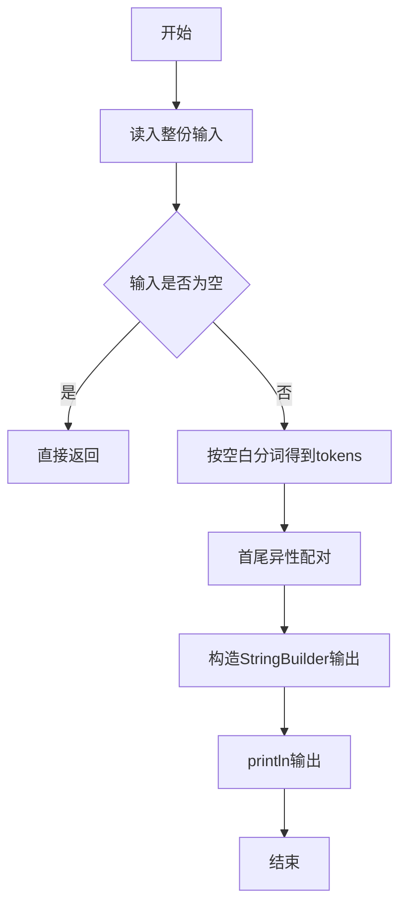
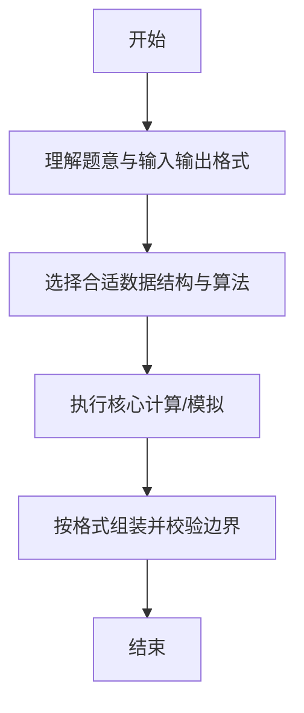

# L1-030 - 一帮一（15 分）

- **时间限制**: 400 ms
- **内存限制**: 65536 KB
- **代码长度限制**: 16 KB

---

## 题目描述


“一帮一学习小组”是中小学中常见的学习组织方式，老师把学习成绩靠前的学生跟学习成绩靠后的学生排在一组。本题就请你编写程序帮助老师自动完成这个分配工作，即在得到全班学生的排名后，在当前尚未分组的学生中，将名次最靠前的学生与名次最靠后的**异性**学生分为一组。

### 输入格式:

输入第一行给出正偶数`N`（$$\le$$50），即全班学生的人数。此后`N`行，按照名次从高到低的顺序给出每个学生的性别（0代表女生，1代表男生）和姓名（不超过8个英文字母的非空字符串），其间以1个空格分隔。这里保证本班男女比例是1:1，并且没有并列名次。

### 输出格式:

每行输出一组两个学生的姓名，其间以1个空格分隔。名次高的学生在前，名次低的学生在后。小组的输出顺序按照前面学生的名次从高到低排列。

### 输入样例:
```in
8
0 Amy
1 Tom
1 Bill
0 Cindy
0 Maya
1 John
1 Jack
0 Linda
```

### 输出样例:
```out
Amy Jack
Tom Linda
Bill Maya
Cindy John
```

## 示例

### 示例 1

**输入:**
```
8
0 Amy
1 Tom
1 Bill
0 Cindy
0 Maya
1 John
1 Jack
0 Linda
```

**输出:**
```
Amy Jack
Tom Linda
Bill Maya
Cindy John
```

--

### 解题思路

#### 题目分析
题目“L1-030 - 一帮一（15 分）”的任务是：“一帮一学习小组”是中小学中常见的学习组织方式，老师把学习成绩靠前的学生跟学习成绩靠后的学生排在一组。本题就请你编写程序帮助老师自动完成这个分配工作，即在得到全班学生的排名后，在当前尚未分组的学生中，将名次最靠前的学生与名次最靠后的 异性。输入需考虑空行、首尾空白以及多空格分隔的容错；输出要求严格按样例格式，数字、空格与换行均不可偏差。边界上要处理 极值、零值与符号位 等情况，仓颉实现中通过 `readToEnd` / `readln` 配合 `trimAscii` 与 `isEmpty` 提前返回来规避空指针。

#### 核心算法
双指针 front 从前往后，back 从后往前找异性未配对者配对输出。以 `toRuneArray` 按 Rune 遍历，确保多字节字符安全。实现上先将整份输入按空白分词为 `tokens`/`lines`，用 `Int64.parse` 解析数值，随后按题意执行核心循环与条件分支。该思路与 L1-030 的仓颉源码逻辑一一对应，体现了从暴力到必要的剪枝。

#### 复杂度分析
- **时间复杂度**：O(n²)
- **空间复杂度**：O(n)

### 代码流程说明

1. 通过 `getStdIn().readToEnd()`/`readln` 读入全部输入，`trimAscii` 判空，若为空则直接 `return`。
2. 按空白符（空格、换行、制表）遍历 `toRuneArray()` 切分得到 `tokens`/`lines`，并过滤空串。
3. 用 `Int64.parse` 解析首个或多个数值（视题目而定），初始化计数器、集合或累加变量。
4. 执行核心逻辑——首尾异性配对：对应源码中的主循环/条件（如 `while`/`for`、`if` 分支、集合查表或公式计算）。
5. 将结果按题面要求的格式组装到 `StringBuilder`，处理对齐、分隔符与多行换行。
6. 调用 `println` 一次性输出最终字符串并结束 `main`。

### 代码实现

仓颉代码实现如下：

```cangjie
// L1-030 一帮一 - pair highest with lowest opposite gender
import std.env.*
import std.convert.*
main() {
    let cin = getStdIn()
    var lines = Array<String>(0, repeat: "")
    while (let Some(line) <- cin.readln()) {
        var s = line
        // strip trailing \r
        if (s.size > 0) {
            let ra = s.toRuneArray()
            if (ra[ra.size - 1] == r'\r') {
                var t = ""
                var k: Int64 = 0
                while (k < ra.size - 1) { t += ra[k].toString(); k += 1 }
                s = t
            }
        }
        // keep lines including empty? but skip leading empties
        var tmp = Array<String>(lines.size + 1, repeat: "")
        var i: Int64 = 0
        while (i < lines.size) { tmp[i] = lines[i]; i += 1 }
        tmp[lines.size] = s
        lines = tmp
    }
    // remove leading empty lines if any
    var start: Int64 = 0
    while (start < lines.size && lines[start].trimAscii().size == 0) { start += 1 }
    if (start >= lines.size) { return }
    // shift if start>0
    if (start > 0) {
        var newLines = Array<String>(lines.size - start, repeat: "")
        var i: Int64 = 0
        while (i < newLines.size) { newLines[i] = lines[start + i]; i += 1 }
        lines = newLines
    }
    if (lines.size == 0) { return }
    let n = Int64.parse(lines[0].trimAscii())
    var genders = Array<Int64>(n, repeat: 0)
    var names = Array<String>(n, repeat: "")
    var i: Int64 = 0
    while (i < n) {
        let idx = i + 1
        if (idx >= lines.size) { break }
        let line = lines[idx]
        let ra = line.toRuneArray()
        var sp: Int64 = -1
        var k: Int64 = 0
        while (k < ra.size) {
            if (ra[k] == r' ') { sp = k; break }
            k += 1
        }
        var gs = ""
        var nm = ""
        if (sp == -1) {
            gs = line.trimAscii()
        } else {
            var t: Int64 = 0
            while (t < sp) { gs += ra[t].toString(); t += 1 }
            t = sp + 1
            while (t < ra.size) { nm += ra[t].toString(); t += 1 }
            nm = nm.trimAscii()
        }
        genders[i] = Int64.parse(gs.trimAscii())
        names[i] = nm
        i += 1
    }
    var used = Array<Bool>(n, repeat: false)
    var front: Int64 = 0
    while (front < n) {
        if (used[front]) { front += 1; continue }
        var back: Int64 = n - 1
        var found: Int64 = -1
        while (back > front) {
            if (!used[back] && genders[back] != genders[front]) { found = back; break }
            back -= 1
        }
        if (found != -1) {
            println("${names[front]} ${names[found]}")
            used[front] = true
            used[found] = true
        } else {
            used[front] = true
        }
        front += 1
    }
}
```

### 代码流程图



### 解题流程图



