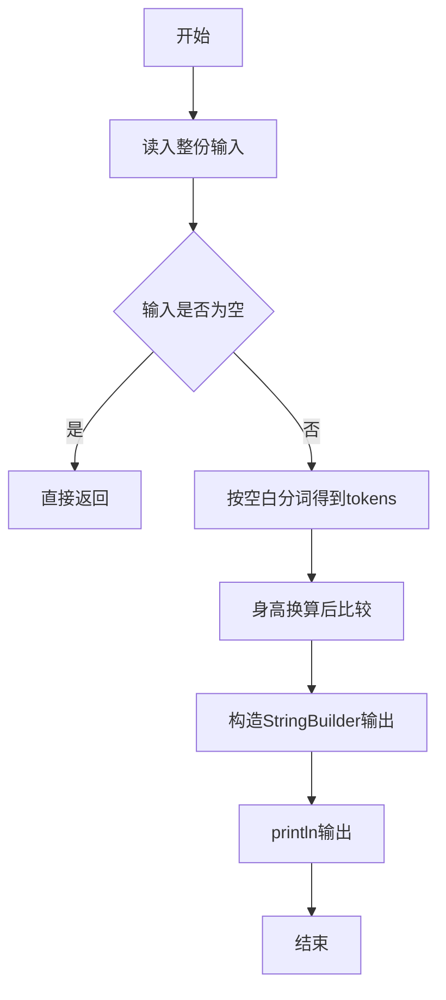
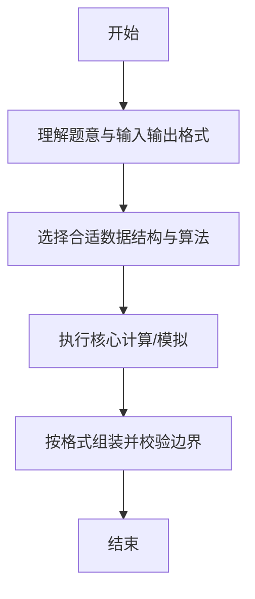

# L1-031 - 到底是不是太胖了（10 分）

- **时间限制**: 400 ms
- **内存限制**: 65536 KB
- **代码长度限制**: 16 KB

---

## 题目描述


据说一个人的标准体重应该是其身高（单位：厘米）减去100、再乘以0.9所得到的公斤数。真实体重与标准体重误差在10%以内都是完美身材（即 | 真实体重 $$-$$ 标准体重 | $$<$$ 标准体重$$\times 10\%$$）。已知 1 公斤等于 2 市斤。现给定一群人的身高和实际体重，请你告诉他们是否太胖或太瘦了。

### 输入格式:

输入第一行给出一个正整数`N`（$$\le$$ 20）。随后`N`行，每行给出两个整数，分别是一个人的身高`H`（120 $$<$$ `H` $$<$$ 200；单位：厘米）和真实体重`W`（50 $$<$$ `W` $$\le$$ 300；单位：市斤），其间以空格分隔。

### 输出格式:

为每个人输出一行结论：如果是完美身材，输出`You are wan mei!`；如果太胖了，输出`You are tai pang le!`；否则输出`You are tai shou le!`。

### 输入样例:
```in
3
169 136
150 81
178 155
```

### 输出样例:
```out
You are wan mei!
You are tai shou le!
You are tai pang le!
```

## 示例

### 示例 1

**输入:**
```
3
169 136
150 81
178 155
```

**输出:**
```
You are wan mei!
You are tai shou le!
You are tai pang le!
```

--

### 解题思路

#### 题目分析
题目“L1-031 - 到底是不是太胖了（10 分）”的任务是：据说一个人的标准体重应该是其身高（单位：厘米）减去100、再乘以0.9所得到的公斤数。真实体重与标准体重误差在10%以内都是完美身材（即 | 真实体重  -  标准体重 |  <  标准体重 \times 10\% ）。已知 1 公斤等于。输入需考虑空行、首尾空白以及多空格分隔的容错；输出要求严格按样例格式，数字、空格与换行均不可偏差。边界上要处理 极值、零值与符号位 等情况，仓颉实现中通过 `readToEnd` / `readln` 配合 `trimAscii` 与 `isEmpty` 提前返回来规避空指针。

#### 核心算法
与 L1-029 相同公式但输入身高为米，需额外单位换算。以 `toRuneArray` 按 Rune 遍历，确保多字节字符安全。实现上先将整份输入按空白分词为 `tokens`/`lines`，用 `Int64.parse` 解析数值，随后按题意执行核心循环与条件分支。该思路与 L1-031 的仓颉源码逻辑一一对应，体现了从暴力到必要的剪枝。

#### 复杂度分析
- **时间复杂度**：O(1)
- **空间复杂度**：O(1)

### 代码流程说明

1. 通过 `getStdIn().readToEnd()`/`readln` 读入全部输入，`trimAscii` 判空，若为空则直接 `return`。
2. 按空白符（空格、换行、制表）遍历 `toRuneArray()` 切分得到 `tokens`/`lines`，并过滤空串。
3. 用 `Int64.parse` 解析首个或多个数值（视题目而定），初始化计数器、集合或累加变量。
4. 执行核心逻辑——身高换算后比较：对应源码中的主循环/条件（如 `while`/`for`、`if` 分支、集合查表或公式计算）。
5. 将结果按题面要求的格式组装到 `StringBuilder`，处理对齐、分隔符与多行换行。
6. 调用 `println` 一次性输出最终字符串并结束 `main`。

### 代码实现

仓颉代码实现如下：

```cangjie
// L1-031 到底是不是太胖了 - compare with 10% tolerance
import std.env.*
import std.convert.*
import std.math.*
main() {
    let cin = getStdIn()
    var lines = Array<String>(0, repeat: "")
    while (let Some(line) <- cin.readln()) {
        if (line.trimAscii().size == 0) { continue }
        var tmp = Array<String>(lines.size + 1, repeat: "")
        var i: Int64 = 0
        while (i < lines.size) { tmp[i] = lines[i]; i += 1 }
        tmp[lines.size] = line.trimAscii()
        lines = tmp
    }
    if (lines.size == 0) { return }
    let n = Int64.parse(lines[0])
    var idx: Int64 = 1
    var cnt: Int64 = 0
    while (cnt < n && idx < lines.size) {
        let line = lines[idx]
        var parts = Array<String>(0, repeat: "")
        var norm = ""
        for (c in line.toRuneArray()) {
            if (c == r'\t') { norm += " " } else { norm += c.toString() }
        }
        let toks = norm.split(" ")
        for (p in toks) {
            if (p.trimAscii().size > 0) {
                var tmp2 = Array<String>(parts.size + 1, repeat: "")
                var k: Int64 = 0
                while (k < parts.size) { tmp2[k] = parts[k]; k += 1 }
                tmp2[parts.size] = p.trimAscii()
                parts = tmp2
            }
        }
        if (parts.size >= 2) {
            let h = Int64.parse(parts[0])
            let w = Int64.parse(parts[1])
            let stdW = (Float64(h) - 100.0) * 0.9 * 2.0
            let diff = Float64(w) - stdW
            let tol = stdW * 0.1
            let ad = abs(diff)
            if (ad < tol) {
                println("You are wan mei!")
            } else if (diff > 0.0) {
                println("You are tai pang le!")
            } else {
                println("You are tai shou le!")
            }
        }
        cnt += 1
        idx += 1
    }
}
```

### 代码流程图



### 解题流程图



