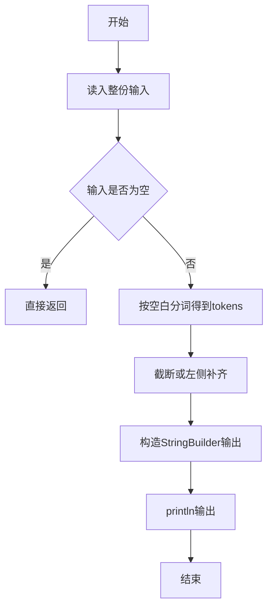
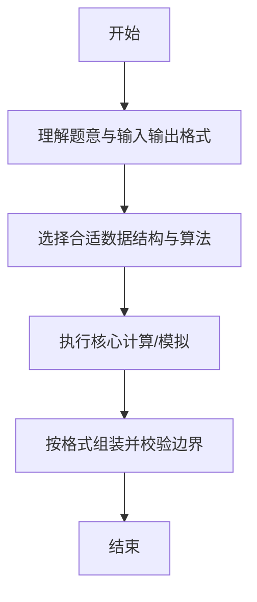

# L1-032 - Left-pad（20 分）

- **时间限制**: 400 ms
- **内存限制**: 65536 KB
- **代码长度限制**: 16 KB

---

## 题目描述


根据新浪微博上的消息，有一位开发者不满NPM（Node Package Manager）的做法，收回了自己的开源代码，其中包括一个叫left-pad的模块，就是这个模块把javascript里面的React/Babel干瘫痪了。这是个什么样的模块？就是在字符串前填充一些东西到一定的长度。例如用`*`去填充字符串`GPLT`，使之长度为10，调用left-pad的结果就应该是`******GPLT`。Node社区曾经对left-pad紧急发布了一个替代，被严重吐槽。下面就请你来实现一下这个模块。

### 输入格式:

输入在第一行给出一个正整数`N`（$$\le 10^4$$）和一个字符，分别是填充结果字符串的长度和用于填充的字符，中间以1个空格分开。第二行给出原始的非空字符串，以回车结束。

### 输出格式:

在一行中输出结果字符串。

### 输入样例 1：
```in
15 _
I love GPLT
```

### 输出样例 1：
```out
____I love GPLT
```

### 输入样例 2：
```in
4 *
this is a sample for cut
```

### 输出样例 2：
```out
cut
```

## 示例

### 示例 1

**输入:**
```
15 _
I love GPLT
```

**输出:**
```
____I love GPLT
```

### 示例 2

**输入:**
```
4 *
this is a sample for cut
```

**输出:**
```
cut
```

--

### 解题思路

#### 题目分析
题目“L1-032 - Left-pad（20 分）”的任务是：根据新浪微博上的消息，有一位开发者不满NPM（Node Package Manager）的做法，收回了自己的开源代码，其中包括一个叫left-pad的模块，就是这个模块把javascript里面的React/Babel干瘫痪了。这是个什么样。输入需考虑空行、首尾空白以及多空格分隔的容错；输出要求严格按样例格式，数字、空格与换行均不可偏差。边界上要处理 极值、零值与符号位 等情况，仓颉实现中通过 `readToEnd` / `readln` 配合 `trimAscii` 与 `isEmpty` 提前返回来规避空指针。

#### 核心算法
若字符串长度≥N截取末 N 位，否则左侧用指定字符补齐。以 `toRuneArray` 按 Rune 遍历，确保多字节字符安全。实现上先将整份输入按空白分词为 `tokens`/`lines`，用 `Int64.parse` 解析数值，随后按题意执行核心循环与条件分支。该思路与 L1-032 的仓颉源码逻辑一一对应，体现了从暴力到必要的剪枝。

#### 复杂度分析
- **时间复杂度**：O(N)
- **空间复杂度**：O(N)

### 代码流程说明

1. 通过 `getStdIn().readToEnd()`/`readln` 读入全部输入，`trimAscii` 判空，若为空则直接 `return`。
2. 按空白符（空格、换行、制表）遍历 `toRuneArray()` 切分得到 `tokens`/`lines`，并过滤空串。
3. 用 `Int64.parse` 解析首个或多个数值（视题目而定），初始化计数器、集合或累加变量。
4. 执行核心逻辑——截断或左侧补齐：对应源码中的主循环/条件（如 `while`/`for`、`if` 分支、集合查表或公式计算）。
5. 将结果按题面要求的格式组装到 `StringBuilder`，处理对齐、分隔符与多行换行。
6. 调用 `println` 一次性输出最终字符串并结束 `main`。

### 代码实现

仓颉代码实现如下：

```cangjie
// L1-032 Left-pad - pad or truncate
import std.env.*
import std.convert.*
main() {
    let cin = getStdIn()
    var first = ""
    var second = ""
    var idx: Int64 = 0
    while (let Some(line) <- cin.readln()) {
        var s = line
        if (s.size > 0) {
            let ra = s.toRuneArray()
            if (ra[ra.size - 1] == r'\r') {
                var t = ""
                var k: Int64 = 0
                while (k < ra.size - 1) { t += ra[k].toString(); k += 1 }
                s = t
            }
        }
        if (idx == 0) { first = s }
        else if (idx == 1) { second = s; break }
        idx += 1
    }
    let ra0 = first.toRuneArray()
    var pos: Int64 = -1
    var p: Int64 = 0
    while (p < ra0.size) {
        if (ra0[p] == r' ') { pos = p; break }
        p += 1
    }
    if (pos == -1) { return }
    var nStr = ""
    var q: Int64 = 0
    while (q < pos) { nStr += ra0[q].toString(); q += 1 }
    let n = Int64.parse(nStr.trimAscii())
    var padChar: Rune = r' '
    if (pos + 1 < ra0.size) { padChar = ra0[pos + 1] }
    let sRunes = second.toRuneArray()
    let len = sRunes.size
    if (len >= n) {
        var out = ""
        var start = len - n
        var k: Int64 = start
        while (k < len) { out += sRunes[k].toString(); k += 1 }
        println(out)
    } else {
        let padCount = n - len
        var out = ""
        var c: Int64 = 0
        while (c < padCount) { out += padChar.toString(); c += 1 }
        out += second
        println(out)
    }
}
```

### 代码流程图



### 解题流程图



