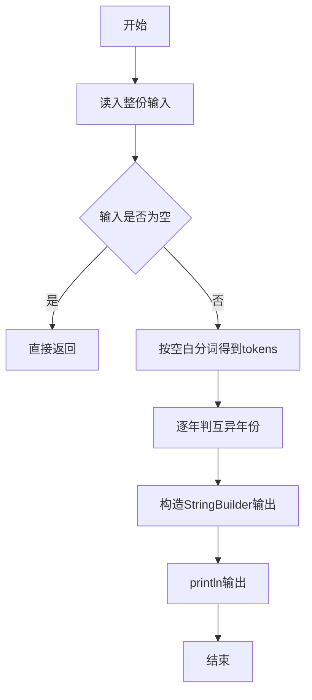
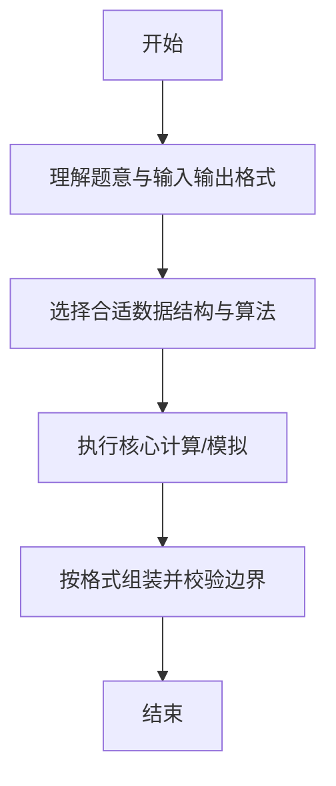

# L1-033 - 出生年（15 分）

- **时间限制**: 400 ms
- **内存限制**: 65536 KB
- **代码长度限制**: 16 KB

---

## 题目描述


以上是新浪微博中一奇葩贴：“我出生于1988年，直到25岁才遇到4个数字都不相同的年份。”也就是说，直到2013年才达到“4个数字都不相同”的要求。本题请你根据要求，自动填充“我出生于`y`年，直到`x`岁才遇到`n`个数字都不相同的年份”这句话。

### 输入格式:

输入在一行中给出出生年份`y`和目标年份中不同数字的个数`n`，其中`y`在[1, 3000]之间，`n`可以是2、或3、或4。注意不足4位的年份要在前面补零，例如公元1年被认为是0001年，有2个不同的数字0和1。

### 输出格式:

根据输入，输出`x`和能达到要求的年份。数字间以1个空格分隔，行首尾不得有多余空格。年份要按4位输出。注意：所谓“`n`个数字都不相同”是指不同的数字正好是`n`个。如“2013”被视为满足“4位数字都不同”的条件，但不被视为满足2位或3位数字不同的条件。

### 输入样例 1：
```in
1988 4
```

### 输出样例 1：
```out
25 2013
```

### 输入样例 2：
```in
1 2
```

### 输出样例 2：
```out
0 0001
```

## 示例

### 示例 1

**输入:**
```
1988 4
```

**输出:**
```
25 2013
```

### 示例 2

**输入:**
```
1 2
```

**输出:**
```
0 0001
```

--

### 解题思路

#### 题目分析
题目“L1-033 - 出生年（15 分）”的任务是： 以上是新浪微博中一奇葩贴：“我出生于1988年，直到25岁才遇到4个数字都不相同的年份。”也就是说，直到2013年才达到“4个数字都不相同”的要求。本题请你根据要求，自动填充“我出生于 y 年，直到 x 岁才遇到 n。输入需考虑空行、首尾空白以及多空格分隔的容错；输出要求严格按样例格式，数字、空格与换行均不可偏差。边界上要处理 极值、零值与符号位 等情况，仓颉实现中通过 `readToEnd` / `readln` 配合 `trimAscii` 与 `isEmpty` 提前返回来规避空指针。

#### 核心算法
从给定年份起逐年递增，用集合判4位数字互异。以 `toRuneArray` 按 Rune 遍历，确保多字节字符安全。实现上先将整份输入按空白分词为 `tokens`/`lines`，用 `Int64.parse` 解析数值，随后按题意执行核心循环与条件分支。该思路与 L1-033 的仓颉源码逻辑一一对应，体现了从暴力到必要的剪枝。

#### 复杂度分析
- **时间复杂度**：O(k)
- **空间复杂度**：O(1)

### 代码流程说明

1. 通过 `getStdIn().readToEnd()`/`readln` 读入全部输入，`trimAscii` 判空，若为空则直接 `return`。
2. 按空白符（空格、换行、制表）遍历 `toRuneArray()` 切分得到 `tokens`/`lines`，并过滤空串。
3. 用 `Int64.parse` 解析首个或多个数值（视题目而定），初始化计数器、集合或累加变量。
4. 执行核心逻辑——逐年判互异年份：对应源码中的主循环/条件（如 `while`/`for`、`if` 分支、集合查表或公式计算）。
5. 将结果按题面要求的格式组装到 `StringBuilder`，处理对齐、分隔符与多行换行。
6. 调用 `println` 一次性输出最终字符串并结束 `main`。

### 代码实现

仓颉代码实现如下：

```cangjie
// L1-033 出生年 - find year with n distinct digits, 4-digit zero padded
import std.env.*
import std.convert.*
func distinctCount(y: Int64): Int64 {
    var seen = Array<Bool>(10, repeat: false)
    var v = y
    var digits = Array<Int64>(4, repeat: 0)
    digits[3] = v % 10; v /= 10
    digits[2] = v % 10; v /= 10
    digits[1] = v % 10; v /= 10
    digits[0] = v % 10
    var k: Int64 = 0
    while (k < 4) { seen[digits[k]] = true; k += 1 }
    var cnt: Int64 = 0
    var d: Int64 = 0
    while (d < 10) { if (seen[d]) { cnt += 1 }; d += 1 }
    return cnt
}
func pad4(y: Int64): String {
    var s = "${y}"
    while (s.size < 4) { s = "0" + s }
    return s
}
main() {
    let cin = getStdIn()
    let all = cin.readToEnd() ?? ""
    var norm = ""
    for (c in all.toRuneArray()) {
        if (c == r'\n' || c == r'\r' || c == r'\t') { norm += " " } else { norm += c.toString() }
    }
    let parts = norm.split(" ")
    var toks = Array<String>(0, repeat: "")
    for (p in parts) {
        if (p.trimAscii().size > 0) {
            var tmp = Array<String>(toks.size + 1, repeat: "")
            var i: Int64 = 0
            while (i < toks.size) { tmp[i] = toks[i]; i += 1 }
            tmp[toks.size] = p.trimAscii()
            toks = tmp
        }
    }
    if (toks.size < 2) { return }
    let y = Int64.parse(toks[0])
    let n = Int64.parse(toks[1])
    var curY = y
    while (true) {
        if (distinctCount(curY) == n) { break }
        curY += 1
    }
    let age = curY - y
    println("${age} ${pad4(curY)}")
}
```

### 代码流程图



### 解题流程图



