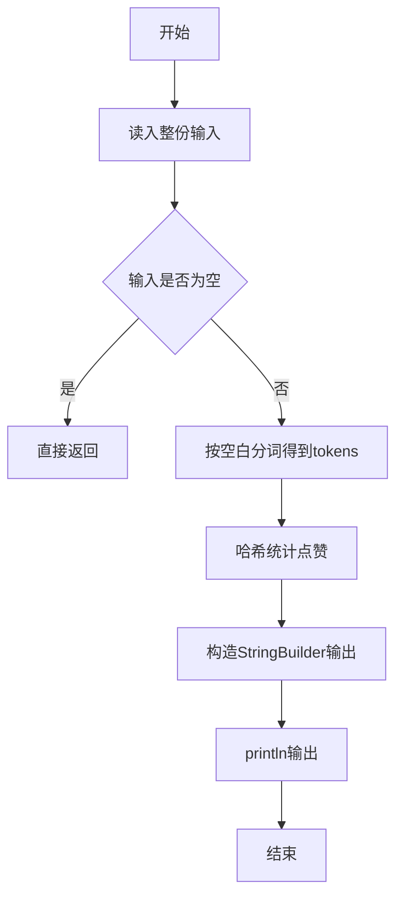
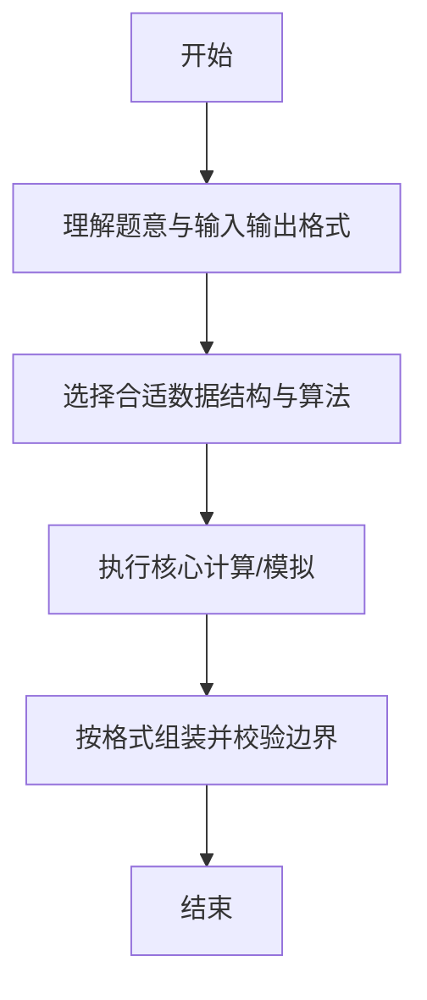

# L1-034 - 点赞（20 分）

- **时间限制**: 200 ms
- **内存限制**: 65536 KB
- **代码长度限制**: 16 KB

---

## 题目描述


微博上有个“点赞”功能，你可以为你喜欢的博文点个赞表示支持。每篇博文都有一些刻画其特性的标签，而你点赞的博文的类型，也间接刻画了你的特性。本题就要求你写个程序，通过统计一个人点赞的纪录，分析这个人的特性。

### 输入格式:

输入在第一行给出一个正整数$$N$$（$$\le 1000$$），是该用户点赞的博文数量。随后$$N$$行，每行给出一篇被其点赞的博文的特性描述，格式为“$$K$$ $$F_1\cdots F_K$$”，其中$$1\le K\le 10$$，$$F_i$$（$$i=1, \cdots , K$$）是特性标签的编号，我们将所有特性标签从1到1000编号。数字间以空格分隔。

### 输出格式:

统计所有被点赞的博文中最常出现的那个特性标签，在一行中输出它的编号和出现次数，数字间隔1个空格。如果有并列，则输出编号最大的那个。

### 输入样例:
```in
4
3 889 233 2
5 100 3 233 2 73
4 3 73 889 2
2 233 123
```

### 输出样例:
```out
233 3
```

## 示例

### 示例 1

**输入:**
```
4
3 889 233 2
5 100 3 233 2 73
4 3 73 889 2
2 233 123
```

**输出:**
```
233 3
```

--

### 解题思路

#### 题目分析
题目“L1-034 - 点赞（20 分）”的任务是：微博上有个“点赞”功能，你可以为你喜欢的博文点个赞表示支持。每篇博文都有一些刻画其特性的标签，而你点赞的博文的类型，也间接刻画了你的特性。本题就要求你写个程序，通过统计一个人点赞的纪录，分析这个人的特性。。输入需考虑空行、首尾空白以及多空格分隔的容错；输出要求严格按样例格式，数字、空格与换行均不可偏差。边界上要处理 极值、零值与符号位 等情况，仓颉实现中通过 `readToEnd` / `readln` 配合 `trimAscii` 与 `isEmpty` 提前返回来规避空指针。

#### 核心算法
用 HashMap 统计每个标签出现次数，找出最大值及对应标签。以 `toRuneArray` 按 Rune 遍历，确保多字节字符安全。实现上先将整份输入按空白分词为 `tokens`/`lines`，用 `Int64.parse` 解析数值，随后按题意执行核心循环与条件分支。该思路与 L1-034 的仓颉源码逻辑一一对应，体现了从暴力到必要的剪枝。

#### 复杂度分析
- **时间复杂度**：O(n)
- **空间复杂度**：O(n)

### 代码流程说明

1. 通过 `getStdIn().readToEnd()`/`readln` 读入全部输入，`trimAscii` 判空，若为空则直接 `return`。
2. 按空白符（空格、换行、制表）遍历 `toRuneArray()` 切分得到 `tokens`/`lines`，并过滤空串。
3. 用 `Int64.parse` 解析首个或多个数值（视题目而定），初始化计数器、集合或累加变量。
4. 执行核心逻辑——哈希统计点赞：对应源码中的主循环/条件（如 `while`/`for`、`if` 分支、集合查表或公式计算）。
5. 涉及集合/映射/矩阵结构时，预先分配 `Array`/`HashSet`/`HashMap` 并填充数据。
6. 将结果按题面要求的格式组装到 `StringBuilder`，处理对齐、分隔符与多行换行。
7. 调用 `println` 一次性输出最终字符串并结束 `main`。

### 代码实现

仓颉代码实现如下：

```cangjie
// L1-034 点赞 - most frequent tag, tie largest id
import std.env.*
import std.convert.*
main() {
    let cin = getStdIn()
    var lines = Array<String>(0, repeat: "")
    while (let Some(line) <- cin.readln()) {
        if (line.trimAscii().size == 0) { continue }
        var tmp = Array<String>(lines.size + 1, repeat: "")
        var i: Int64 = 0
        while (i < lines.size) { tmp[i] = lines[i]; i += 1 }
        tmp[lines.size] = line.trimAscii()
        lines = tmp
    }
    if (lines.size == 0) { return }
    let n = Int64.parse(lines[0])
    var cnt = Array<Int64>(1001, repeat: 0)
    var i: Int64 = 1
    var processed: Int64 = 0
    while (processed < n && i < lines.size) {
        let line = lines[i]
        var norm = ""
        for (c in line.toRuneArray()) {
            if (c == r'\t') { norm += " " } else { norm += c.toString() }
        }
        let toksRaw = norm.split(" ")
        var toks = Array<String>(0, repeat: "")
        for (p in toksRaw) {
            if (p.trimAscii().size > 0) {
                var tmp2 = Array<String>(toks.size + 1, repeat: "")
                var k: Int64 = 0
                while (k < toks.size) { tmp2[k] = toks[k]; k += 1 }
                tmp2[toks.size] = p.trimAscii()
                toks = tmp2
            }
        }
        if (toks.size > 0) {
            let k = Int64.parse(toks[0])
            var t: Int64 = 1
            while (t <= k && t < toks.size) {
                let tag = Int64.parse(toks[t])
                if (tag >= 0 && tag <= 1000) { cnt[tag] += 1 }
                t += 1
            }
        }
        processed += 1
        i += 1
    }
    var bestTag: Int64 = 0
    var bestCnt: Int64 = -1
    var tag: Int64 = 1
    while (tag <= 1000) {
        let c = cnt[tag]
        if (c > bestCnt || (c == bestCnt && tag > bestTag)) {
            bestCnt = c
            bestTag = tag
        }
        tag += 1
    }
    println("${bestTag} ${bestCnt}")
}
```

### 代码流程图



### 解题流程图



