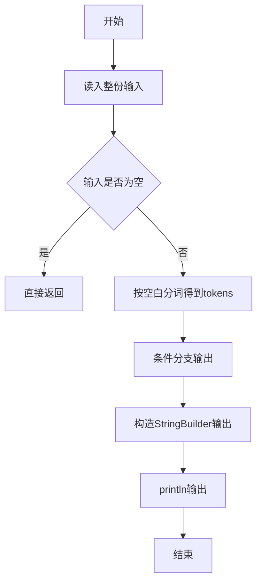
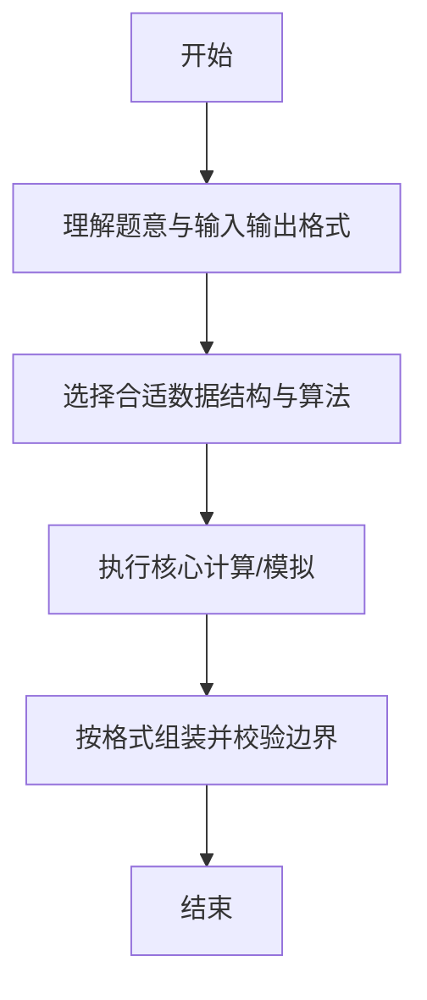

# L1-035 - 情人节（15 分）

- **时间限制**: 400 ms
- **内存限制**: 65536 KB
- **代码长度限制**: 16 KB

---

## 题目描述


以上是朋友圈中一奇葩贴：“2月14情人节了，我决定造福大家。第2个赞和第14个赞的，我介绍你俩认识…………咱三吃饭…你俩请…”。现给出此贴下点赞的朋友名单，请你找出那两位要请客的倒霉蛋。

### 输入格式:

输入按照点赞的先后顺序给出不知道多少个点赞的人名，每个人名占一行，为不超过10个英文字母的非空单词，以回车结束。一个英文句点`.`标志输入的结束，这个符号不算在点赞名单里。

### 输出格式:

根据点赞情况在一行中输出结论：若存在第2个人A和第14个人B，则输出“A and B are inviting you to dinner...”；若只有A没有B，则输出“A is the only one for you...”；若连A都没有，则输出“Momo... No one is for you ...”。

### 输入样例 1：
```in
GaoXZh
Magi
Einst
Quark
LaoLao
FatMouse
ZhaShen
fantacy
latesum
SenSen
QuanQuan
whatever
whenever
Potaty
hahaha
.
```

### 输出样例 1：
```out
Magi and Potaty are inviting you to dinner...
```

### 输入样例 2：
```in
LaoLao
FatMouse
whoever
.
```

### 输出样例 2：
```out
FatMouse is the only one for you...
```

### 输入样例 3：
```in
LaoLao
.
```

### 输出样例 3：
```out
Momo... No one is for you ...
```

## 示例

### 示例 1

**输入:**
```
GaoXZh
Magi
Einst
Quark
LaoLao
FatMouse
ZhaShen
fantacy
latesum
SenSen
QuanQuan
whatever
whenever
Potaty
hahaha
.
```

**输出:**
```
Magi and Potaty are inviting you to dinner...
```

### 示例 2

**输入:**
```
LaoLao
FatMouse
whoever
.
```

**输出:**
```
FatMouse is the only one for you...
```

### 示例 3

**输入:**
```
LaoLao
.
```

**输出:**
```
Momo... No one is for you ...
```

--

### 解题思路

#### 题目分析
题目“L1-035 - 情人节（15 分）”的任务是： 以上是朋友圈中一奇葩贴：“2月14情人节了，我决定造福大家。第2个赞和第14个赞的，我介绍你俩认识…………咱三吃饭…你俩请…”。现给出此贴下点赞的朋友名单，请你找出那两位要请客的倒霉蛋。。输入需考虑空行、首尾空白以及多空格分隔的容错；输出要求严格按样例格式，数字、空格与换行均不可偏差。边界上要处理 极值、零值与符号位 等情况，仓颉实现中通过 `readToEnd` / `readln` 配合 `trimAscii` 与 `isEmpty` 提前返回来规避空指针。

#### 核心算法
按特殊三元组优先级判断情人节结果分支输出。以 `toRuneArray` 按 Rune 遍历，确保多字节字符安全。实现上先将整份输入按空白分词为 `tokens`/`lines`，用 `Int64.parse` 解析数值，随后按题意执行核心循环与条件分支。该思路与 L1-035 的仓颉源码逻辑一一对应，体现了从暴力到必要的剪枝。

#### 复杂度分析
- **时间复杂度**：O(1)
- **空间复杂度**：O(1)

### 代码流程说明

1. 通过 `getStdIn().readToEnd()`/`readln` 读入全部输入，`trimAscii` 判空，若为空则直接 `return`。
2. 按空白符（空格、换行、制表）遍历 `toRuneArray()` 切分得到 `tokens`/`lines`，并过滤空串。
3. 用 `Int64.parse` 解析首个或多个数值（视题目而定），初始化计数器、集合或累加变量。
4. 执行核心逻辑——条件分支输出：对应源码中的主循环/条件（如 `while`/`for`、`if` 分支、集合查表或公式计算）。
5. 将结果按题面要求的格式组装到 `StringBuilder`，处理对齐、分隔符与多行换行。
6. 调用 `println` 一次性输出最终字符串并结束 `main`。

### 代码实现

仓颉代码实现如下：

```cangjie
// L1-035 情人节 - find 2nd and 14th names
import std.env.*
main() {
    let cin = getStdIn()
    var names = Array<String>(0, repeat: "")
    while (let Some(line) <- cin.readln()) {
        var s = line
        if (s.size > 0) {
            let ra = s.toRuneArray()
            if (ra[ra.size - 1] == r'\r') {
                var t = ""
                var k: Int64 = 0
                while (k < ra.size - 1) { t += ra[k].toString(); k += 1 }
                s = t
            }
        }
        s = s.trimAscii()
        if (s == ".") { break }
        if (s.size > 0) {
            var tmp = Array<String>(names.size + 1, repeat: "")
            var i: Int64 = 0
            while (i < names.size) { tmp[i] = names[i]; i += 1 }
            tmp[names.size] = s
            names = tmp
        }
    }
    let sz = names.size
    if (sz < 2) {
        println("Momo... No one is for you ...")
    } else if (sz < 14) {
        let a = names[1]
        println("${a} is the only one for you...")
    } else {
        let a = names[1]
        let b = names[13]
        println("${a} and ${b} are inviting you to dinner...")
    }
}
```

### 代码流程图



### 解题流程图



