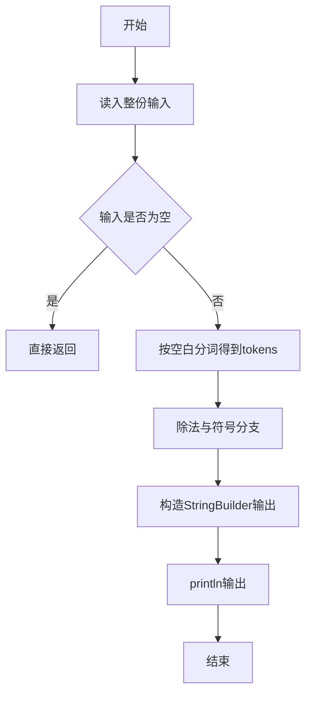
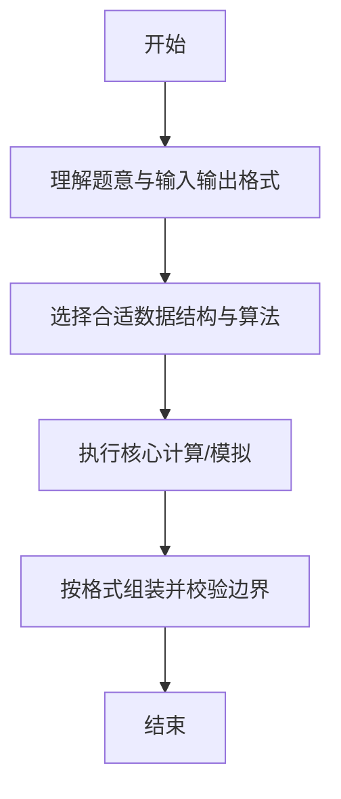

# L1-037 - A除以B（10 分）

- **时间限制**: 400 ms
- **内存限制**: 65536 KB
- **代码长度限制**: 16 KB

---

## 题目描述


真的是简单题哈 —— 给定两个绝对值不超过100的整数$$A$$和$$B$$，要求你按照“$$A/B=$$商”的格式输出结果。

### 输入格式:

输入在第一行给出两个整数$$A$$和$$B$$（$$-100 \le A, B \le 100$$），数字间以空格分隔。

### 输出格式:

在一行中输出结果：如果分母是正数，则输出“$$A/B=$$商”；如果分母是负数，则要用括号把分母括起来输出；如果分母为零，则输出的商应为`Error`。输出的商应保留小数点后2位。

### 输入样例 1：
```in
-1 2
```

### 输出样例 1：
```out
-1/2=-0.50
```

### 输入样例 2：
```in
1 -3
```

### 输出样例 2：
```out
1/(-3)=-0.33
```

### 输入样例 3：
```in
5 0
```

### 输出样例 3：
```out
5/0=Error
```

## 示例

### 示例 1

**输入:**
```
-1 2
```

**输出:**
```
-1/2=-0.50
```

### 示例 2

**输入:**
```
1 -3
```

**输出:**
```
1/(-3)=-0.33
```

### 示例 3

**输入:**
```
5 0
```

**输出:**
```
5/0=Error
```

--

### 解题思路

#### 题目分析
题目“L1-037 - A除以B（10 分）”的任务是：真的是简单题哈 —— 给定两个绝对值不超过100的整数 A 和 B ，要求你按照“ A/B= 商”的格式输出结果。。输入需考虑空行、首尾空白以及多空格分隔的容错；输出要求严格按样例格式，数字、空格与换行均不可偏差。边界上要处理 极值、零值与符号位 等情况，仓颉实现中通过 `readToEnd` / `readln` 配合 `trimAscii` 与 `isEmpty` 提前返回来规避空指针。

#### 核心算法
区分除数正负分支，输出商与余数的符号处理。以 `toRuneArray` 按 Rune 遍历，确保多字节字符安全。实现上先将整份输入按空白分词为 `tokens`/`lines`，用 `Int64.parse` 解析数值，随后按题意执行核心循环与条件分支。该思路与 L1-037 的仓颉源码逻辑一一对应，体现了从暴力到必要的剪枝。

#### 复杂度分析
- **时间复杂度**：O(1)
- **空间复杂度**：O(1)

### 代码流程说明

1. 通过 `getStdIn().readToEnd()`/`readln` 读入全部输入，`trimAscii` 判空，若为空则直接 `return`。
2. 按空白符（空格、换行、制表）遍历 `toRuneArray()` 切分得到 `tokens`/`lines`，并过滤空串。
3. 用 `Int64.parse` 解析首个或多个数值（视题目而定），初始化计数器、集合或累加变量。
4. 执行核心逻辑——除法与符号分支：对应源码中的主循环/条件（如 `while`/`for`、`if` 分支、集合查表或公式计算）。
5. 将结果按题面要求的格式组装到 `StringBuilder`，处理对齐、分隔符与多行换行。
6. 调用 `println` 一次性输出最终字符串并结束 `main`。

### 代码实现

仓颉代码实现如下：

```cangjie
// L1-037 A除以B - formatted division with 2 decimals
import std.env.*
import std.convert.*
func format2(q: Float64): String {
    var scaled: Int64 = 0
    if (q >= 0.0) {
        scaled = Int64(q * 100.0 + 0.5 + 1e-9)
    } else {
        scaled = Int64(q * 100.0 - 0.5 - 1e-9)
    }
    var neg = false
    if (scaled < 0) { neg = true; scaled = -scaled }
    let intPart = scaled / 100
    let fracPart = scaled % 100
    var fracStr = "${fracPart}"
    if (fracPart < 10) { fracStr = "0" + fracStr }
    var res = "${intPart}.${fracStr}"
    if (neg) { res = "-" + res }
    return res
}
main() {
    let cin = getStdIn()
    let all = cin.readToEnd() ?? ""
    var norm = ""
    for (c in all.toRuneArray()) {
        if (c == r'\n' || c == r'\r' || c == r'\t') { norm += " " } else { norm += c.toString() }
    }
    let parts = norm.split(" ")
    var toks = Array<String>(0, repeat: "")
    for (p in parts) {
        if (p.trimAscii().size > 0) {
            var tmp = Array<String>(toks.size + 1, repeat: "")
            var i: Int64 = 0
            while (i < toks.size) { tmp[i] = toks[i]; i += 1 }
            tmp[toks.size] = p.trimAscii()
            toks = tmp
        }
    }
    if (toks.size < 2) { return }
    let a = Int64.parse(toks[0])
    let b = Int64.parse(toks[1])
    if (b == 0) {
        println("${a}/0=Error")
        return
    }
    let q = Float64(a) / Float64(b)
    let qs = format2(q)
    if (b > 0) {
        println("${a}/${b}=${qs}")
    } else {
        println("${a}/(${b})=${qs}")
    }
}
```

### 代码流程图



### 解题流程图



