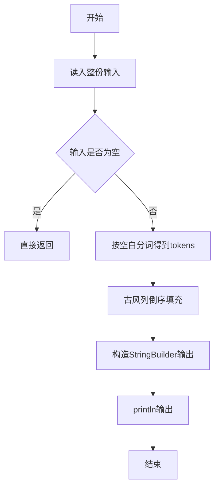
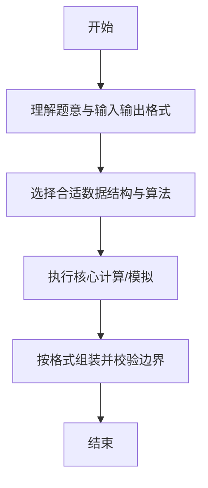

# L1-039 - 古风排版（20 分）

- **时间限制**: 400 ms
- **内存限制**: 65536 KB
- **代码长度限制**: 16 KB

---

## 题目描述


中国的古人写文字，是从右向左竖向排版的。本题就请你编写程序，把一段文字按古风排版。

### 输入格式:

输入在第一行给出一个正整数$$N$$（$$<100$$），是每一列的字符数。第二行给出一个长度不超过1000的非空字符串，以回车结束。

### 输出格式:

按古风格式排版给定的字符串，每列$$N$$个字符（除了最后一列可能不足$$N$$个）。

### 输入样例:
```in
4
This is a test case
```

### 输出样例:
```out
asa T
st ih
e tsi
 ce s
```

## 示例

### 示例 1

**输入:**
```
4
This is a test case
```

**输出:**
```
asa T
st ih
e tsi
 ce s
```

--

### 解题思路

#### 题目分析
题目“L1-039 - 古风排版（20 分）”的任务是：中国的古人写文字，是从右向左竖向排版的。本题就请你编写程序，把一段文字按古风排版。。输入需考虑空行、首尾空白以及多空格分隔的容错；输出要求严格按样例格式，数字、空格与换行均不可偏差。边界上要处理 极值、零值与符号位 等情况，仓颉实现中通过 `readToEnd` / `readln` 配合 `trimAscii` 与 `isEmpty` 提前返回来规避空指针。

#### 核心算法
按 n 行、cols=ceil(len/n) 构造网格，列倒序填充后逐行输出。以 `toRuneArray` 按 Rune 遍历，确保多字节字符安全。实现上先将整份输入按空白分词为 `tokens`/`lines`，用 `Int64.parse` 解析数值，随后按题意执行核心循环与条件分支。该思路与 L1-039 的仓颉源码逻辑一一对应，体现了从暴力到必要的剪枝。

#### 复杂度分析
- **时间复杂度**：O(n·cols)
- **空间复杂度**：O(n·cols)

### 代码流程说明

1. 通过 `getStdIn().readToEnd()`/`readln` 读入全部输入，`trimAscii` 判空，若为空则直接 `return`。
2. 按空白符（空格、换行、制表）遍历 `toRuneArray()` 切分得到 `tokens`/`lines`，并过滤空串。
3. 用 `Int64.parse` 解析首个或多个数值（视题目而定），初始化计数器、集合或累加变量。
4. 执行核心逻辑——古风列倒序填充：对应源码中的主循环/条件（如 `while`/`for`、`if` 分支、集合查表或公式计算）。
5. 将结果按题面要求的格式组装到 `StringBuilder`，处理对齐、分隔符与多行换行。
6. 调用 `println` 一次性输出最终字符串并结束 `main`。

### 代码实现

仓颉代码实现如下：

```cangjie
// L1-039 古风排版 - vertical right-to-left layout
import std.env.*
import std.convert.*
main() {
    let cin = getStdIn()
    var firstLine = ""
    var secondLine = ""
    var idx: Int64 = 0
    while (let Some(line) <- cin.readln()) {
        var s = line
        if (s.size > 0) {
            let ra = s.toRuneArray()
            if (ra[ra.size - 1] == r'\r') {
                var t = ""
                var k: Int64 = 0
                while (k < ra.size - 1) { t += ra[k].toString(); k += 1 }
                s = t
            }
        }
        if (idx == 0) { firstLine = s }
        else if (idx == 1) { secondLine = s; break }
        idx += 1
    }
    if (firstLine.trimAscii().size == 0) { return }
    let n = Int64.parse(firstLine.trimAscii())
    let runes = secondLine.toRuneArray()
    let len = runes.size
    let cols: Int64 = (Int64(len) + n - 1) / n
    let nInt = Int64(n)
    // grid
    var grid = Array<Array<Rune>>(n, { _ => Array<Rune>(cols, repeat: r' ') })
    var p: Int64 = 0
    var col: Int64 = cols - 1
    while (col >= 0) {
        var row: Int64 = 0
        while (row < n) {
            if (p < Int64(len)) {
                grid[row][col] = runes[p]
                p += 1
            }
            row += 1
        }
        col -= 1
    }
    var r: Int64 = 0
    while (r < n) {
        var line = ""
        var c: Int64 = 0
        while (c < cols) {
            line += grid[r][c].toString()
            c += 1
        }
        println(line)
        r += 1
    }
}
```

### 代码流程图



### 解题流程图



