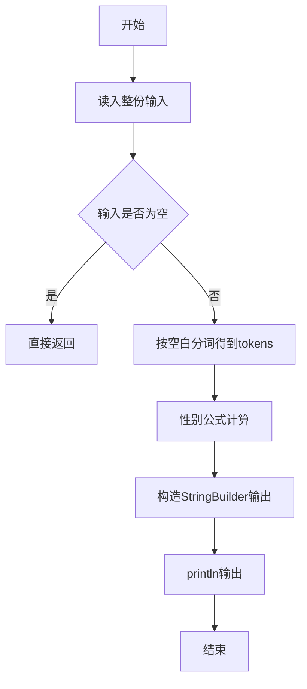
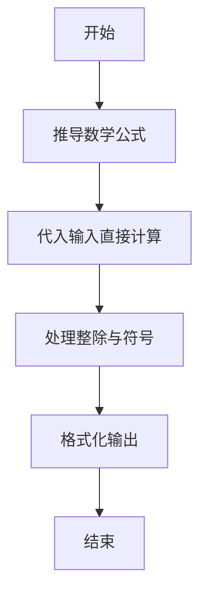

# L1-040 - 最佳情侣身高差（10 分）

- **时间限制**: 400 ms
- **内存限制**: 65536 KB
- **代码长度限制**: 16 KB

---

## 题目描述


专家通过多组情侣研究数据发现，最佳的情侣身高差遵循着一个公式：（女方的身高）$$\times$$1.09 =（男方的身高）。如果符合，你俩的身高差不管是牵手、拥抱、接吻，都是最和谐的差度。

下面就请你写个程序，为任意一位用户计算他/她的情侣的最佳身高。

### 输入格式:

输入第一行给出正整数$$N$$（$$\le 10$$），为前来查询的用户数。随后$$N$$行，每行按照“性别 身高”的格式给出前来查询的用户的性别和身高，其中“性别”为“F”表示女性、“M”表示男性；“身高”为区间 [1.0, 3.0] 之间的实数。

### 输出格式:

对每一个查询，在一行中为该用户计算出其情侣的最佳身高，保留小数点后2位。

### 输入样例:
```in
2
M 1.75
F 1.8
```

### 输出样例:
```out
1.61
1.96
```

## 示例

### 示例 1

**输入:**
```
2
M 1.75
F 1.8
```

**输出:**
```
1.61
1.96
```

--

### 解题思路

#### 题目分析
题目“L1-040 - 最佳情侣身高差（10 分）”的任务是：专家通过多组情侣研究数据发现，最佳的情侣身高差遵循着一个公式：（女方的身高） \times 1.09 =（男方的身高）。如果符合，你俩的身高差不管是牵手、拥抱、接吻，都是最和谐的差度。 下面就请你写个程序，为任意一位用户计算他/她的情侣的最。输入需考虑空行、首尾空白以及多空格分隔的容错；输出要求严格按样例格式，数字、空格与换行均不可偏差。边界上要处理 空输入直接返回、非法字符过滤 等情况，仓颉实现中通过 `readToEnd` / `readln` 配合 `trimAscii` 与 `isEmpty` 提前返回来规避空指针。

#### 核心算法
分性别套用不同系数公式计算最佳身高差。使用 `StringBuilder` 缓冲拼接以减少重复分配。实现上先将整份输入按空白分词为 `tokens`/`lines`，用 `Int64.parse` 解析数值，随后按题意执行核心循环与条件分支。该思路与 L1-040 的仓颉源码逻辑一一对应，体现了从暴力到必要的剪枝。

#### 复杂度分析
- **时间复杂度**：O(1)
- **空间复杂度**：O(1)

### 代码流程说明

1. 通过 `getStdIn().readToEnd()`/`readln` 读入全部输入，`trimAscii` 判空，若为空则直接 `return`。
2. 按空白符（空格、换行、制表）遍历 `toRuneArray()` 切分得到 `tokens`/`lines`，并过滤空串。
3. 用 `Int64.parse` 解析首个或多个数值（视题目而定），初始化计数器、集合或累加变量。
4. 执行核心逻辑——性别公式计算：对应源码中的主循环/条件（如 `while`/`for`、`if` 分支、集合查表或公式计算）。
5. 将结果按题面要求的格式组装到 `StringBuilder`，处理对齐、分隔符与多行换行。
6. 调用 `println` 一次性输出最终字符串并结束 `main`。

### 代码实现

仓颉代码实现如下：

```cangjie
// L1-040 最佳情侣身高差 — 公式 女*1.09=男，保留2位小数
import std.env.*
import std.collection.*
import std.convert.*
import std.math.*
func fmt2(x: Float64): String {
    let c = Int64(round(x * 100.0))
    var neg = false
    var ac = c
    if (c < 0) { neg = true; ac = -c }
    let ip = ac / 100
    let fp = ac % 100
    var fs = fp.toString()
    if (fp < 10) { fs = "0${fs}" }
    if (neg) { return "-${ip}.${fs}" } else { return "${ip}.${fs}" }
}
main() {
    let cin = getStdIn()
    let all = cin.readToEnd() ?? ""
    if (all.trimAscii().isEmpty()) { return }
    var parts = all.split(" ")
    var toks = ArrayList<String>()
    for (p in parts) {
        let a = p.split("\n")
        for (q in a) {
            let b = q.split("\r")
            for (r in b) {
                let c = r.split("\t")
                for (t in c) {
                    let s = t.trimAscii()
                    if (!s.isEmpty()) { toks.add(s) }
                }
            }
        }
    }
    if (toks.size == 0) { return }
    let n = Int64.parse(toks[0])
    var idx: Int64 = 1
    let sb = StringBuilder()
    var i: Int64 = 0
    while (i < n) {
        if (idx + 1 >= toks.size) { break }
        let g = toks[idx]; let hs = toks[idx+1]; idx += 2
        let h = Float64.parse(hs)
        var ans: Float64 = 0.0
        if (g == "M") { ans = h / 1.09 } else { ans = h * 1.09 }
        sb.append(fmt2(ans))
        sb.append("\n")
        i += 1
    }
    print(sb.toString())
}
```

### 代码流程图



### 解题流程图



