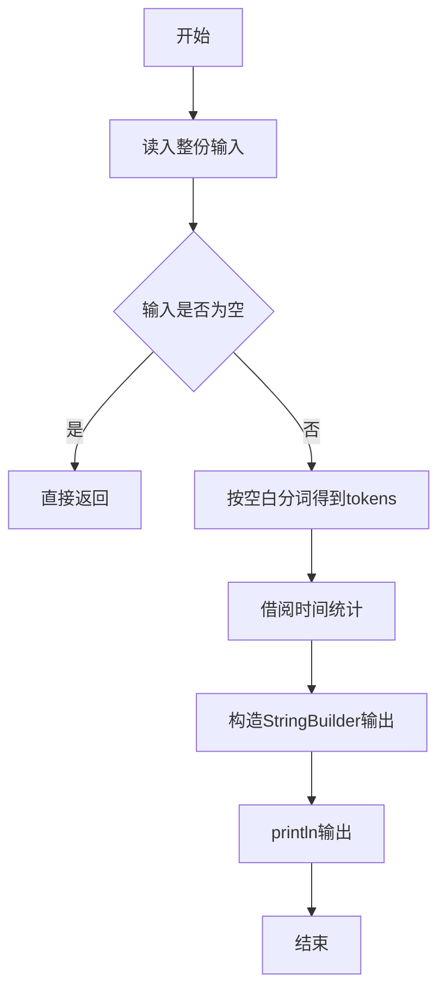
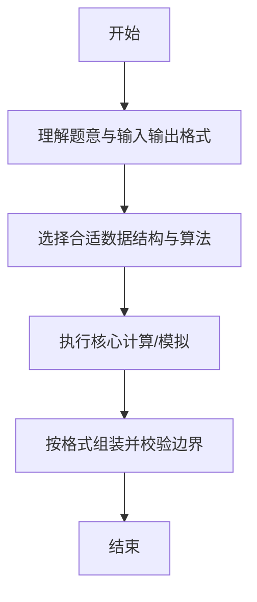

# L1-043 - 阅览室（20 分）

- **时间限制**: 400 ms
- **内存限制**: 65536 KB
- **代码长度限制**: 16 KB

---

## 题目描述


天梯图书阅览室请你编写一个简单的图书借阅统计程序。当读者借书时，管理员输入书号并按下`S`键，程序开始计时；当读者还书时，管理员输入书号并按下`E`键，程序结束计时。书号为不超过1000的正整数。当管理员将0作为书号输入时，表示一天工作结束，你的程序应输出当天的读者借书次数和平均阅读时间。

注意：由于线路偶尔会有故障，可能出现不完整的纪录，即只有`S`没有`E`，或者只有`E`没有`S`的纪录，系统应能自动忽略这种无效纪录。另外，题目保证书号是书的唯一标识，同一本书在任何时间区间内只可能被一位读者借阅。

### 输入格式:

输入在第一行给出一个正整数$$N$$（$$\le 10$$），随后给出$$N$$天的纪录。每天的纪录由若干次借阅操作组成，每次操作占一行，格式为：

`书号`（[1, 1000]内的整数） `键值`（`S`或`E`） `发生时间`（`hh:mm`，其中`hh`是[0,23]内的整数，`mm`是[0, 59]内整数）

每一天的纪录保证按时间递增的顺序给出。

### 输出格式:

对每天的纪录，在一行中输出当天的读者借书次数和平均阅读时间（以分钟为单位的精确到个位的整数时间）。

### 输入样例:
```in
3
1 S 08:10
2 S 08:35
1 E 10:00
2 E 13:16
0 S 17:00
0 S 17:00
3 E 08:10
1 S 08:20
2 S 09:00
1 E 09:20
0 E 17:00
```

### 输出样例:
```out
2 196
0 0
1 60
```

## 示例

### 示例 1

**输入:**
```
3
1 S 08:10
2 S 08:35
1 E 10:00
2 E 13:16
0 S 17:00
0 S 17:00
3 E 08:10
1 S 08:20
2 S 09:00
1 E 09:20
0 E 17:00
```

**输出:**
```
2 196
0 0
1 60
```

--

### 解题思路

#### 题目分析
题目“L1-043 - 阅览室（20 分）”的任务是：天梯图书阅览室请你编写一个简单的图书借阅统计程序。当读者借书时，管理员输入书号并按下 S 键，程序开始计时；当读者还书时，管理员输入书号并按下 E 键，程序结束计时。书号为不超过1000的正整数。当管理员将0作为书号输入时，表示一天工作结束。输入需考虑空行、首尾空白以及多空格分隔的容错；输出要求严格按样例格式，数字、空格与换行均不可偏差。边界上要处理 空输入直接返回、非法字符过滤 等情况，仓颉实现中通过 `readToEnd` / `readln` 配合 `trimAscii` 与 `isEmpty` 提前返回来规避空指针。

#### 核心算法
按借阅记录统计每本书借阅次数和归还时间差。使用 `StringBuilder` 缓冲拼接以减少重复分配。实现上先将整份输入按空白分词为 `tokens`/`lines`，用 `Int64.parse` 解析数值，随后按题意执行核心循环与条件分支。该思路与 L1-043 的仓颉源码逻辑一一对应，体现了从暴力到必要的剪枝。

#### 复杂度分析
- **时间复杂度**：O(n)
- **空间复杂度**：O(n)

### 代码流程说明

1. 通过 `getStdIn().readToEnd()`/`readln` 读入全部输入，`trimAscii` 判空，若为空则直接 `return`。
2. 按空白符（空格、换行、制表）遍历 `toRuneArray()` 切分得到 `tokens`/`lines`，并过滤空串。
3. 用 `Int64.parse` 解析首个或多个数值（视题目而定），初始化计数器、集合或累加变量。
4. 执行核心逻辑——借阅时间统计：对应源码中的主循环/条件（如 `while`/`for`、`if` 分支、集合查表或公式计算）。
5. 将结果按题面要求的格式组装到 `StringBuilder`，处理对齐、分隔符与多行换行。
6. 调用 `println` 一次性输出最终字符串并结束 `main`。

### 代码实现

仓颉代码实现如下：

```cangjie
// L1-043 阅览室 — 统计借阅次数和平均时长
import std.env.*
import std.collection.*
import std.convert.*
func toMin(s: String): Int64 {
    let p = s.split(":")
    let h = Int64.parse(p[0].trimAscii())
    let m = Int64.parse(p[1].trimAscii())
    return h*60+m
}
main() {
    let cin = getStdIn()
    let all = cin.readToEnd() ?? ""
    // split into lines by \n
    var rawLines = all.split("\n")
    // clean \r
    var lines = ArrayList<String>()
    for (l in rawLines) {
        var t = l
        // remove \r if present
        let nr = t.split("\r")
        var merged = ""
        var first = true
        for (x in nr) {
            if (first) { merged = x; first = false } else { merged = merged + x }
        }
        lines.add(merged)
    }
    // skip empty at start to find N
    var idx: Int64 = 0
    while (idx < lines.size && lines[idx].trimAscii().isEmpty()) { idx += 1 }
    if (idx >= lines.size) { return }
    let n = Int64.parse(lines[idx].trimAscii())
    idx += 1
    let sb = StringBuilder()
    var day: Int64 = 0
    var borrow = Array<Int64>(1001, repeat: -1)
    var cnt: Int64 = 0
    var total: Int64 = 0
    while (day < n) {
        if (idx >= lines.size) {
            let avg: Int64 = if (cnt == 0) { 0 } else { (total + cnt/2)/cnt }
            sb.append("${cnt} ${avg}\n")
            day += 1
            if (day < n) {
                borrow = Array<Int64>(1001, repeat: -1)
                cnt = 0; total = 0
            }
            continue
        }
        let raw = lines[idx]
        idx += 1
        if (raw.trimAscii().isEmpty()) { continue }
        // token split
        var partsA = raw.split(" ")
        var toks = ArrayList<String>()
        for (p in partsA) {
            let q = p.split("\t")
            for (r in q) {
                let s = r.trimAscii()
                if (!s.isEmpty()) { toks.add(s) }
            }
        }
        if (toks.size < 3) { continue }
        let bookId = Int64.parse(toks[0])
        let key = toks[1]
        let timeS = toks[2]
        if (bookId == 0) {
            let avg: Int64 = if (cnt == 0) { 0 } else { (total + cnt/2)/cnt }
            sb.append("${cnt} ${avg}\n")
            borrow = Array<Int64>(1001, repeat: -1)
            cnt = 0; total = 0
            day += 1
        } else {
            let mins = toMin(timeS)
            let bi = bookId
            if (key == "S") {
                borrow[bi] = mins
            } else if (key == "E") {
                let st = borrow[bi]
                if (st != -1) {
                    total += mins - st
                    cnt += 1
                    borrow[bi] = -1
                }
            }
        }
    }
    print(sb.toString())
}
```

### 代码流程图



### 解题流程图



