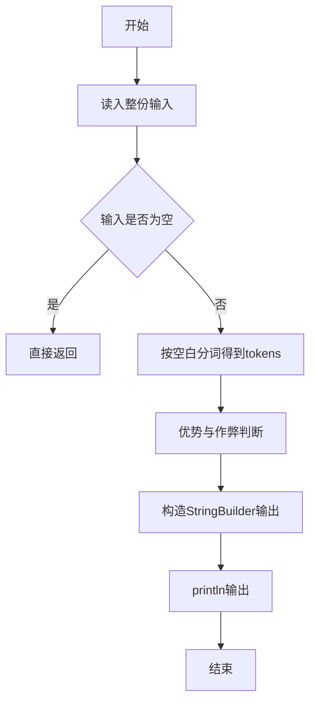
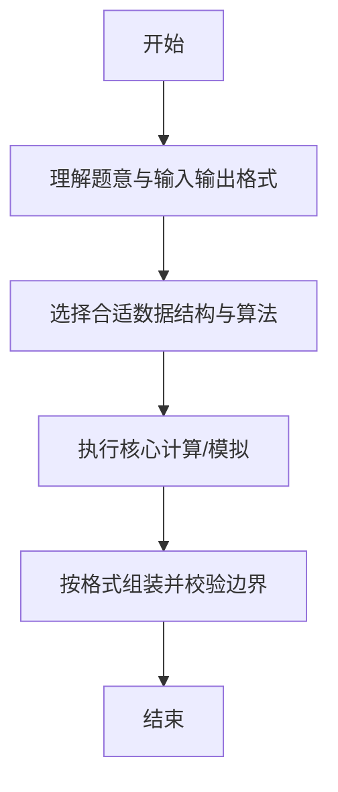

# L1-044 - 稳赢（15 分）

- **时间限制**: 400 ms
- **内存限制**: 65536 KB
- **代码长度限制**: 16 KB

---

## 题目描述


大家应该都会玩“锤子剪刀布”的游戏：两人同时给出手势，胜负规则如图所示：


现要求你编写一个稳赢不输的程序，根据对方的出招，给出对应的赢招。但是！为了不让对方输得太惨，你需要每隔$$K$$次就让一个平局。

### 输入格式:

输入首先在第一行给出正整数$$K$$（$$\le 10$$），即平局间隔的次数。随后每行给出对方的一次出招：`ChuiZi`代表“锤子”、`JianDao`代表“剪刀”、`Bu`代表“布”。`End`代表输入结束，这一行不要作为出招处理。

### 输出格式:

对每一个输入的出招，按要求输出稳赢或平局的招式。每招占一行。

### 输入样例:
```in
2
ChuiZi
JianDao
Bu
JianDao
Bu
ChuiZi
ChuiZi
End
```

### 输出样例:
```out
Bu
ChuiZi
Bu
ChuiZi
JianDao
ChuiZi
Bu
```

## 示例

### 示例 1

**输入:**
```
2
ChuiZi
JianDao
Bu
JianDao
Bu
ChuiZi
ChuiZi
End
```

**输出:**
```
Bu
ChuiZi
Bu
ChuiZi
JianDao
ChuiZi
Bu
```

--

### 解题思路

#### 题目分析
题目“L1-044 - 稳赢（15 分）”的任务是：大家应该都会玩“锤子剪刀布”的游戏：两人同时给出手势，胜负规则如图所示：  现要求你编写一个稳赢不输的程序，根据对方的出招，给出对应的赢招。但是！为了不让对方输得太惨，你需要每隔 K 次就让一个平局。。输入需考虑空行、首尾空白以及多空格分隔的容错；输出要求严格按样例格式，数字、空格与换行均不可偏差。边界上要处理 空输入直接返回、非法字符过滤 等情况，仓颉实现中通过 `readToEnd` / `readln` 配合 `trimAscii` 与 `isEmpty` 提前返回来规避空指针。

#### 核心算法
按是否是对方优势牌及是否被连续压制判断稳赢。使用 `StringBuilder` 缓冲拼接以减少重复分配。实现上先将整份输入按空白分词为 `tokens`/`lines`，用 `Int64.parse` 解析数值，随后按题意执行核心循环与条件分支。该思路与 L1-044 的仓颉源码逻辑一一对应，体现了从暴力到必要的剪枝。

#### 复杂度分析
- **时间复杂度**：O(1)
- **空间复杂度**：O(1)

### 代码流程说明

1. 通过 `getStdIn().readToEnd()`/`readln` 读入全部输入，`trimAscii` 判空，若为空则直接 `return`。
2. 按空白符（空格、换行、制表）遍历 `toRuneArray()` 切分得到 `tokens`/`lines`，并过滤空串。
3. 用 `Int64.parse` 解析首个或多个数值（视题目而定），初始化计数器、集合或累加变量。
4. 执行核心逻辑——优势与作弊判断：对应源码中的主循环/条件（如 `while`/`for`、`if` 分支、集合查表或公式计算）。
5. 将结果按题面要求的格式组装到 `StringBuilder`，处理对齐、分隔符与多行换行。
6. 调用 `println` 一次性输出最终字符串并结束 `main`。

### 代码实现

仓颉代码实现如下：

```cangjie
// L1-044 稳赢 — 每隔K次平局否则赢招
import std.env.*
import std.collection.*
import std.convert.*
main() {
    let cin = getStdIn()
    let all = cin.readToEnd() ?? ""
    var rawLines = all.split("\n")
    var lines = ArrayList<String>()
    for (l in rawLines) {
        let t = l.trimAscii()
        // handle \r
        let nr = t.split("\r")
        var merged = ""
        var first = true
        for (x in nr) {
            if (first) { merged = x; first = false } else { merged = merged + x }
        }
        let tt = merged.trimAscii()
        if (!tt.isEmpty()) { lines.add(tt) }
    }
    if (lines.size == 0) { return }
    let k = Int64.parse(lines[0])
    var cnt: Int64 = 0
    let sb = StringBuilder()
    var i: Int64 = 1
    while (i < lines.size) {
        let op = lines[i]
        if (op == "End") { break }
        cnt += 1
        if (cnt % (k + 1) == 0) {
            sb.append("${op}\n")
        } else {
            if (op == "ChuiZi") { sb.append("Bu\n") }
            else if (op == "JianDao") { sb.append("ChuiZi\n") }
            else if (op == "Bu") { sb.append("JianDao\n") }
            else { sb.append("${op}\n") }
        }
        i += 1
    }
    print(sb.toString())
}
```

### 代码流程图



### 解题流程图



