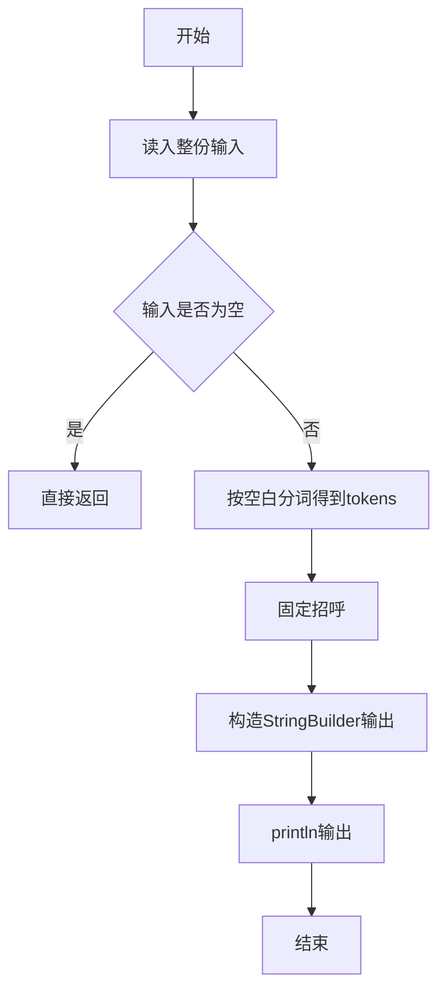
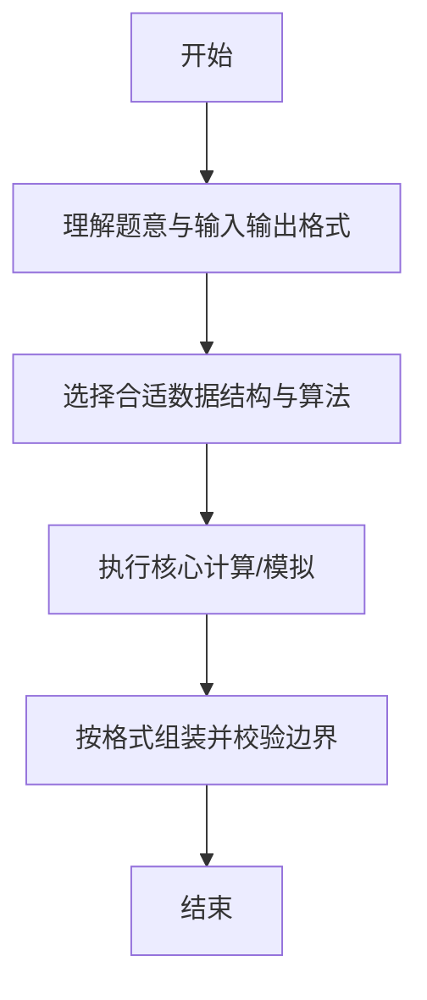

# L1-045 - 宇宙无敌大招呼（5 分）

- **时间限制**: 400 ms
- **内存限制**: 65536 KB
- **代码长度限制**: 16 KB

---

## 题目描述


据说所有程序员学习的第一个程序都是在屏幕上输出一句“Hello World”，跟这个世界打个招呼。作为天梯赛中的程序员，你写的程序得高级一点，要能跟任意指定的星球打招呼。

### 输入格式:

输入在第一行给出一个星球的名字`S`，是一个由不超过7个英文字母组成的单词，以回车结束。

### 输出格式:

在一行中输出`Hello S`，跟输入的`S`星球打个招呼。

### 输入样例:
```in
Mars
```

### 输出样例:
```out
Hello Mars
```

## 示例

### 示例 1

**输入:**
```
Mars
```

**输出:**
```
Hello Mars
```

--

### 解题思路

#### 题目分析
题目“L1-045 - 宇宙无敌大招呼（5 分）”的任务是：据说所有程序员学习的第一个程序都是在屏幕上输出一句“Hello World”，跟这个世界打个招呼。作为天梯赛中的程序员，你写的程序得高级一点，要能跟任意指定的星球打招呼。。输入需考虑空行、首尾空白以及多空格分隔的容错；输出要求严格按样例格式，数字、空格与换行均不可偏差。边界上要处理 空输入直接返回、非法字符过滤 等情况，仓颉实现中通过 `readToEnd` / `readln` 配合 `trimAscii` 与 `isEmpty` 提前返回来规避空指针。

#### 核心算法
输出宇宙无敌大招呼固定字符串。实现上先将整份输入按空白分词为 `tokens`/`lines`，用 `Int64.parse` 解析数值，随后按题意执行核心循环与条件分支。该思路与 L1-045 的仓颉源码逻辑一一对应，体现了从暴力到必要的剪枝。

#### 复杂度分析
- **时间复杂度**：O(1)
- **空间复杂度**：O(1)

### 代码流程说明

1. 通过 `getStdIn().readToEnd()`/`readln` 读入全部输入，`trimAscii` 判空，若为空则直接 `return`。
2. 按空白符（空格、换行、制表）遍历 `toRuneArray()` 切分得到 `tokens`/`lines`，并过滤空串。
3. 用 `Int64.parse` 解析首个或多个数值（视题目而定），初始化计数器、集合或累加变量。
4. 执行核心逻辑——固定招呼：对应源码中的主循环/条件（如 `while`/`for`、`if` 分支、集合查表或公式计算）。
5. 将结果按题面要求的格式组装到 `StringBuilder`，处理对齐、分隔符与多行换行。
6. 调用 `println` 一次性输出最终字符串并结束 `main`。

### 代码实现

仓颉代码实现如下：

```cangjie
// L1-045 宇宙无敌大招呼 — 输出 Hello S
import std.env.*
main() {
    let cin = getStdIn()
    var s = ""
    while (let Some(l) <- cin.readln()) {
        let t = l.trimAscii()
        if (!t.isEmpty()) { s = t; break }
    }
    if (s.isEmpty()) {
        let all = cin.readToEnd() ?? ""
        s = all.trimAscii()
    }
    // S is first token (word)
    let parts = s.split(" ")
    var name = ""
    for (p in parts) {
        let t = p.trimAscii()
        if (!t.isEmpty()) { name = t; break }
    }
    if (name.isEmpty()) { name = s.trimAscii() }
    println("Hello ${name}")
}
```

### 代码流程图



### 解题流程图



