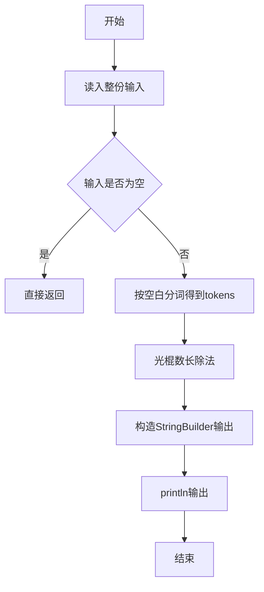
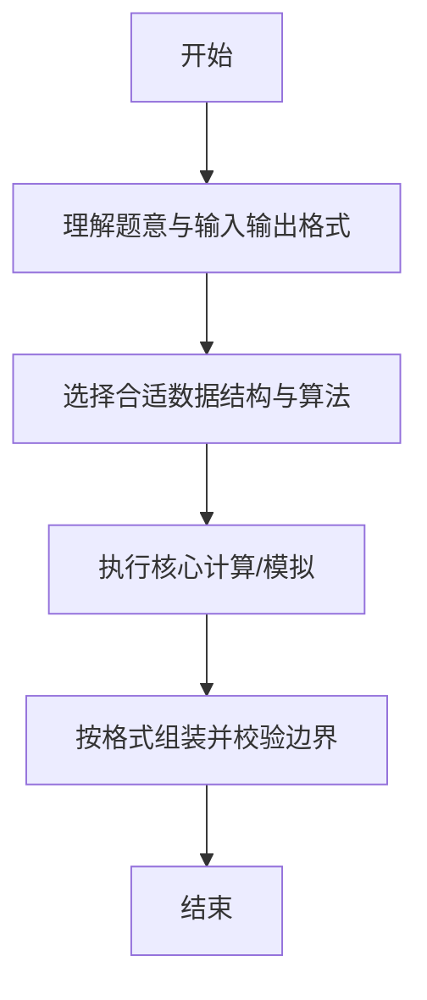

# L1-046 - 整除光棍（20 分）

- **时间限制**: 400 ms
- **内存限制**: 65536 KB
- **代码长度限制**: 16 KB

---

## 题目描述


这里所谓的“光棍”，并不是指单身汪啦~ 说的是全部由1组成的数字，比如1、11、111、1111等。传说任何一个光棍都能被一个不以5结尾的奇数整除。比如，111111就可以被13整除。 现在，你的程序要读入一个整数`x`，这个整数一定是奇数并且不以5结尾。然后，经过计算，输出两个数字：第一个数字`s`，表示`x`乘以`s`是一个光棍，第二个数字`n`是这个光棍的位数。这样的解当然不是唯一的,题目要求你输出最小的解。

提示：一个显然的办法是逐渐增加光棍的位数，直到可以整除`x`为止。但难点在于，`s`可能是个非常大的数 —— 比如，程序输入31，那么就输出3584229390681和15，因为31乘以3584229390681的结果是111111111111111，一共15个1。

### 输入格式:

输入在一行中给出一个不以5结尾的正奇数`x`（$$< 1000$$）。

### 输出格式:

在一行中输出相应的最小的`s`和`n`，其间以1个空格分隔。

### 输入样例:
```in
31
```

### 输出样例:
```out
3584229390681 15
```

## 示例

### 示例 1

**输入:**
```
31
```

**输出:**
```
3584229390681 15
```

--

### 解题思路

#### 题目分析
题目“L1-046 - 整除光棍（20 分）”的任务是：这里所谓的“光棍”，并不是指单身汪啦~ 说的是全部由1组成的数字，比如1、11、111、1111等。传说任何一个光棍都能被一个不以5结尾的奇数整除。比如，111111就可以被13整除。 现在，你的程序要读入一个整数 x ，这个整数一定是奇数。输入需考虑空行、首尾空白以及多空格分隔的容错；输出要求严格按样例格式，数字、空格与换行均不可偏差。边界上要处理 空输入直接返回、非法字符过滤 等情况，仓颉实现中通过 `readToEnd` / `readln` 配合 `trimAscii` 与 `isEmpty` 提前返回来规避空指针。

#### 核心算法
构造 111..1 的余数迭代，每步追加一位商直至余数为0。使用 `StringBuilder` 缓冲拼接以减少重复分配。实现上先将整份输入按空白分词为 `tokens`/`lines`，用 `Int64.parse` 解析数值，随后按题意执行核心循环与条件分支。该思路与 L1-046 的仓颉源码逻辑一一对应，体现了从暴力到必要的剪枝。

#### 复杂度分析
- **时间复杂度**：O(k)
- **空间复杂度**：O(k)

### 代码流程说明

1. 通过 `getStdIn().readToEnd()`/`readln` 读入全部输入，`trimAscii` 判空，若为空则直接 `return`。
2. 按空白符（空格、换行、制表）遍历 `toRuneArray()` 切分得到 `tokens`/`lines`，并过滤空串。
3. 用 `Int64.parse` 解析首个或多个数值（视题目而定），初始化计数器、集合或累加变量。
4. 执行核心逻辑——光棍数长除法：对应源码中的主循环/条件（如 `while`/`for`、`if` 分支、集合查表或公式计算）。
5. 循环内部进行整除/取模/试除判定，维护最优解的起点与长度。
6. 将结果按题面要求的格式组装到 `StringBuilder`，处理对齐、分隔符与多行换行。
7. 调用 `println` 一次性输出最终字符串并结束 `main`。

### 代码实现

仓颉代码实现如下：

```cangjie
// L1-046 整除光棍 — 找最小光棍的商和位数
import std.env.*
import std.convert.*
main() {
    let cin = getStdIn()
    let all = cin.readToEnd() ?? ""
    let t = all.trimAscii()
    if (t.isEmpty()) { return }
    // first token is x
    var xs = ""
    let parts = t.split(" ")
    for (p in parts) {
        let a = p.split("\n")
        for (q in a) {
            let b = q.split("\r")
            for (r in b) {
                let c = r.split("\t")
                for (v in c) {
                    let s = v.trimAscii()
                    if (!s.isEmpty()) { xs = s; break }
                }
                if (!xs.isEmpty()) { break }
            }
            if (!xs.isEmpty()) { break }
        }
        if (!xs.isEmpty()) { break }
    }
    if (xs.isEmpty()) { xs = t }
    let x = Int64.parse(xs)
    var rem: Int64 = 0
    var n: Int64 = 0
    let sb = StringBuilder()
    var started = false
    while (true) {
        rem = rem * 10 + 1
        n += 1
        let q = rem / x
        rem = rem % x
        if (!started) {
            if (q != 0) {
                started = true
                sb.append(q.toString())
            } else {
                // still leading zero: if rem==0 meaning single digit case x==1
                if (rem == 0) {
                    sb.append(q.toString())
                    started = true
                }
            }
        } else {
            sb.append(q.toString())
        }
        if (rem == 0) { break }
    }
    println("${sb.toString()} ${n}")
}
```

### 代码流程图



### 解题流程图



