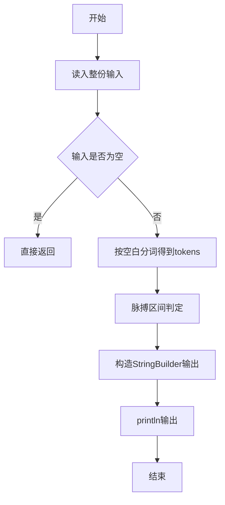
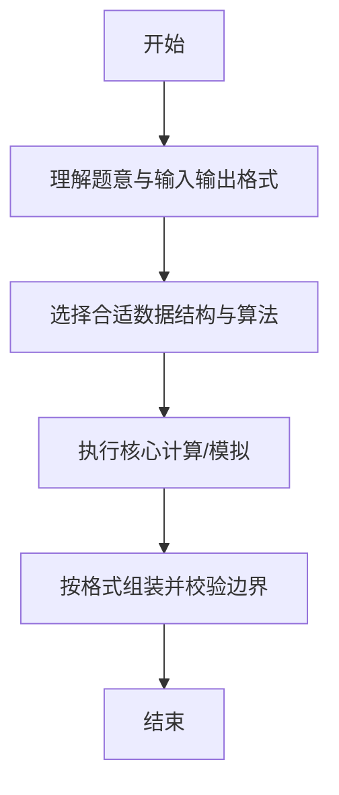

# L1-047 - 装睡（10 分）

- **时间限制**: 400 ms
- **内存限制**: 65536 KB
- **代码长度限制**: 16 KB

---

## 题目描述


你永远叫不醒一个装睡的人 —— 但是通过分析一个人的呼吸频率和脉搏，你可以发现谁在装睡！医生告诉我们，正常人睡眠时的呼吸频率是每分钟15-20次，脉搏是每分钟50-70次。下面给定一系列人的呼吸频率与脉搏，请你找出他们中间有可能在装睡的人，即至少一项指标不在正常范围内的人。

### 输入格式:

输入在第一行给出一个正整数$$N$$（$$\le 10$$）。随后$$N$$行，每行给出一个人的名字（仅由英文字母组成的、长度不超过3个字符的串）、其呼吸频率和脉搏（均为不超过100的正整数）。

### 输出格式:

按照输入顺序检查每个人，如果其至少一项指标不在正常范围内，则输出其名字，每个名字占一行。

### 输入样例:
```in
4
Amy 15 70
Tom 14 60
Joe 18 50
Zoe 21 71
```

### 输出样例:
```out
Tom
Zoe
```

## 示例

### 示例 1

**输入:**
```
4
Amy 15 70
Tom 14 60
Joe 18 50
Zoe 21 71
```

**输出:**
```
Tom
Zoe
```

--

### 解题思路

#### 题目分析
题目“L1-047 - 装睡（10 分）”的任务是：你永远叫不醒一个装睡的人 —— 但是通过分析一个人的呼吸频率和脉搏，你可以发现谁在装睡！医生告诉我们，正常人睡眠时的呼吸频率是每分钟15-20次，脉搏是每分钟50-70次。下面给定一系列人的呼吸频率与脉搏，请你找出他们中间有可能在装睡的人，。输入需考虑空行、首尾空白以及多空格分隔的容错；输出要求严格按样例格式，数字、空格与换行均不可偏差。边界上要处理 空输入直接返回、非法字符过滤 等情况，仓颉实现中通过 `readToEnd` / `readln` 配合 `trimAscii` 与 `isEmpty` 提前返回来规避空指针。

#### 核心算法
脉搏阈值区间判断是否装睡或测量异常。使用 `StringBuilder` 缓冲拼接以减少重复分配。实现上先将整份输入按空白分词为 `tokens`/`lines`，用 `Int64.parse` 解析数值，随后按题意执行核心循环与条件分支。该思路与 L1-047 的仓颉源码逻辑一一对应，体现了从暴力到必要的剪枝。

#### 复杂度分析
- **时间复杂度**：O(n)
- **空间复杂度**：O(1)

### 代码流程说明

1. 通过 `getStdIn().readToEnd()`/`readln` 读入全部输入，`trimAscii` 判空，若为空则直接 `return`。
2. 按空白符（空格、换行、制表）遍历 `toRuneArray()` 切分得到 `tokens`/`lines`，并过滤空串。
3. 用 `Int64.parse` 解析首个或多个数值（视题目而定），初始化计数器、集合或累加变量。
4. 执行核心逻辑——脉搏区间判定：对应源码中的主循环/条件（如 `while`/`for`、`if` 分支、集合查表或公式计算）。
5. 将结果按题面要求的格式组装到 `StringBuilder`，处理对齐、分隔符与多行换行。
6. 调用 `println` 一次性输出最终字符串并结束 `main`。

### 代码实现

仓颉代码实现如下：

```cangjie
// L1-047 装睡 — 找出指标异常的人
import std.env.*
import std.collection.*
import std.convert.*
main() {
    let cin = getStdIn()
    let all = cin.readToEnd() ?? ""
    if (all.trimAscii().isEmpty()) { return }
    var parts = all.split(" ")
    var toks = ArrayList<String>()
    for (p in parts) {
        let a = p.split("\n")
        for (q in a) {
            let b = q.split("\r")
            for (r in b) {
                let c = r.split("\t")
                for (t in c) {
                    let s = t.trimAscii()
                    if (!s.isEmpty()) { toks.add(s) }
                }
            }
        }
    }
    if (toks.size == 0) { return }
    let n = Int64.parse(toks[0])
    var idx: Int64 = 1
    let sb = StringBuilder()
    var i: Int64 = 0
    while (i < n) {
        if (idx + 2 >= toks.size) { break }
        let name = toks[idx]
        let resp = Int64.parse(toks[idx+1])
        let pulse = Int64.parse(toks[idx+2])
        idx += 3
        let abnormal = (resp < 15 || resp > 20 || pulse < 50 || pulse > 70)
        if (abnormal) { sb.append("${name}\n") }
        i += 1
    }
    print(sb.toString())
}
```

### 代码流程图



### 解题流程图



