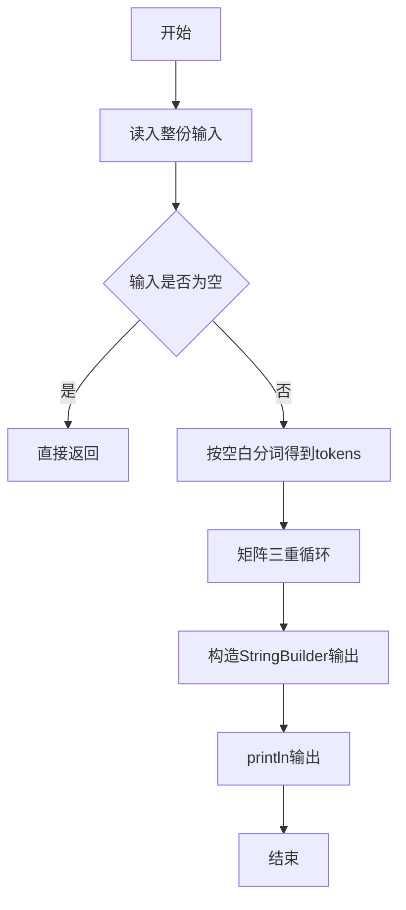
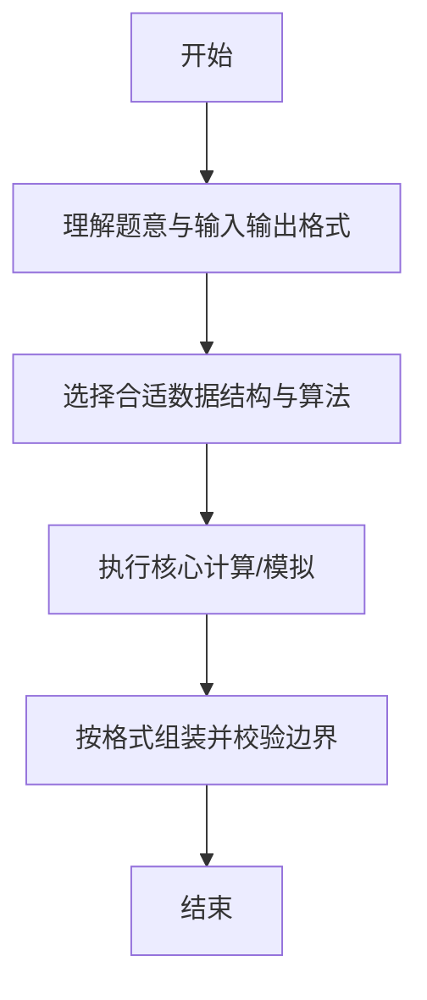

# L1-048 - 矩阵A乘以B（15 分）

- **时间限制**: 400 ms
- **内存限制**: 65536 KB
- **代码长度限制**: 16 KB

---

## 题目描述


给定两个矩阵$$A$$和$$B$$，要求你计算它们的乘积矩阵$$AB$$。需要注意的是，只有规模匹配的矩阵才可以相乘。即若$$A$$有$$R_a$$行、$$C_a$$列，$$B$$有$$R_b$$行、$$C_b$$列，则只有$$C_a$$与$$R_b$$相等时，两个矩阵才能相乘。

### 输入格式:

输入先后给出两个矩阵$$A$$和$$B$$。对于每个矩阵，首先在一行中给出其行数$$R$$和列数$$C$$，随后$$R$$行，每行给出$$C$$个整数，以1个空格分隔，且行首尾没有多余的空格。输入保证两个矩阵的$$R$$和$$C$$都是正数，并且所有整数的绝对值不超过100。

### 输出格式:

若输入的两个矩阵的规模是匹配的，则按照输入的格式输出乘积矩阵$$AB$$，否则输出`Error: Ca != Rb`，其中`Ca`是$$A$$的列数，`Rb`是$$B$$的行数。

### 输入样例 1：
```in
2 3
1 2 3
4 5 6
3 4
7 8 9 0
-1 -2 -3 -4
5 6 7 8
```

### 输出样例 1：
```out
2 4
20 22 24 16
53 58 63 28
```

### 输入样例 2：
```in
3 2
38 26
43 -5
0 17
3 2
-11 57
99 68
81 72
```

### 输出样例 2：
```out
Error: 2 != 3
```

## 示例

### 示例 1

**输入:**
```
2 3
1 2 3
4 5 6
3 4
7 8 9 0
-1 -2 -3 -4
5 6 7 8
```

**输出:**
```
2 4
20 22 24 16
53 58 63 28
```

### 示例 2

**输入:**
```
3 2
38 26
43 -5
0 17
3 2
-11 57
99 68
81 72
```

**输出:**
```
Error: 2 != 3
```

--

### 解题思路

#### 题目分析
题目“L1-048 - 矩阵A乘以B（15 分）”的任务是：给定两个矩阵 A 和 B ，要求你计算它们的乘积矩阵 AB 。需要注意的是，只有规模匹配的矩阵才可以相乘。即若 A 有 R a 行、 C a 列， B 有 R b 行、 C b 列，则只有 C a 与 R b 相等时，两个矩阵才能相乘。。输入需考虑空行、首尾空白以及多空格分隔的容错；输出要求严格按样例格式，数字、空格与换行均不可偏差。边界上要处理 空输入直接返回、非法字符过滤 等情况，仓颉实现中通过 `readToEnd` / `readln` 配合 `trimAscii` 与 `isEmpty` 提前返回来规避空指针。

#### 核心算法
维度校验 ca!=rb 报错，否则三重循环矩阵乘法。使用 `StringBuilder` 缓冲拼接以减少重复分配。实现上先将整份输入按空白分词为 `tokens`/`lines`，用 `Int64.parse` 解析数值，随后按题意执行核心循环与条件分支。该思路与 L1-048 的仓颉源码逻辑一一对应，体现了从暴力到必要的剪枝。

#### 复杂度分析
- **时间复杂度**：O(ra·ca·cb)
- **空间复杂度**：O(ra·cb)

### 代码流程说明

1. 通过 `getStdIn().readToEnd()`/`readln` 读入全部输入，`trimAscii` 判空，若为空则直接 `return`。
2. 按空白符（空格、换行、制表）遍历 `toRuneArray()` 切分得到 `tokens`/`lines`，并过滤空串。
3. 用 `Int64.parse` 解析首个或多个数值（视题目而定），初始化计数器、集合或累加变量。
4. 执行核心逻辑——矩阵三重循环：对应源码中的主循环/条件（如 `while`/`for`、`if` 分支、集合查表或公式计算）。
5. 涉及集合/映射/矩阵结构时，预先分配 `Array`/`HashSet`/`HashMap` 并填充数据。
6. 将结果按题面要求的格式组装到 `StringBuilder`，处理对齐、分隔符与多行换行。
7. 调用 `println` 一次性输出最终字符串并结束 `main`。

### 代码实现

仓颉代码实现如下：

```cangjie
// L1-048 矩阵A乘以B — 矩阵乘法或报错
import std.env.*
import std.collection.*
import std.convert.*
main() {
    let cin = getStdIn()
    let all = cin.readToEnd() ?? ""
    if (all.trimAscii().isEmpty()) { return }
    var parts = all.split(" ")
    var toks = ArrayList<String>()
    for (p in parts) {
        let a = p.split("\n")
        for (q in a) {
            let b = q.split("\r")
            for (r in b) {
                let c = r.split("\t")
                for (t in c) {
                    let s = t.trimAscii()
                    if (!s.isEmpty()) { toks.add(s) }
                }
            }
        }
    }
    var idx: Int64 = 0
    if (toks.size < 2) { return }
    let ra = Int64.parse(toks[idx]); let ca = Int64.parse(toks[idx+1]); idx += 2
    var A = Array<Array<Int64>>(ra, { _ => Array<Int64>(ca, repeat: 0) })
    var ii: Int64 = 0
    while (ii < ra) {
        var jj: Int64 = 0
        while (jj < ca) {
            A[ii][jj] = Int64.parse(toks[idx]); idx += 1
            jj += 1
        }
        ii += 1
    }
    let rb = Int64.parse(toks[idx]); let cb = Int64.parse(toks[idx+1]); idx += 2
    var B = Array<Array<Int64>>(rb, { _ => Array<Int64>(cb, repeat: 0) })
    ii = 0
    while (ii < rb) {
        var jj: Int64 = 0
        while (jj < cb) {
            B[ii][jj] = Int64.parse(toks[idx]); idx += 1
            jj += 1
        }
        ii += 1
    }
    if (ca != rb) {
        println("Error: ${ca} != ${rb}")
        return
    }
    var C = Array<Array<Int64>>(ra, { _ => Array<Int64>(cb, repeat: 0) })
    ii = 0
    while (ii < ra) {
        var jj: Int64 = 0
        while (jj < cb) {
            var sum: Int64 = 0
            var kk: Int64 = 0
            while (kk < ca) {
                sum += A[ii][kk] * B[kk][jj]
                kk += 1
            }
            C[ii][jj] = sum
            jj += 1
        }
        ii += 1
    }
    println("${ra} ${cb}")
    ii = 0
    while (ii < ra) {
        let sb = StringBuilder()
        var jj: Int64 = 0
        while (jj < cb) {
            if (jj > 0) { sb.append(" ") }
            sb.append(C[ii][jj].toString())
            jj += 1
        }
        println(sb.toString())
        ii += 1
    }
}
```

### 代码流程图



### 解题流程图



