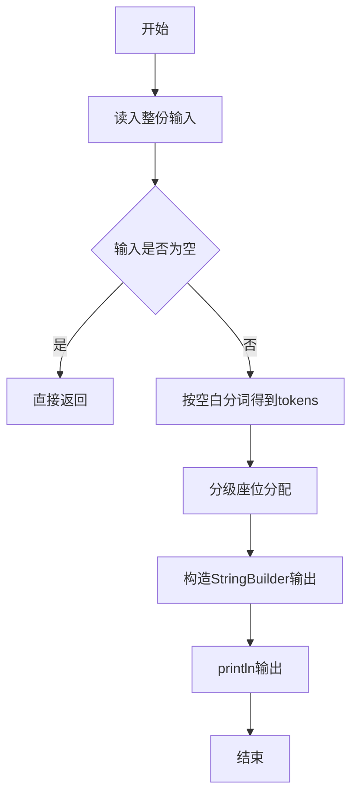
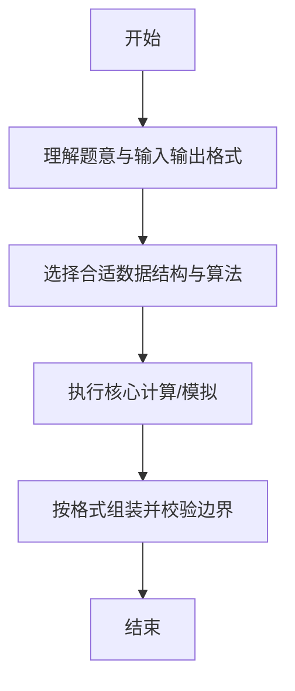

# L1-049 - 天梯赛座位分配（20 分）

- **时间限制**: 400 ms
- **内存限制**: 65536 KB
- **代码长度限制**: 16 KB

---

## 题目描述


天梯赛每年有大量参赛队员，要保证同一所学校的所有队员都不能相邻，分配座位就成为一件比较麻烦的事情。为此我们制定如下策略：假设某赛场有 N 所学校参赛，第 i 所学校有 M[i] 支队伍，每队 10 位参赛选手。令每校选手排成一列纵队，第 i+1 队的选手排在第 i 队选手之后。从第 1 所学校开始，各校的第 1 位队员顺次入座，然后是各校的第 2 位队员…… 以此类推。如果最后只剩下 1 所学校的队伍还没有分配座位，则需要安排他们的队员隔位就坐。本题就要求你编写程序，自动为各校生成队员的座位号，从 1 开始编号。

### 输入格式:

输入在一行中给出参赛的高校数 N （不超过100的正整数）；第二行给出 N 个不超过10的正整数，其中第 i 个数对应第 i 所高校的参赛队伍数，数字间以空格分隔。

### 输出格式:

从第 1 所高校的第 1 支队伍开始，顺次输出队员的座位号。每队占一行，座位号间以 1 个空格分隔，行首尾不得有多余空格。另外，每所高校的第一行按“#X”输出该校的编号X，从 1 开始。

### 输入样例:
```in
3
3 4 2
```

### 输出样例:
```out
#1
1 4 7 10 13 16 19 22 25 28
31 34 37 40 43 46 49 52 55 58
61 63 65 67 69 71 73 75 77 79
#2
2 5 8 11 14 17 20 23 26 29
32 35 38 41 44 47 50 53 56 59
62 64 66 68 70 72 74 76 78 80
82 84 86 88 90 92 94 96 98 100
#3
3 6 9 12 15 18 21 24 27 30
33 36 39 42 45 48 51 54 57 60
```

## 示例

### 示例 1

**输入:**
```
3
3 4 2
```

**输出:**
```
#1
1 4 7 10 13 16 19 22 25 28
31 34 37 40 43 46 49 52 55 58
61 63 65 67 69 71 73 75 77 79
#2
2 5 8 11 14 17 20 23 26 29
32 35 38 41 44 47 50 53 56 59
62 64 66 68 70 72 74 76 78 80
82 84 86 88 90 92 94 96 98 100
#3
3 6 9 12 15 18 21 24 27 30
33 36 39 42 45 48 51 54 57 60
```

--

### 解题思路

#### 题目分析
题目“L1-049 - 天梯赛座位分配（20 分）”的任务是：天梯赛每年有大量参赛队员，要保证同一所学校的所有队员都不能相邻，分配座位就成为一件比较麻烦的事情。为此我们制定如下策略：假设某赛场有 N 所学校参赛，第 i 所学校有 M[i] 支队伍，每队 10 位参赛选手。令每校选手排成一列纵队，第 i。输入需考虑空行、首尾空白以及多空格分隔的容错；输出要求严格按样例格式，数字、空格与换行均不可偏差。边界上要处理 空输入直接返回、非法字符过滤 等情况，仓颉实现中通过 `readToEnd` / `readln` 配合 `trimAscii` 与 `isEmpty` 提前返回来规避空指针。

#### 核心算法
天梯赛分级座位按 10/10/变量 规则逐级分配编号。使用 `StringBuilder` 缓冲拼接以减少重复分配。实现上先将整份输入按空白分词为 `tokens`/`lines`，用 `Int64.parse` 解析数值，随后按题意执行核心循环与条件分支。该思路与 L1-049 的仓颉源码逻辑一一对应，体现了从暴力到必要的剪枝。

#### 复杂度分析
- **时间复杂度**：O(n)
- **空间复杂度**：O(n)

### 代码流程说明

1. 通过 `getStdIn().readToEnd()`/`readln` 读入全部输入，`trimAscii` 判空，若为空则直接 `return`。
2. 按空白符（空格、换行、制表）遍历 `toRuneArray()` 切分得到 `tokens`/`lines`，并过滤空串。
3. 用 `Int64.parse` 解析首个或多个数值（视题目而定），初始化计数器、集合或累加变量。
4. 执行核心逻辑——分级座位分配：对应源码中的主循环/条件（如 `while`/`for`、`if` 分支、集合查表或公式计算）。
5. 将结果按题面要求的格式组装到 `StringBuilder`，处理对齐、分隔符与多行换行。
6. 调用 `println` 一次性输出最终字符串并结束 `main`。

### 代码实现

仓颉代码实现如下：

```cangjie
// L1-049 天梯赛座位分配 — 按规则分配座位
import std.env.*
import std.collection.*
import std.convert.*
main() {
    let cin = getStdIn()
    let all = cin.readToEnd() ?? ""
    if (all.trimAscii().isEmpty()) { return }
    var parts = all.split(" ")
    var toks = ArrayList<String>()
    for (p in parts) {
        let a = p.split("\n")
        for (q in a) {
            let b = q.split("\r")
            for (r in b) {
                let c = r.split("\t")
                for (t in c) {
                    let s = t.trimAscii()
                    if (!s.isEmpty()) { toks.add(s) }
                }
            }
        }
    }
    let n = Int64.parse(toks[0])
    var teams = Array<Int64>(n, repeat: 0)
    var i: Int64 = 0
    while (i < n) {
        teams[i] = Int64.parse(toks[i+1])
        i += 1
    }
    var totalStudents = Array<Int64>(n, repeat: 0)
    i = 0
    while (i < n) { totalStudents[i] = teams[i]*10; i += 1 }
    var allocated = Array<Int64>(n, repeat: 0)
    var seats = Array<Array<Int64>>(n, repeat: Array<Int64>(0, repeat: 0))
    var si: Int64 = 0
    while (si < n) {
        seats[si] = Array<Int64>(totalStudents[si], repeat: 0)
        si += 1
    }
    var cur: Int64 = 1
    while (true) {
        var remaining: Int64 = 0
        var last: Int64 = -1
        var j: Int64 = 0
        while (j < n) {
            if (allocated[j] < totalStudents[j]) { remaining += 1; last = j }
            j += 1
        }
        if (remaining == 0) { break }
        if (remaining == 1) {
            if (cur != 1) { cur += 1 }
            while (allocated[last] < totalStudents[last]) {
                seats[last][allocated[last]] = cur
                allocated[last] += 1
                cur += 2
            }
            break
        }
        j = 0
        while (j < n) {
            if (allocated[j] < totalStudents[j]) {
                seats[j][allocated[j]] = cur
                allocated[j] += 1
                cur += 1
            }
            j += 1
        }
    }
    i = 0
    while (i < n) {
        println("#${i+1}")
        var team: Int64 = 0
        while (team < teams[i]) {
            let sb = StringBuilder()
            var k: Int64 = 0
            while (k < 10) {
                if (k > 0) { sb.append(" ") }
                let idx2 = team*10 + k
                sb.append(seats[i][idx2].toString())
                k += 1
            }
            println(sb.toString())
            team += 1
        }
        i += 1
    }
}
```

### 代码流程图



### 解题流程图



