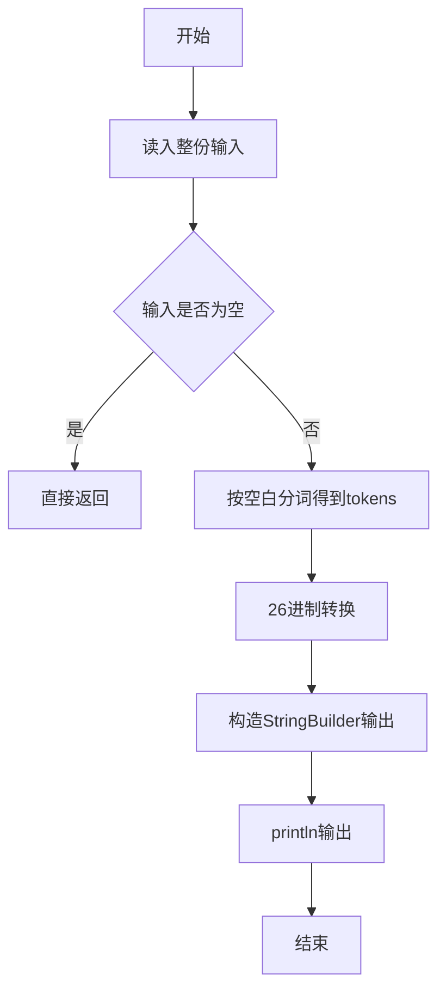
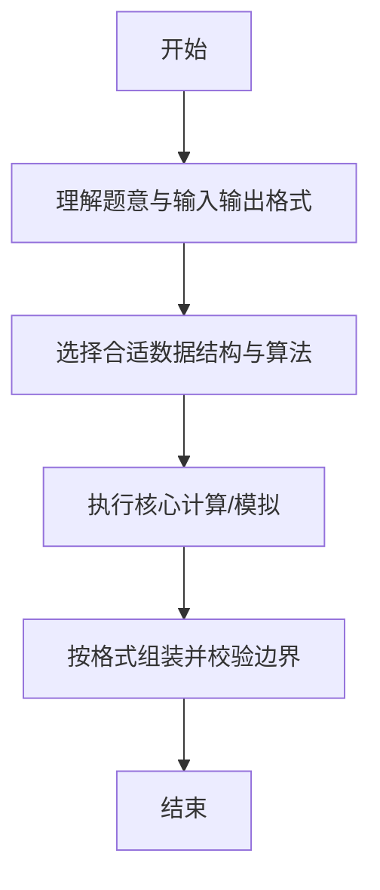

# L1-050 - 倒数第N个字符串（15 分）

- **时间限制**: 400 ms
- **内存限制**: 65536 KB
- **代码长度限制**: 16 KB

---

## 题目描述


给定一个完全由小写英文字母组成的字符串等差递增序列，该序列中的每个字符串的长度固定为 L，从 L 个 a 开始，以 1 为步长递增。例如当 L 为 3 时，序列为 { aaa, aab, aac, ..., aaz, aba, abb, ..., abz, ..., zzz }。这个序列的倒数第27个字符串就是 zyz。对于任意给定的 L，本题要求你给出对应序列倒数第 N 个字符串。

### 输入格式:

输入在一行中给出两个正整数 L（2 $$\le$$ L $$\le$$ 6）和 N（$$\le 10^5$$）。

### 输出格式:

在一行中输出对应序列倒数第 N 个字符串。题目保证这个字符串是存在的。

### 输入样例:
```in
3 7417
```

### 输出样例:
```out
pat
```

## 示例

### 示例 1

**输入:**
```
3 7417
```

**输出:**
```
pat
```

--

### 解题思路

#### 题目分析
题目“L1-050 - 倒数第N个字符串（15 分）”的任务是：给定一个完全由小写英文字母组成的字符串等差递增序列，该序列中的每个字符串的长度固定为 L，从 L 个 a 开始，以 1 为步长递增。例如当 L 为 3 时，序列为 { aaa, aab, aac, ..., aaz, aba, abb, .。输入需考虑空行、首尾空白以及多空格分隔的容错；输出要求严格按样例格式，数字、空格与换行均不可偏差。边界上要处理 空输入直接返回、非法字符过滤 等情况，仓颉实现中通过 `readToEnd` / `readln` 配合 `trimAscii` 与 `isEmpty` 提前返回来规避空指针。

#### 核心算法
将序号转为 26 进制字符串，偏移量处理倒数第 N 个。使用 `StringBuilder` 缓冲拼接以减少重复分配。实现上先将整份输入按空白分词为 `tokens`/`lines`，用 `Int64.parse` 解析数值，随后按题意执行核心循环与条件分支。该思路与 L1-050 的仓颉源码逻辑一一对应，体现了从暴力到必要的剪枝。

#### 复杂度分析
- **时间复杂度**：O(L)
- **空间复杂度**：O(L)

### 代码流程说明

1. 通过 `getStdIn().readToEnd()`/`readln` 读入全部输入，`trimAscii` 判空，若为空则直接 `return`。
2. 按空白符（空格、换行、制表）遍历 `toRuneArray()` 切分得到 `tokens`/`lines`，并过滤空串。
3. 用 `Int64.parse` 解析首个或多个数值（视题目而定），初始化计数器、集合或累加变量。
4. 执行核心逻辑——26进制转换：对应源码中的主循环/条件（如 `while`/`for`、`if` 分支、集合查表或公式计算）。
5. 将结果按题面要求的格式组装到 `StringBuilder`，处理对齐、分隔符与多行换行。
6. 调用 `println` 一次性输出最终字符串并结束 `main`。

### 代码实现

仓颉代码实现如下：

```cangjie
// L1-050 倒数第N个字符串 — 26进制转换
import std.env.*
import std.collection.*
import std.convert.*
main() {
    let cin = getStdIn()
    let all = cin.readToEnd() ?? ""
    if (all.trimAscii().isEmpty()) { return }
    var parts = all.split(" ")
    var toks = ArrayList<String>()
    for (p in parts) {
        let a = p.split("\n")
        for (q in a) {
            let b = q.split("\r")
            for (r in b) {
                let c = r.split("\t")
                for (t in c) {
                    let s = t.trimAscii()
                    if (!s.isEmpty()) { toks.add(s) }
                }
            }
        }
    }
    let L = Int64.parse(toks[0])
    let N = Int64.parse(toks[1])
    var total: Int64 = 1
    var i: Int64 = 0
    while (i < L) { total *= 26; i += 1 }
    var num = total - N
    var chars = Array<String>(L, repeat: "")
    var pos = L - 1
    while (pos >= 0) {
        let d = num % 26
        // 0->a
        let code = 97 + d // 'a' ascii
        // build char string
        // use rune conversion via StringBuilder? simple mapping
        var ch: String = ""
        if (d == 0) { ch = "a" } else if (d == 1) { ch = "b" } else if (d == 2) { ch = "c" } else if (d == 3) { ch = "d" } else if (d == 4) { ch = "e" } else if (d == 5) { ch = "f" } else if (d == 6) { ch = "g" } else if (d == 7) { ch = "h" } else if (d == 8) { ch = "i" } else if (d == 9) { ch = "j" } else if (d == 10) { ch = "k" } else if (d == 11) { ch = "l" } else if (d == 12) { ch = "m" } else if (d == 13) { ch = "n" } else if (d == 14) { ch = "o" } else if (d == 15) { ch = "p" } else if (d == 16) { ch = "q" } else if (d == 17) { ch = "r" } else if (d == 18) { ch = "s" } else if (d == 19) { ch = "t" } else if (d == 20) { ch = "u" } else if (d == 21) { ch = "v" } else if (d == 22) { ch = "w" } else if (d == 23) { ch = "x" } else if (d == 24) { ch = "y" } else { ch = "z" }
        chars[pos] = ch
        num = num / 26
        pos -= 1
    }
    let sb = StringBuilder()
    var k: Int64 = 0
    while (k < L) { sb.append(chars[k]); k += 1 }
    println(sb.toString())
}
```

### 代码流程图



### 解题流程图



