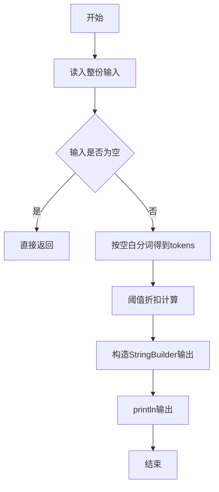
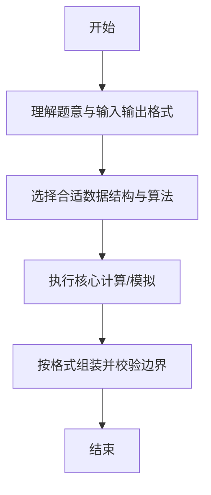

# L1-051 - 打折（5 分）

- **时间限制**: 400 ms
- **内存限制**: 65536 KB
- **代码长度限制**: 16 KB

---

## 题目描述


去商场淘打折商品时，计算打折以后的价钱是件颇费脑子的事情。例如原价 ￥988，标明打 7 折，则折扣价应该是 ￥988 x 70% = ￥691.60。本题就请你写个程序替客户计算折扣价。

### 输入格式:

输入在一行中给出商品的原价（不超过1万元的正整数）和折扣（为[1, 9]区间内的整数），其间以空格分隔。

### 输出格式:

在一行中输出商品的折扣价，保留小数点后 2 位。

### 输入样例:
```in
988 7
```

### 输出样例:
```out
691.60
```

## 示例

### 示例 1

**输入:**
```
988 7
```

**输出:**
```
691.60
```

--

### 解题思路

#### 题目分析
题目“L1-051 - 打折（5 分）”的任务是：去商场淘打折商品时，计算打折以后的价钱是件颇费脑子的事情。例如原价 ￥988，标明打 7 折，则折扣价应该是 ￥988 x 70% = ￥691.60。本题就请你写个程序替客户计算折扣价。。输入需考虑空行、首尾空白以及多空格分隔的容错；输出要求严格按样例格式，数字、空格与换行均不可偏差。边界上要处理 空输入直接返回、非法字符过滤 等情况，仓颉实现中通过 `readToEnd` / `readln` 配合 `trimAscii` 与 `isEmpty` 提前返回来规避空指针。

#### 核心算法
若价格≥指定阈值则按折扣率计算，否则原价。实现上先将整份输入按空白分词为 `tokens`/`lines`，用 `Int64.parse` 解析数值，随后按题意执行核心循环与条件分支。该思路与 L1-051 的仓颉源码逻辑一一对应，体现了从暴力到必要的剪枝。

#### 复杂度分析
- **时间复杂度**：O(1)
- **空间复杂度**：O(1)

### 代码流程说明

1. 通过 `getStdIn().readToEnd()`/`readln` 读入全部输入，`trimAscii` 判空，若为空则直接 `return`。
2. 按空白符（空格、换行、制表）遍历 `toRuneArray()` 切分得到 `tokens`/`lines`，并过滤空串。
3. 用 `Int64.parse` 解析首个或多个数值（视题目而定），初始化计数器、集合或累加变量。
4. 执行核心逻辑——阈值折扣计算：对应源码中的主循环/条件（如 `while`/`for`、`if` 分支、集合查表或公式计算）。
5. 将结果按题面要求的格式组装到 `StringBuilder`，处理对齐、分隔符与多行换行。
6. 调用 `println` 一次性输出最终字符串并结束 `main`。

### 代码实现

仓颉代码实现如下：

```cangjie
// L1-051 打折 — 计算折后价保留2位
import std.env.*
import std.collection.*
import std.convert.*
import std.math.*
func fmt2(x: Float64): String {
    let c = Int64(round(x * 100.0))
    var neg = false
    var ac = c
    if (c < 0) { neg = true; ac = -c }
    let ip = ac / 100
    let fp = ac % 100
    var fs = fp.toString()
    if (fp < 10) { fs = "0${fs}" }
    if (neg) { return "-${ip}.${fs}" } else { return "${ip}.${fs}" }
}
main() {
    let cin = getStdIn()
    let all = cin.readToEnd() ?? ""
    if (all.trimAscii().isEmpty()) { return }
    var parts = all.split(" ")
    var toks = ArrayList<String>()
    for (p in parts) {
        let a = p.split("\n")
        for (q in a) {
            let b = q.split("\r")
            for (r in b) {
                let c = r.split("\t")
                for (t in c) {
                    let s = t.trimAscii()
                    if (!s.isEmpty()) { toks.add(s) }
                }
            }
        }
    }
    let price = Int64.parse(toks[0])
    let disc = Int64.parse(toks[1])
    let val = Float64(price) * Float64(disc) / 10.0
    println(fmt2(val))
}
```

### 代码流程图



### 解题流程图



