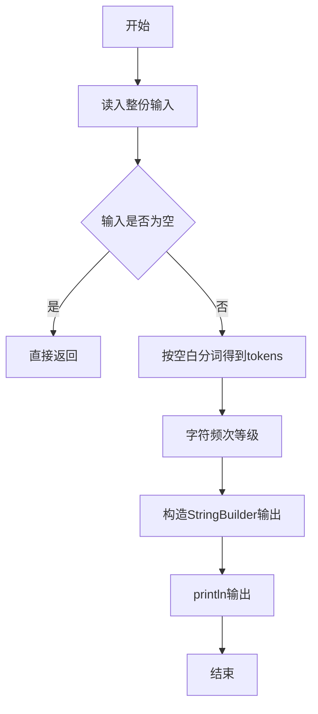
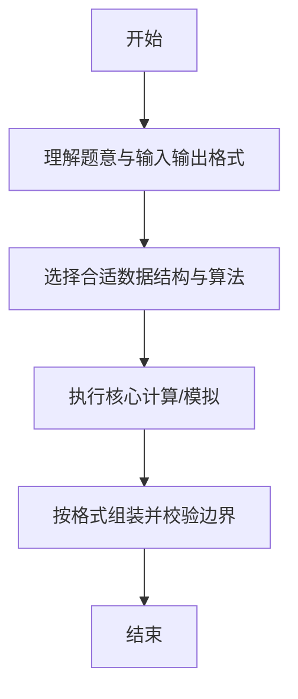

# L1-053 - 电子汪（10 分）

- **时间限制**: 400 ms
- **内存限制**: 65536 KB
- **代码长度限制**: 16 KB

---

## 题目描述


据说汪星人的智商能达到人类 4 岁儿童的水平，更有些聪明汪会做加法计算。比如你在地上放两堆小球，分别有 1 只球和 2 只球，聪明汪就会用“汪！汪！汪！”表示 1 加 2 的结果是 3。

本题要求你为电子宠物汪做一个模拟程序，根据电子眼识别出的两堆小球的个数，计算出和，并且用汪星人的叫声给出答案。

### 输入格式:

输入在一行中给出两个 [1, 9] 区间内的正整数 A 和 B，用空格分隔。

### 输出格式:

在一行中输出 A + B 个`Wang!`。

### 输入样例:
```in
2 1
```

### 输出样例:
```out
Wang!Wang!Wang!
```

## 示例

### 示例 1

**输入:**
```
2 1
```

**输出:**
```
Wang!Wang!Wang!
```

--

### 解题思路

#### 题目分析
题目“L1-053 - 电子汪（10 分）”的任务是：据说汪星人的智商能达到人类 4 岁儿童的水平，更有些聪明汪会做加法计算。比如你在地上放两堆小球，分别有 1 只球和 2 只球，聪明汪就会用“汪！汪！汪！”表示 1 加 2 的结果是 3。 本题要求你为电子宠物汪做一个模拟程序，根据电子眼识别。输入需考虑空行、首尾空白以及多空格分隔的容错；输出要求严格按样例格式，数字、空格与换行均不可偏差。边界上要处理 空输入直接返回、非法字符过滤 等情况，仓颉实现中通过 `readToEnd` / `readln` 配合 `trimAscii` 与 `isEmpty` 提前返回来规避空指针。

#### 核心算法
统计字符串中指定字符出现次数判断电子汪等级。使用 `StringBuilder` 缓冲拼接以减少重复分配。实现上先将整份输入按空白分词为 `tokens`/`lines`，用 `Int64.parse` 解析数值，随后按题意执行核心循环与条件分支。该思路与 L1-053 的仓颉源码逻辑一一对应，体现了从暴力到必要的剪枝。

#### 复杂度分析
- **时间复杂度**：O(n)
- **空间复杂度**：O(1)

### 代码流程说明

1. 通过 `getStdIn().readToEnd()`/`readln` 读入全部输入，`trimAscii` 判空，若为空则直接 `return`。
2. 按空白符（空格、换行、制表）遍历 `toRuneArray()` 切分得到 `tokens`/`lines`，并过滤空串。
3. 用 `Int64.parse` 解析首个或多个数值（视题目而定），初始化计数器、集合或累加变量。
4. 执行核心逻辑——字符频次等级：对应源码中的主循环/条件（如 `while`/`for`、`if` 分支、集合查表或公式计算）。
5. 将结果按题面要求的格式组装到 `StringBuilder`，处理对齐、分隔符与多行换行。
6. 调用 `println` 一次性输出最终字符串并结束 `main`。

### 代码实现

仓颉代码实现如下：

```cangjie
// L1-053 电子汪 — 输出A+B个Wang!
import std.env.*
import std.collection.*
import std.convert.*
main() {
    let cin = getStdIn()
    let all = cin.readToEnd() ?? ""
    if (all.trimAscii().isEmpty()) { return }
    var parts = all.split(" ")
    var toks = ArrayList<String>()
    for (p in parts) {
        let a = p.split("\n")
        for (q in a) {
            let b = q.split("\r")
            for (r in b) {
                let c = r.split("\t")
                for (t in c) {
                    let s = t.trimAscii()
                    if (!s.isEmpty()) { toks.add(s) }
                }
            }
        }
    }
    if (toks.size < 2) { return }
    let a = Int64.parse(toks[0])
    let b = Int64.parse(toks[1])
    let sum = a + b
    let sb = StringBuilder()
    var i: Int64 = 0
    while (i < sum) { sb.append("Wang!"); i += 1 }
    println(sb.toString())
}
```

### 代码流程图



### 解题流程图



