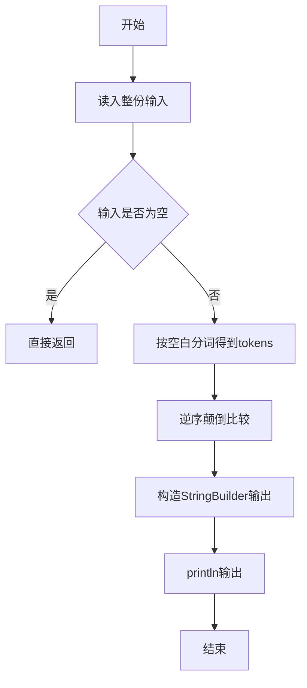
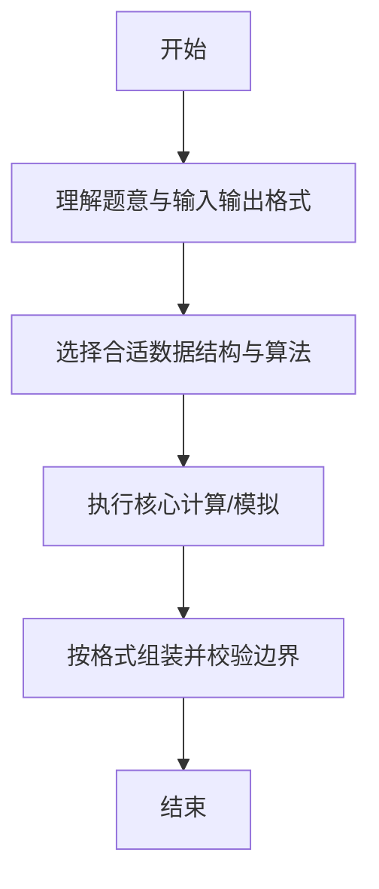

# L1-054 - 福到了（15 分）

- **时间限制**: 400 ms
- **内存限制**: 65536 KB
- **代码长度限制**: 16 KB

---

## 题目描述


“福”字倒着贴，寓意“福到”。不论到底算不算民俗，本题且请你编写程序，把各种汉字倒过来输出。这里要处理的每个汉字是由一个 N $$\times$$ N 的网格组成的，网格中的元素或者为字符 `@` 或者为空格。而倒过来的汉字所用的字符由裁判指定。

### 输入格式:

输入在第一行中给出倒过来的汉字所用的字符、以及网格的规模 N （不超过100的正整数），其间以 1 个空格分隔；随后 N 行，每行给出 N 个字符，或者为 `@` 或者为空格。

### 输出格式:

输出倒置的网格，如样例所示。但是，如果这个字正过来倒过去是一样的，就先输出`bu yong dao le`，然后再用输入指定的字符将其输出。

### 输入样例 1：
```in
$ 9
 @  @@@@@
@@@  @@@ 
 @   @ @ 
@@@  @@@ 
@@@ @@@@@
@@@ @ @ @
@@@ @@@@@
 @  @ @ @
 @  @@@@@
```

### 输出样例 1：
```out
$$$$$  $ 
$ $ $  $ 
$$$$$ $$$
$ $ $ $$$
$$$$$ $$$
 $$$  $$$
 $ $   $ 
 $$$  $$$
$$$$$  $
```

### 输入样例 2：
```in
& 3
@@@
 @ 
@@@
```

### 输出样例 2：
```out
bu yong dao le
&&&
 & 
&&&
```

## 示例

### 示例 1

**输入:**
```
$ 9
 @  @@@@@
@@@  @@@ 
 @   @ @ 
@@@  @@@ 
@@@ @@@@@
@@@ @ @ @
@@@ @@@@@
 @  @ @ @
 @  @@@@@
```

**输出:**
```
$$$$$  $ 
$ $ $  $ 
$$$$$ $$$
$ $ $ $$$
$$$$$ $$$
 $$$  $$$
 $ $   $ 
 $$$  $$$
$$$$$  $
```

### 示例 2

**输入:**
```
& 3
@@@
 @ 
@@@
```

**输出:**
```
bu yong dao le
&&&
 & 
&&&
```

--

### 解题思路

#### 题目分析
题目“L1-054 - 福到了（15 分）”的任务是：“福”字倒着贴，寓意“福到”。不论到底算不算民俗，本题且请你编写程序，把各种汉字倒过来输出。这里要处理的每个汉字是由一个 N  \times  N 的网格组成的，网格中的元素或者为字符  @  或者为空格。而倒过来的汉字所用的字符由裁判指定。输入需考虑空行、首尾空白以及多空格分隔的容错；输出要求严格按样例格式，数字、空格与换行均不可偏差。边界上要处理 空输入直接返回、非法字符过滤 等情况，仓颉实现中通过 `readToEnd` / `readln` 配合 `trimAscii` 与 `isEmpty` 提前返回来规避空指针。

#### 核心算法
逆序字符串并比较上下颠倒后的差异度。使用 `StringBuilder` 缓冲拼接以减少重复分配。实现上先将整份输入按空白分词为 `tokens`/`lines`，用 `Int64.parse` 解析数值，随后按题意执行核心循环与条件分支。该思路与 L1-054 的仓颉源码逻辑一一对应，体现了从暴力到必要的剪枝。

#### 复杂度分析
- **时间复杂度**：O(n)
- **空间复杂度**：O(n)

### 代码流程说明

1. 通过 `getStdIn().readToEnd()`/`readln` 读入全部输入，`trimAscii` 判空，若为空则直接 `return`。
2. 按空白符（空格、换行、制表）遍历 `toRuneArray()` 切分得到 `tokens`/`lines`，并过滤空串。
3. 用 `Int64.parse` 解析首个或多个数值（视题目而定），初始化计数器、集合或累加变量。
4. 执行核心逻辑——逆序颠倒比较：对应源码中的主循环/条件（如 `while`/`for`、`if` 分支、集合查表或公式计算）。
5. 将结果按题面要求的格式组装到 `StringBuilder`，处理对齐、分隔符与多行换行。
6. 调用 `println` 一次性输出最终字符串并结束 `main`。

### 代码实现

仓颉代码实现如下：

```cangjie
// L1-054 福到了 — 倒置输出
import std.env.*
import std.collection.*
import std.convert.*
main() {
    let cin = getStdIn()
    var firstLine = ""
    while (let Some(l) <- cin.readln()) {
        // keep raw line not trimmed fully for char parsing? but first line is "<char> <N>"
        if (!l.trimAscii().isEmpty()) { firstLine = l; break }
        if (!l.isEmpty()) { firstLine = l; break }
    }
    if (firstLine.isEmpty()) {
        let all = cin.readToEnd() ?? ""
        firstLine = all.split("\n")[0]
    }
    // parse char and N
    let ft = firstLine.trimAscii()
    var toks = ft.split(" ")
    var clean = ArrayList<String>()
    for (p in toks) {
        let s = p.trimAscii()
        if (!s.isEmpty()) { clean.add(s) }
        // also handle tab
        let sub = p.split("\t")
        if (sub.size > 1) {
            for (q in sub) {
                let t = q.trimAscii()
                if (!t.isEmpty() && t != s) { clean.add(t) }
            }
        }
    }
    // fallback simple: split by whitespace manual
    if (clean.size < 2) {
        // try split by last space
        var lastSpace: Int64 = -1
        var idx: Int64 = 0
        let runes = firstLine.toRuneArray()
        while (idx < runes.size) {
            if (runes[idx] == ' '.toRuneArray()[0]) { lastSpace = idx }
            idx += 1
        }
        if (lastSpace != -1) {
            clean = ArrayList<String>()
            // construct strings via rune slices? easier use substring not available
            // fallback parse via split again
        }
    }
    var chStr = ""
    var nStr = ""
    if (clean.size >= 2) {
        chStr = clean[0]
        nStr = clean[1]
    } else {
        // alternative: first non-space char is ch
        let trimmed = firstLine.trimAscii()
        if (!trimmed.isEmpty()) {
            chStr = trimmed.split(" ")[0]
            // find number part
            var parts2 = trimmed.split(" ")
            for (p in parts2) {
                let t = p.trimAscii()
                if (t.isEmpty()) { continue }
                if (t == chStr) { continue }
                nStr = t
            }
        }
    }
    if (chStr.isEmpty() || nStr.isEmpty()) { return }
    // new char is first rune of chStr
    let newRunes = chStr.toRuneArray()
    let newRune = newRunes[0]
    let n = Int64.parse(nStr.trimAscii())
    // read n grid lines, preserving spaces, each exactly N characters
    var grid = Array<Array<Rune>>(n, { _ => Array<Rune>(n, repeat: ' '.toRuneArray()[0]) })
    var row: Int64 = 0
    // we have already consumed firstLine, need to read next n lines via readln
    while (row < n) {
        var lineOpt = cin.readln()
        var line: String = ""
        if (let Some(l) <- lineOpt) {
            line = l
        } else {
            let rest = cin.readToEnd() ?? ""
            let restLines = rest.split("\n")
            var ri: Int64 = 0
            while (row < n && ri < restLines.size) {
                line = restLines[ri]
                ri += 1
                // process this line
                let ra = line.toRuneArray()
                var col: Int64 = 0
                while (col < n) {
                    if (col < ra.size) { grid[row][col] = ra[col] } else { grid[row][col] = ' '.toRuneArray()[0] }
                    col += 1
                }
                row += 1
            }
            break
        }
        let ra = line.toRuneArray()
        var col: Int64 = 0
        while (col < n) {
            if (col < ra.size) { grid[row][col] = ra[col] } else { grid[row][col] = ' '.toRuneArray()[0] }
            col += 1
        }
        row += 1
    }
    // If we didn't get enough rows due to empty read, try readToEnd fallback
    if (row < n) {
        let rest = cin.readToEnd() ?? ""
        let restLines = rest.split("\n")
        var ri: Int64 = 0
        while (row < n && ri < restLines.size) {
            let line = restLines[ri]
            ri += 1
            if (line.isEmpty() && row < n-1) { continue }
            let ra = line.toRuneArray()
            var col: Int64 = 0
            while (col < n) {
                if (col < ra.size) { grid[row][col] = ra[col] } else { grid[row][col] = ' '.toRuneArray()[0] }
                col += 1
            }
            row += 1
        }
    }
    // check palindrome: grid[i][j] vs grid[n-1-i][n-1-j]
    var pal = true
    var i: Int64 = 0
    while (i < n) {
        var j: Int64 = 0
        while (j < n) {
            if (grid[i][j] != grid[n-1-i][n-1-j]) { pal = false; break }
            j += 1
        }
        if (!pal) { break }
        i += 1
    }
    if (pal) { println("bu yong dao le") }
    // build reversed grid with substitution
    var outIdx: Int64 = 0
    while (outIdx < n) {
        let sb = StringBuilder()
        var j: Int64 = 0
        while (j < n) {
            // reversed position
            let ri = n - 1 - outIdx
            let rj = n - 1 - j
            let c = grid[ri][rj]
            let atRune = '@'.toRuneArray()[0]
            if (c == atRune) {
                sb.append(newRune.toString())
            } else {
                sb.append(c.toString())
            }
            j += 1
        }
        println(sb.toString())
        outIdx += 1
    }
}
```

### 代码流程图



### 解题流程图



