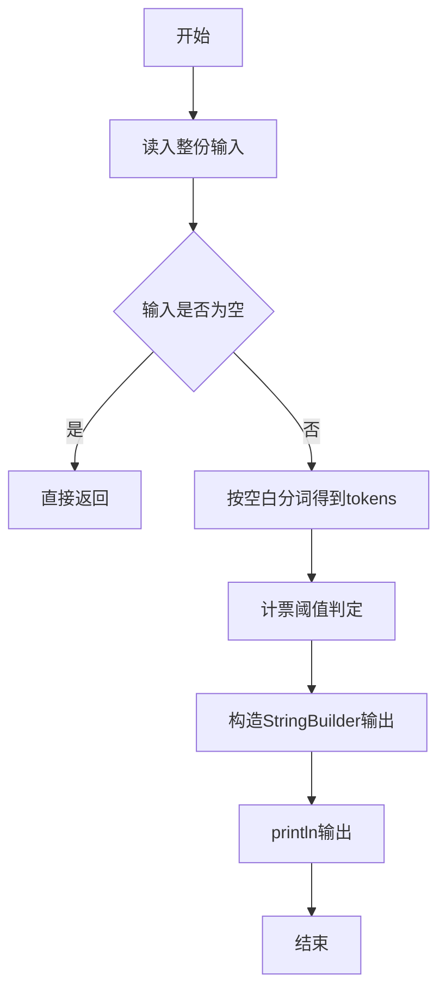
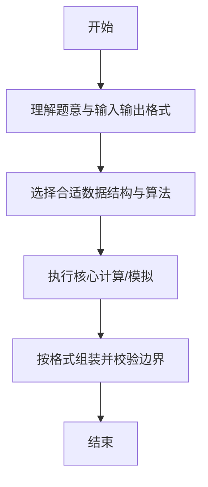

# L1-055 - 谁是赢家（10 分）

- **时间限制**: 400 ms
- **内存限制**: 65536 KB
- **代码长度限制**: 16 KB

---

## 题目描述


某电视台的娱乐节目有个表演评审环节，每次安排两位艺人表演，他们的胜负由观众投票和 3 名评委投票两部分共同决定。规则为：如果一位艺人的观众票数高，且得到至少 1 名评委的认可，该艺人就胜出；或艺人的观众票数低，但得到全部评委的认可，也可以胜出。节目保证投票的观众人数为奇数，所以不存在平票的情况。本题就请你用程序判断谁是赢家。

### 输入格式:

输入第一行给出 2 个不超过 1000 的正整数 Pa 和 Pb，分别是艺人 a 和艺人 b 得到的观众票数。题目保证这两个数字不相等。随后第二行给出 3 名评委的投票结果。数字 0 代表投票给 a，数字 1 代表投票给 b，其间以一个空格分隔。

### 输出格式:

按以下格式输出赢家：

```
The winner is x: P1 + P2
```

其中 `x` 是代表赢家的字母，`P1` 是赢家得到的观众票数，`P2` 是赢家得到的评委票数。

### 输入样例:
```in
327 129
1 0 1
```

### 输出样例:
```out
The winner is a: 327 + 1
```

## 示例

### 示例 1

**输入:**
```
327 129
1 0 1
```

**输出:**
```
The winner is a: 327 + 1
```

--

### 解题思路

#### 题目分析
题目“L1-055 - 谁是赢家（10 分）”的任务是：某电视台的娱乐节目有个表演评审环节，每次安排两位艺人表演，他们的胜负由观众投票和 3 名评委投票两部分共同决定。规则为：如果一位艺人的观众票数高，且得到至少 1 名评委的认可，该艺人就胜出；或艺人的观众票数低，但得到全部评委的认可，也可以胜。输入需考虑空行、首尾空白以及多空格分隔的容错；输出要求严格按样例格式，数字、空格与换行均不可偏差。边界上要处理 空输入直接返回、非法字符过滤 等情况，仓颉实现中通过 `readToEnd` / `readln` 配合 `trimAscii` 与 `isEmpty` 提前返回来规避空指针。

#### 核心算法
计票并与阈值比较判定赢家及是否破纪录。实现上先将整份输入按空白分词为 `tokens`/`lines`，用 `Int64.parse` 解析数值，随后按题意执行核心循环与条件分支。该思路与 L1-055 的仓颉源码逻辑一一对应，体现了从暴力到必要的剪枝。

#### 复杂度分析
- **时间复杂度**：O(n)
- **空间复杂度**：O(n)

### 代码流程说明

1. 通过 `getStdIn().readToEnd()`/`readln` 读入全部输入，`trimAscii` 判空，若为空则直接 `return`。
2. 按空白符（空格、换行、制表）遍历 `toRuneArray()` 切分得到 `tokens`/`lines`，并过滤空串。
3. 用 `Int64.parse` 解析首个或多个数值（视题目而定），初始化计数器、集合或累加变量。
4. 执行核心逻辑——计票阈值判定：对应源码中的主循环/条件（如 `while`/`for`、`if` 分支、集合查表或公式计算）。
5. 将结果按题面要求的格式组装到 `StringBuilder`，处理对齐、分隔符与多行换行。
6. 调用 `println` 一次性输出最终字符串并结束 `main`。

### 代码实现

仓颉代码实现如下：

```cangjie
// L1-055 谁是赢家 — 判断赢家
import std.env.*
import std.collection.*
import std.convert.*
main() {
    let cin = getStdIn()
    let all = cin.readToEnd() ?? ""
    if (all.trimAscii().isEmpty()) { return }
    var parts = all.split(" ")
    var toks = ArrayList<String>()
    for (p in parts) {
        let a = p.split("\n")
        for (q in a) {
            let b = q.split("\r")
            for (r in b) {
                let c = r.split("\t")
                for (t in c) {
                    let s = t.trimAscii()
                    if (!s.isEmpty()) { toks.add(s) }
                }
            }
        }
    }
    if (toks.size < 5) { return }
    let pa = Int64.parse(toks[0])
    let pb = Int64.parse(toks[1])
    let v0 = Int64.parse(toks[2])
    let v1 = Int64.parse(toks[3])
    let v2 = Int64.parse(toks[4])
    var ca: Int64 = 0
    var cb: Int64 = 0
    if (v0 == 0) { ca += 1 } else { cb += 1 }
    if (v1 == 0) { ca += 1 } else { cb += 1 }
    if (v2 == 0) { ca += 1 } else { cb += 1 }
    var winner: String = ""
    var p1: Int64 = 0
    var p2: Int64 = 0
    if (pa > pb) {
        if (ca >= 1) { winner = "a"; p1 = pa; p2 = ca } else { winner = "b"; p1 = pb; p2 = cb }
    } else {
        if (cb >= 1) { winner = "b"; p1 = pb; p2 = cb } else { winner = "a"; p1 = pa; p2 = ca }
    }
    println("The winner is ${winner}: ${p1} + ${p2}")
}
```

### 代码流程图



### 解题流程图



