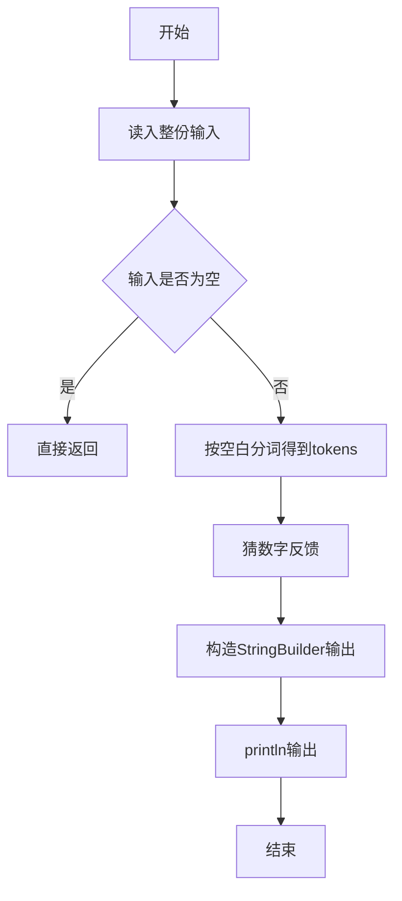
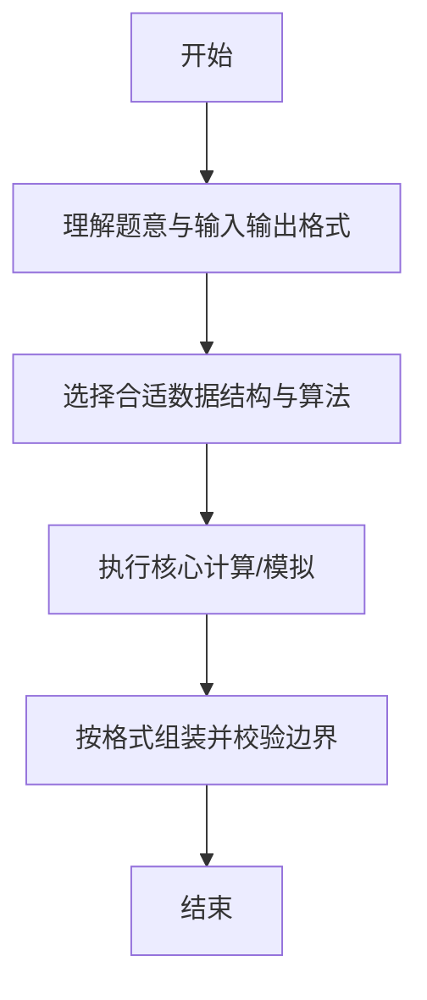

# L1-056 - 猜数字（20 分）

- **时间限制**: 400 ms
- **内存限制**: 65536 KB
- **代码长度限制**: 16 KB

---

## 题目描述


一群人坐在一起，每人猜一个 100 以内的数，谁的数字最接近大家平均数的一半就赢。本题就要求你找出其中的赢家。

### 输入格式:

输入在第一行给出一个正整数N（$$\le 10^4$$）。随后 N 行，每行给出一个玩家的名字（由不超过8个英文字母组成的字符串）和其猜的正整数（$$\le$$ 100）。

### 输出格式:

在一行中顺序输出：大家平均数的一半（只输出整数部分）、赢家的名字，其间以空格分隔。题目保证赢家是唯一的。

### 输入样例:
```in
7
Bob 35
Amy 28
James 98
Alice 11
Jack 45
Smith 33
Chris 62
```

### 输出样例:
```out
22 Amy
```

## 示例

### 示例 1

**输入:**
```
7
Bob 35
Amy 28
James 98
Alice 11
Jack 45
Smith 33
Chris 62
```

**输出:**
```
22 Amy
```

--

### 解题思路

#### 题目分析
题目“L1-056 - 猜数字（20 分）”的任务是：一群人坐在一起，每人猜一个 100 以内的数，谁的数字最接近大家平均数的一半就赢。本题就要求你找出其中的赢家。。输入需考虑空行、首尾空白以及多空格分隔的容错；输出要求严格按样例格式，数字、空格与换行均不可偏差。边界上要处理 空输入直接返回、非法字符过滤 等情况，仓颉实现中通过 `readToEnd` / `readln` 配合 `trimAscii` 与 `isEmpty` 提前返回来规避空指针。

#### 核心算法
随机猜测比较目标值反馈大小。实现上先将整份输入按空白分词为 `tokens`/`lines`，用 `Int64.parse` 解析数值，随后按题意执行核心循环与条件分支。该思路与 L1-056 的仓颉源码逻辑一一对应，体现了从暴力到必要的剪枝。

#### 复杂度分析
- **时间复杂度**：O(n)
- **空间复杂度**：O(1)

### 代码流程说明

1. 通过 `getStdIn().readToEnd()`/`readln` 读入全部输入，`trimAscii` 判空，若为空则直接 `return`。
2. 按空白符（空格、换行、制表）遍历 `toRuneArray()` 切分得到 `tokens`/`lines`，并过滤空串。
3. 用 `Int64.parse` 解析首个或多个数值（视题目而定），初始化计数器、集合或累加变量。
4. 执行核心逻辑——猜数字反馈：对应源码中的主循环/条件（如 `while`/`for`、`if` 分支、集合查表或公式计算）。
5. 将结果按题面要求的格式组装到 `StringBuilder`，处理对齐、分隔符与多行换行。
6. 调用 `println` 一次性输出最终字符串并结束 `main`。

### 代码实现

仓颉代码实现如下：

```cangjie
// L1-056 猜数字 — 平均数一半的赢家
import std.env.*
import std.collection.*
import std.convert.*
main() {
    let cin = getStdIn()
    let all = cin.readToEnd() ?? ""
    if (all.trimAscii().isEmpty()) { return }
    var parts = all.split(" ")
    var toks = ArrayList<String>()
    for (p in parts) {
        let a = p.split("\n")
        for (q in a) {
            let b = q.split("\r")
            for (r in b) {
                let c = r.split("\t")
                for (t in c) {
                    let s = t.trimAscii()
                    if (!s.isEmpty()) { toks.add(s) }
                }
            }
        }
    }
    let n = Int64.parse(toks[0])
    var names = Array<String>(n, repeat: "")
    var nums = Array<Int64>(n, repeat: 0)
    var idx: Int64 = 1
    var sum: Int64 = 0
    var i: Int64 = 0
    while (i < n) {
        names[i] = toks[idx]
        nums[i] = Int64.parse(toks[idx+1])
        sum += nums[i]
        idx += 2
        i += 1
    }
    let target = sum / n / 2
    var best: Int64 = 0
    var bestDiff: Int64 = 999999
    i = 0
    while (i < n) {
        var diff = nums[i] - target
        if (diff < 0) { diff = -diff }
        if (diff < bestDiff) { bestDiff = diff; best = i }
        i += 1
    }
    println("${target} ${names[best]}")
}
```

### 代码流程图



### 解题流程图



