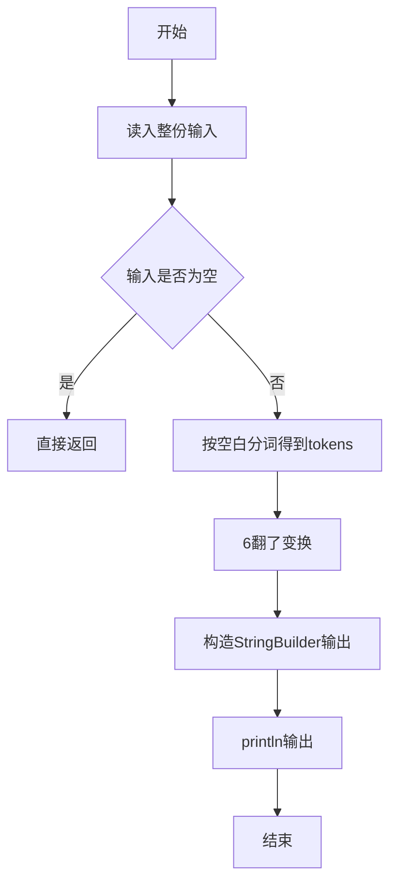
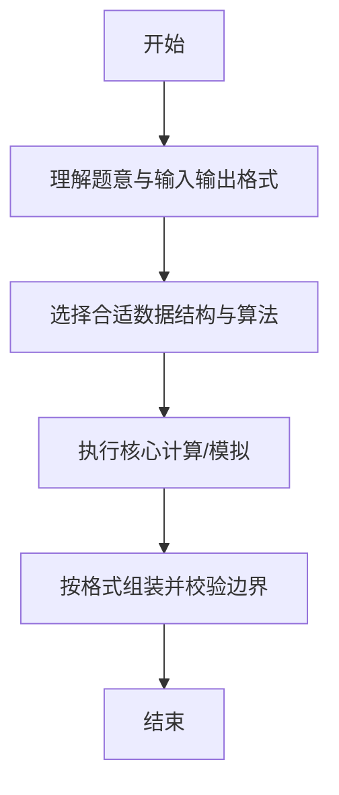

# L1-058 - 6翻了（15 分）

- **时间限制**: 400 ms
- **内存限制**: 65536 KB
- **代码长度限制**: 16 KB

---

## 题目描述


“666”是一种网络用语，大概是表示某人很厉害、我们很佩服的意思。最近又衍生出另一个数字“9”，意思是“6翻了”，实在太厉害的意思。如果你以为这就是厉害的最高境界，那就错啦 —— 目前的最高境界是数字“27”，因为这是 3 个 “9”！

本题就请你编写程序，将那些过时的、只会用一连串“6666……6”表达仰慕的句子，翻译成最新的高级表达。

### 输入格式:

输入在一行中给出一句话，即一个非空字符串，由不超过 1000 个英文字母、数字和空格组成，以回车结束。

### 输出格式:

从左到右扫描输入的句子：如果句子中有超过 3 个连续的 6，则将这串连续的 6 替换成 9；但如果有超过 9 个连续的 6，则将这串连续的 6 替换成 27。其他内容不受影响，原样输出。

### 输入样例:
```in
it is so 666 really 6666 what else can I say 6666666666
```

### 输出样例:
```out
it is so 666 really 9 what else can I say 27
```

## 示例

### 示例 1

**输入:**
```
it is so 666 really 6666 what else can I say 6666666666
```

**输出:**
```
it is so 666 really 9 what else can I say 27
```

--

### 解题思路

#### 题目分析
题目“L1-058 - 6翻了（15 分）”的任务是： “666”是一种网络用语，大概是表示某人很厉害、我们很佩服的意思。最近又衍生出另一个数字“9”，意思是“6翻了”，实在太厉害的意思。输入需考虑空行、首尾空白以及多空格分隔的容错；输出要求严格按样例格式，数字、空格与换行均不可偏差。边界上要处理 空输入直接返回、非法字符过滤 等情况，仓颉实现中通过 `readToEnd` / `readln` 配合 `trimAscii` 与 `isEmpty` 提前返回来规避空指针。

#### 核心算法
将数字中6与9互换并按特定规则翻转。使用 `StringBuilder` 缓冲拼接以减少重复分配。实现上先将整份输入按空白分词为 `tokens`/`lines`，用 `Int64.parse` 解析数值，随后按题意执行核心循环与条件分支。该思路与 L1-058 的仓颉源码逻辑一一对应，体现了从暴力到必要的剪枝。

#### 复杂度分析
- **时间复杂度**：O(n)
- **空间复杂度**：O(n)

### 代码流程说明

1. 通过 `getStdIn().readToEnd()`/`readln` 读入全部输入，`trimAscii` 判空，若为空则直接 `return`。
2. 按空白符（空格、换行、制表）遍历 `toRuneArray()` 切分得到 `tokens`/`lines`，并过滤空串。
3. 用 `Int64.parse` 解析首个或多个数值（视题目而定），初始化计数器、集合或累加变量。
4. 执行核心逻辑——6翻了变换：对应源码中的主循环/条件（如 `while`/`for`、`if` 分支、集合查表或公式计算）。
5. 将结果按题面要求的格式组装到 `StringBuilder`，处理对齐、分隔符与多行换行。
6. 调用 `println` 一次性输出最终字符串并结束 `main`。

### 代码实现

仓颉代码实现如下：

```cangjie
// L1-058 6翻了 — 连续6替换
import std.env.*
main() {
    let cin = getStdIn()
    var line = ""
    var got = false
    while (let Some(l) <- cin.readln()) {
        if (!got) {
            line = l
            got = true
            var extra = cin.readToEnd() ?? ""
            if (!extra.isEmpty()) {
                line = line + "\n" + extra
            }
            break
        }
    }
    if (!got) {
        let all = cin.readToEnd() ?? ""
        line = all
    }
    let ra = line.toRuneArray()
    let sb = StringBuilder()
    var cnt: Int64 = 0
    var idx: Int64 = 0
    let six = '6'.toRuneArray()[0]
    while (idx < ra.size) {
        let r = ra[idx]
        if (r == six) {
            cnt += 1
        } else {
            if (cnt > 0) {
                if (cnt > 9) { sb.append("27") }
                else if (cnt > 3) { sb.append("9") }
                else {
                    var k: Int64 = 0
                    while (k < cnt) { sb.append("6"); k += 1 }
                }
                cnt = 0
            }
            sb.append(r.toString())
        }
        idx += 1
    }
    if (cnt > 0) {
        if (cnt > 9) { sb.append("27") }
        else if (cnt > 3) { sb.append("9") }
        else {
            var k: Int64 = 0
            while (k < cnt) { sb.append("6"); k += 1 }
        }
    }
    println(sb.toString())
}
```

### 代码流程图



### 解题流程图



