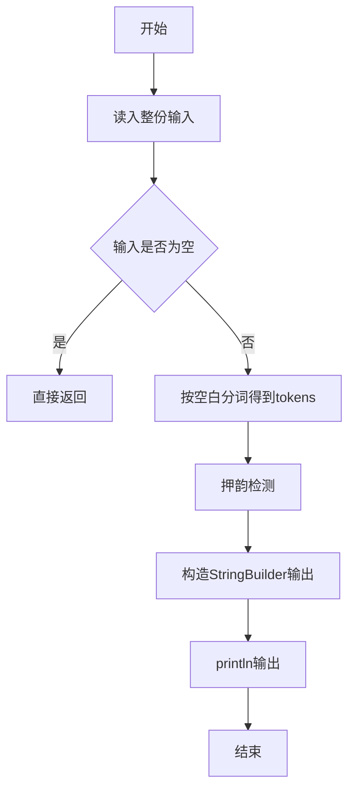
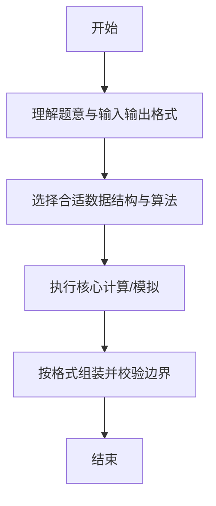

# L1-059 - 敲笨钟（20 分）

- **时间限制**: 400 ms
- **内存限制**: 65536 KB
- **代码长度限制**: 16 KB

---

## 题目描述


微博上有个自称“大笨钟V”的家伙，每天敲钟催促码农们爱惜身体早点睡觉。为了增加敲钟的趣味性，还会糟改几句古诗词。其糟改的方法为：去网上搜寻压“ong”韵的古诗词，把句尾的三个字换成“敲笨钟”。例如唐代诗人李贺有名句曰：“寻章摘句老雕虫，晓月当帘挂玉弓”，其中“虫”（chong）和“弓”（gong）都压了“ong”韵。于是这句诗就被糟改为“寻章摘句老雕虫，晓月当帘敲笨钟”。

现在给你一大堆古诗词句，要求你写个程序自动将压“ong”韵的句子糟改成“敲笨钟”。

### 输入格式:

输入首先在第一行给出一个不超过 20 的正整数 N。随后 N 行，每行用汉语拼音给出一句古诗词，分上下两半句，用逗号 `,` 分隔，句号 `.` 结尾。相邻两字的拼音之间用一个空格分隔。题目保证每个字的拼音不超过 6 个字符，每行字符的总长度不超过 100，并且下半句诗至少有 3 个字。

### 输出格式:

对每一行诗句，判断其是否压“ong”韵。即上下两句末尾的字都是“ong”结尾。如果是压此韵的，就按题面方法糟改之后输出，输出格式同输入；否则输出 `Skipped`，即跳过此句。

### 输入样例:
```in
5
xun zhang zhai ju lao diao chong, xiao yue dang lian gua yu gong.
tian sheng wo cai bi you yong, qian jin san jin huan fu lai.
xue zhui rou zhi leng wei rong, an xiao chen jing shu wei long.
zuo ye xing chen zuo ye feng, hua lou xi pan gui tang dong.
ren xian gui hua luo, ye jing chun shan kong.
```

### 输出样例:
```out
xun zhang zhai ju lao diao chong, xiao yue dang lian qiao ben zhong.
Skipped
xue zhui rou zhi leng wei rong, an xiao chen jing qiao ben zhong.
Skipped
Skipped
```

## 示例

### 示例 1

**输入:**
```
5
xun zhang zhai ju lao diao chong, xiao yue dang lian gua yu gong.
tian sheng wo cai bi you yong, qian jin san jin huan fu lai.
xue zhui rou zhi leng wei rong, an xiao chen jing shu wei long.
zuo ye xing chen zuo ye feng, hua lou xi pan gui tang dong.
ren xian gui hua luo, ye jing chun shan kong.
```

**输出:**
```
xun zhang zhai ju lao diao chong, xiao yue dang lian qiao ben zhong.
Skipped
xue zhui rou zhi leng wei rong, an xiao chen jing qiao ben zhong.
Skipped
Skipped
```

--

### 解题思路

#### 题目分析
题目“L1-059 - 敲笨钟（20 分）”的任务是：微博上有个自称“大笨钟V”的家伙，每天敲钟催促码农们爱惜身体早点睡觉。为了增加敲钟的趣味性，还会糟改几句古诗词。其糟改的方法为：去网上搜寻压“ong”韵的古诗词，把句尾的三个字换成“敲笨钟”。例如唐代诗人李贺有名句曰：“寻章摘句老雕虫，晓月。输入需考虑空行、首尾空白以及多空格分隔的容错；输出要求严格按样例格式，数字、空格与换行均不可偏差。边界上要处理 极值、零值与符号位 等情况，仓颉实现中通过 `readToEnd` / `readln` 配合 `trimAscii` 与 `isEmpty` 提前返回来规避空指针。

#### 核心算法
检测两句诗末尾三字是否押韵且符合敲笨钟规则。使用 `StringBuilder` 缓冲拼接以减少重复分配。实现上先将整份输入按空白分词为 `tokens`/`lines`，用 `Int64.parse` 解析数值，随后按题意执行核心循环与条件分支。该思路与 L1-059 的仓颉源码逻辑一一对应，体现了从暴力到必要的剪枝。

#### 复杂度分析
- **时间复杂度**：O(n)
- **空间复杂度**：O(1)

### 代码流程说明

1. 通过 `getStdIn().readToEnd()`/`readln` 读入全部输入，`trimAscii` 判空，若为空则直接 `return`。
2. 按空白符（空格、换行、制表）遍历 `toRuneArray()` 切分得到 `tokens`/`lines`，并过滤空串。
3. 用 `Int64.parse` 解析首个或多个数值（视题目而定），初始化计数器、集合或累加变量。
4. 执行核心逻辑——押韵检测：对应源码中的主循环/条件（如 `while`/`for`、`if` 分支、集合查表或公式计算）。
5. 将结果按题面要求的格式组装到 `StringBuilder`，处理对齐、分隔符与多行换行。
6. 调用 `println` 一次性输出最终字符串并结束 `main`。

### 代码实现

仓颉代码实现如下：

```cangjie
// L1-059 敲笨钟 - 判断压ong韵并替换末三字
import std.env.*
import std.collection.*
import std.convert.*

func isOng(word: String): Bool {
    let a = word.toRuneArray()
    if (a.size < 3) { return false }
    return a[a.size - 3] == r'o' && a[a.size - 2] == r'n' && a[a.size - 1] == r'g'
}

main() {
    let cin = getStdIn()
    var lines = ArrayList<String>()
    while (let Some(line) <- cin.readln()) {
        lines.add(line)
    }
    if (lines.size == 0) { return }
    let n = Int64.parse(lines[0].trimAscii())
    for (k in 0..n) {
        let idx = 1 + k
        if (idx >= Int64(lines.size)) { break }
        let raw = lines[idx]
        // split by comma
        let parts = raw.split(",")
        if (parts.size < 2) {
            println("Skipped")
            continue
        }
        let upperRaw = parts[0].trimAscii()
        // second part: join remaining commas? but only one comma expected
        var lowerRawBuilder = StringBuilder()
        for (i in 1..Int64(parts.size)) {
            if (i > 1) { lowerRawBuilder.append(",") }
            lowerRawBuilder.append(parts[i])
        }
        var lowerWithDot = lowerRawBuilder.toString().trimAscii()
        // remove trailing '.'
        if (lowerWithDot.size > 0) {
            let la = lowerWithDot.toRuneArray()
            if (la[la.size - 1] == r'.') {
                var tmp = ArrayList<Rune>()
                for (i in 0..Int64(la.size)-1) { tmp.add(la[i]) }
                var sb = StringBuilder()
                for (r in tmp) { sb.append("${r}") }
                lowerWithDot = sb.toString().trimAscii()
            }
        }
        let upPartsRaw = upperRaw.split(" ")
        let lowPartsRaw = lowerWithDot.split(" ")
        var upParts = ArrayList<String>()
        var lowParts = ArrayList<String>()
        for (p in upPartsRaw) { if (p.size > 0) { upParts.add(p) } }
        for (p in lowPartsRaw) { if (p.size > 0) { lowParts.add(p) } }
        if (upParts.size == 0 || lowParts.size == 0) {
            println("Skipped")
            continue
        }
        let lastUp = upParts[upParts.size - 1]
        let lastLow = lowParts[lowParts.size - 1]
        if (!isOng(lastUp) || !isOng(lastLow)) {
            println("Skipped")
            continue
        }
        var newLow = ArrayList<String>()
        let keep = lowParts.size - 3
        for (i in 0..keep) { newLow.add(lowParts[i]) }
        newLow.add("qiao")
        newLow.add("ben")
        newLow.add("zhong")
        let sbUp = StringBuilder()
        for (i in 0..Int64(upParts.size)) {
            if (i > 0) { sbUp.append(" ") }
            sbUp.append(upParts[i])
        }
        let sbLow = StringBuilder()
        for (i in 0..Int64(newLow.size)) {
            if (i > 0) { sbLow.append(" ") }
            sbLow.append(newLow[i])
        }
        println("${sbUp.toString()}, ${sbLow.toString()}.")
    }
}
```

### 代码流程图



### 解题流程图



