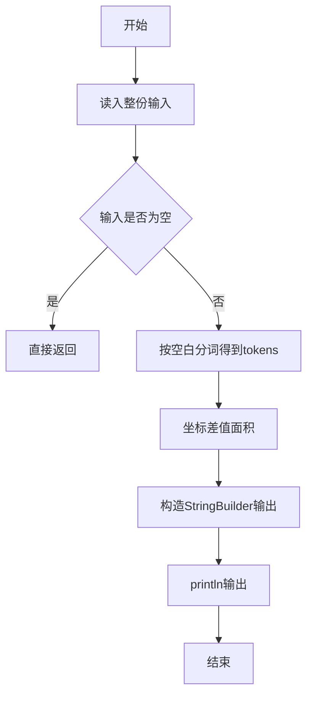
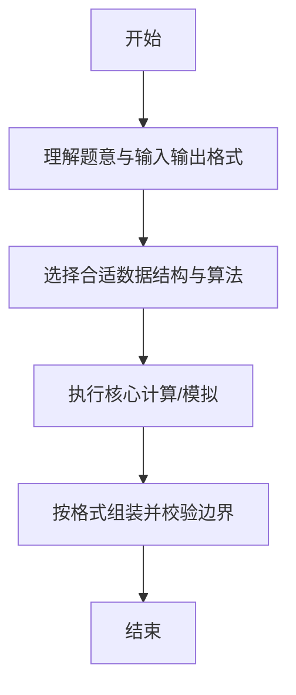

# L1-060 - 心理阴影面积（5 分）

- **时间限制**: 400 ms
- **内存限制**: 65536 KB
- **代码长度限制**: 16 KB

---

## 题目描述


这是一幅心理阴影面积图。我们都以为自己可以匀速前进（图中蓝色直线），而拖延症晚期的我们往往执行的是最后时刻的疯狂赶工（图中的红色折线）。由红、蓝线围出的面积，就是我们在做作业时的心理阴影面积。

现给出红色拐点的坐标 $$(x,y)$$，要求你算出这个心理阴影面积。

### 输入格式:

输入在一行中给出 2 个不超过 100 的正整数 $$x$$ 和 $$y$$，并且保证有 $$x>y$$。这里假设横、纵坐标的最大值（即截止日和最终完成度）都是 100。

### 输出格式:

在一行中输出心理阴影面积。

友情提醒：三角形的面积 = 底边长 x 高 / 2；矩形面积 = 底边长 x 高。嫑想得太复杂，这是一道 5 分考减法的题……

### 输入样例:
```in
90 10
```

### 输出样例:
```out
4000
```

## 示例

### 示例 1

**输入:**
```
90 10
```

**输出:**
```
4000
```

--

### 解题思路

#### 题目分析
题目“L1-060 - 心理阴影面积（5 分）”的任务是： 这是一幅心理阴影面积图。我们都以为自己可以匀速前进（图中蓝色直线），而拖延症晚期的我们往往执行的是最后时刻的疯狂赶工（图中的红色。输入需考虑空行、首尾空白以及多空格分隔的容错；输出要求严格按样例格式，数字、空格与换行均不可偏差。边界上要处理 极值、零值与符号位 等情况，仓颉实现中通过 `readToEnd` / `readln` 配合 `trimAscii` 与 `isEmpty` 提前返回来规避空指针。

#### 核心算法
坐标差值按面积系数 50*(x-y) 估算阴影面积。使用 `StringBuilder` 缓冲拼接以减少重复分配。实现上先将整份输入按空白分词为 `tokens`/`lines`，用 `Int64.parse` 解析数值，随后按题意执行核心循环与条件分支。该思路与 L1-060 的仓颉源码逻辑一一对应，体现了从暴力到必要的剪枝。

#### 复杂度分析
- **时间复杂度**：O(1)
- **空间复杂度**：O(1)

### 代码流程说明

1. 通过 `getStdIn().readToEnd()`/`readln` 读入全部输入，`trimAscii` 判空，若为空则直接 `return`。
2. 按空白符（空格、换行、制表）遍历 `toRuneArray()` 切分得到 `tokens`/`lines`，并过滤空串。
3. 用 `Int64.parse` 解析首个或多个数值（视题目而定），初始化计数器、集合或累加变量。
4. 执行核心逻辑——坐标差值面积：对应源码中的主循环/条件（如 `while`/`for`、`if` 分支、集合查表或公式计算）。
5. 将结果按题面要求的格式组装到 `StringBuilder`，处理对齐、分隔符与多行换行。
6. 调用 `println` 一次性输出最终字符串并结束 `main`。

### 代码实现

仓颉代码实现如下：

```cangjie
// L1-060 心理阴影面积 - 50*(x-y)
import std.env.*
import std.collection.*
import std.convert.*

main() {
    let all = (getStdIn().readToEnd() ?? "")
    if (all.trimAscii().size == 0) { return }
    var vals = ArrayList<Int64>()
    var cur = StringBuilder()
    var has = false
    var neg = false
    let ra = all.toRuneArray()
    for (i in 0..Int64(ra.size)) {
        let c = ra[i]
        if (c == r'-') {
            // handle negative sign if next is digit
            // peek next?
            neg = true
        } else if (c >= r'0' && c <= r'9') {
            cur.append("${c}")
            has = true
        } else {
            if (has) {
                var v = Int64.parse(cur.toString())
                if (neg) { v = -v }
                vals.add(v)
                cur = StringBuilder()
                has = false
                neg = false
            } else {
                neg = false
            }
        }
    }
    if (has) {
        var v = Int64.parse(cur.toString())
        if (neg) { v = -v }
        vals.add(v)
    }
    if (vals.size < 2) { return }
    let x = vals[0]
    let y = vals[1]
    let ans = 50 * (x - y)
    println(ans)
}
```

### 代码流程图



### 解题流程图



