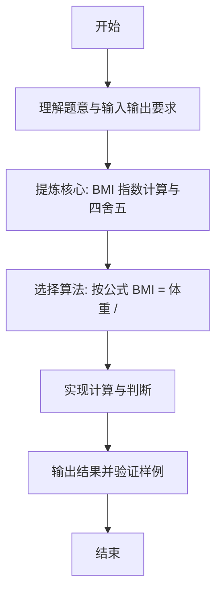

# L1-061 - 新胖子公式（10 分）

- **时间限制**: 400 ms
- **内存限制**: 65536 KB
- **代码长度限制**: 16 KB

---

## 题目描述


根据钱江晚报官方微博的报导，最新的肥胖计算方法为：体重(kg) / 身高(m) 的平方。如果超过 25，你就是胖子。于是本题就请你编写程序自动判断一个人到底算不算胖子。

### 输入格式:

输入在一行中给出两个正数，依次为一个人的体重（以 kg 为单位）和身高（以 m 为单位），其间以空格分隔。其中体重不超过 1000 kg，身高不超过 3.0 m。

### 输出格式:

首先输出将该人的体重和身高代入肥胖公式的计算结果，保留小数点后 1 位。如果这个数值大于 25，就在第二行输出 `PANG`，否则输出 `Hai Xing`。

### 输入样例 1：
```in
100.1 1.74
```

### 输出样例 1：
```out
33.1
PANG
```

### 输入样例 2：
```in
65 1.70
```

### 输出样例 2：
```out
22.5
Hai Xing
```

## 示例

### 示例 1

**输入:**
```
100.1 1.74
```

**输出:**
```
33.1
PANG
```

### 示例 2

**输入:**
```
65 1.70
```

**输出:**
```
22.5
Hai Xing
```

---

### 解题思路

#### 题目分析
本题为“新胖子公式”（BMI 指数计算与四舍五入）。题面要求根据给定输入按规则计算并输出结果，输入规模小但需注意格式与边界。BMI 指数计算与四舍五入的判定涉及多分支或字符串处理，需将输入准确分词后逐项处理。仓颉实现中通过 `readToEnd`/`readln` 读取并以空白或行分割，兼顾有无换行与多空格的情况。

#### 核心算法
按公式 BMI = 体重 / 身高² 计算，使用 round(bmi*10)/10 保留一位小数，阈值 25 判断胖瘦。实现上直接模拟题意：先将原始输入规范化为 Token 或行数组，再按规则遍历计算。例如 以 readToEnd 读取全部输入并按，随后 用 Float64.parse 解析 w 与 h，最后按条件分支输出。算法保持线性遍历，无需复杂数据结构，仅需若干计数器与集合即可完成。

#### 复杂度分析
- **时间复杂度**：遍历分词 O(n)。
- **空间复杂度**：O(1)，仅需常量或线性辅助数组存储输入分词结果。

### 代码流程说明

1. 以 readToEnd 读取全部输入并按空白分词得到体重与身高。
2. 用 Float64.parse 解析 w 与 h。
3. 计算 bmi = w/(h*h) 为 Float64。
4. 调用 format1 通过 round(bmi*10) 实现一位小数四舍五入。
5. 输出格式化后的 BMI。
6. 分支判断 bmi>25 输出 PANG 否则 Hai Xing。

### 代码实现

完整仓颉源码如下（与 `.cj` 文件一致）：

```cangjie
// L1-061 新胖子公式 - BMI保留1位
import std.env.*
import std.collection.*
import std.convert.*
import std.math.*

func format1(x: Float64): String {
    let scaled = Int64(round(x * 10.0))
    let neg = scaled < 0
    let a: Int64 = if (neg) { -scaled } else { scaled }
    let intPart = a / 10
    let frac = a % 10
    let sign = if (neg) { "-" } else { "" }
    return "${sign}${intPart}.${frac}"
}

main() {
    let all = (getStdIn().readToEnd() ?? "")
    if (all.trimAscii().size == 0) { return }
    var tokens = ArrayList<String>()
    var cur = StringBuilder()
    let ra = all.toRuneArray()
    for (i in 0..Int64(ra.size)) {
        let c = ra[i]
        if (c != r' ' && c != r'\n' && c != r'\r' && c != r'\t') {
            cur.append("${c}")
        } else {
            if (cur.size > 0) { tokens.add(cur.toString()); cur = StringBuilder() }
        }
    }
    if (cur.size > 0) { tokens.add(cur.toString()) }
    if (tokens.size < 2) { return }
    let w = Float64.parse(tokens[0])
    let h = Float64.parse(tokens[1])
    let bmi = w / (h * h)
    println(format1(bmi))
    if (bmi > 25.0) {
        println("PANG")
    } else {
        println("Hai Xing")
    }
}
```

### 代码流程图

```mermaid
flowchart TD
    A[开始] --> B[读取输入]
    B --> C[以 readToEnd 读取全部输入并按空白]
    C --> D[用 Float64.parse 解析 w 与]
    D --> E[计算 bmi = w/(h*h) 为 Flo]
    E --> F[调用 format1 通过 round(bm]
    F --> G[输出格式化后的 BMI]
    G --> H[分支判断 bmi>25 输出 PANG 否则]
    H --> Z[结束]
```

### 解题流程图


