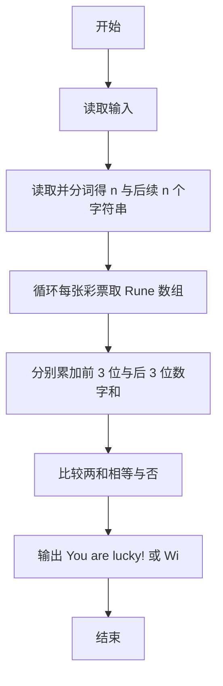
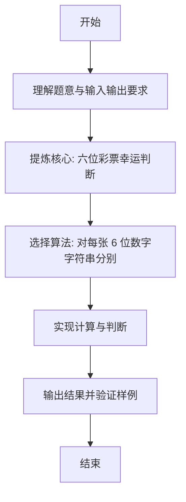

# L1-062 - 幸运彩票（15 分）

- **时间限制**: 400 ms
- **内存限制**: 65536 KB
- **代码长度限制**: 16 KB

---

## 题目描述


彩票的号码有 6 位数字，若一张彩票的前 3 位上的数之和等于后 3 位上的数之和，则称这张彩票是幸运的。本题就请你判断给定的彩票是不是幸运的。

### 输入格式:

输入在第一行中给出一个正整数 N（$$\le$$ 100）。随后 N 行，每行给出一张彩票的 6 位数字。

### 输出格式:

对每张彩票，如果它是幸运的，就在一行中输出 `You are lucky!`；否则输出 `Wish you good luck.`。

### 输入样例:
```in
2
233008
123456
```

### 输出样例:
```out
You are lucky!
Wish you good luck.
```

## 示例

### 示例 1

**输入:**
```
2
233008
123456
```

**输出:**
```
You are lucky!
Wish you good luck.
```

---

### 解题思路

#### 题目分析
本题为“幸运彩票”（六位彩票幸运判断）。题面要求根据给定输入按规则计算并输出结果，输入规模小但需注意格式与边界。六位彩票幸运判断的判定涉及多分支或字符串处理，需将输入准确分词后逐项处理。仓颉实现中通过 `readToEnd`/`readln` 读取并以空白或行分割，兼顾有无换行与多空格的情况。

#### 核心算法
对每张 6 位数字字符串分别求前三位数字和后三位数字和，相等则幸运。实现上直接模拟题意：先将原始输入规范化为 Token 或行数组，再按规则遍历计算。例如 读取并分词得 n 与后续 n 个字符串，随后 循环每张彩票取 Rune 数组，最后按条件分支输出。算法保持线性遍历，无需复杂数据结构，仅需若干计数器与集合即可完成。

#### 复杂度分析
- **时间复杂度**：对每张票 O(6)。
- **空间复杂度**：O(1)，仅需常量或线性辅助数组存储输入分词结果。

### 代码流程说明

1. 读取并分词得 n 与后续 n 个字符串。
2. 循环每张彩票取 Rune 数组。
3. 分别累加前 3 位与后 3 位数字和。
4. 比较两和相等与否。
5. 输出 You are lucky! 或 Wish you good luck.。

### 代码实现

完整仓颉源码如下（与 `.cj` 文件一致）：

```cangjie
// L1-062 幸运彩票 - 前3后3和
import std.env.*
import std.collection.*
import std.convert.*

main() {
    let all = (getStdIn().readToEnd() ?? "")
    if (all.trimAscii().size == 0) { return }
    var tokens = ArrayList<String>()
    var cur = StringBuilder()
    let ra = all.toRuneArray()
    for (i in 0..Int64(ra.size)) {
        let c = ra[i]
        if (c != r' ' && c != r'\n' && c != r'\r' && c != r'\t') {
            cur.append("${c}")
        } else {
            if (cur.size > 0) { tokens.add(cur.toString()); cur = StringBuilder() }
        }
    }
    if (cur.size > 0) { tokens.add(cur.toString()) }
    if (tokens.size == 0) { return }
    let n = Int64.parse(tokens[0])
    for (k in 0..n) {
        let idx = 1 + k
        if (idx >= Int64(tokens.size)) { break }
        let t = tokens[idx]
        let a = t.toRuneArray()
        var sum1: Int64 = 0
        var sum2: Int64 = 0
        for (i in 0..3) { sum1 += Int64.parse("${a[i]}") }
        for (i in 3..6) { sum2 += Int64.parse("${a[i]}") }
        if (sum1 == sum2) {
            println("You are lucky!")
        } else {
            println("Wish you good luck.")
        }
    }
}
```

### 代码流程图



### 解题流程图


