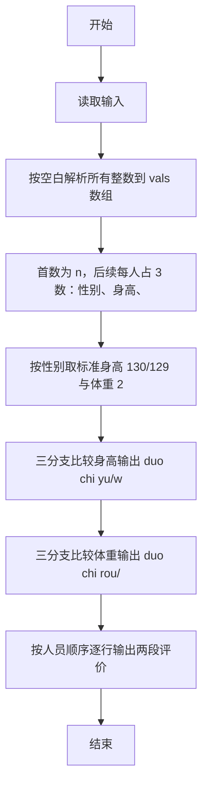
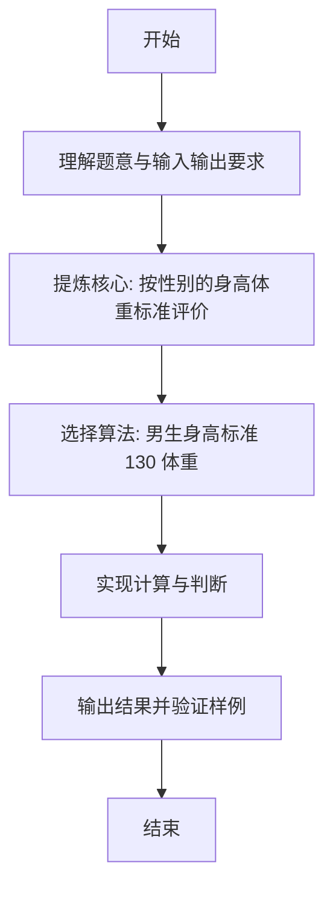

# L1-063 - 吃鱼还是吃肉（10 分）

- **时间限制**: 400 ms
- **内存限制**: 65536 KB
- **代码长度限制**: 16 KB

---

## 题目描述


  


国家给出了 8 岁男宝宝的标准身高为 130 厘米、标准体重为 27 公斤；8 岁女宝宝的标准身高为 129 厘米、标准体重为 25 公斤。

现在你要根据小宝宝的身高体重，给出补充营养的建议。

### 输入格式:

输入在第一行给出一个不超过 10 的正整数 $$N$$，随后 $$N$$ 行，每行给出一位宝宝的身体数据：
```
性别 身高 体重
```
其中`性别`是 1 表示男生，0 表示女生。`身高`和`体重`都是不超过 200 的正整数。

### 输出格式:

对于每一位宝宝，在一行中给出你的建议：

- 如果太矮了，输出：`duo chi yu!`（多吃鱼）；
- 如果太瘦了，输出：`duo chi rou!`（多吃肉）；
- 如果正标准，输出：`wan mei!`（完美）；
- 如果太高了，输出：`ni li hai!`（你厉害）；
- 如果太胖了，输出：`shao chi rou!`（少吃肉）。

先评价身高，再评价体重。两句话之间要有 1 个空格。

### 输入样例:
```in
4
0 130 23
1 129 27
1 130 30
0 128 27
```

### 输出样例:
```out
ni li hai! duo chi rou!
duo chi yu! wan mei!
wan mei! shao chi rou!
duo chi yu! shao chi rou!
```

## 示例

### 示例 1

**输入:**
```
4
0 130 23
1 129 27
1 130 30
0 128 27
```

**输出:**
```
ni li hai! duo chi rou!
duo chi yu! wan mei!
wan mei! shao chi rou!
duo chi yu! shao chi rou!
```

---

### 解题思路

#### 题目分析
本题为“吃鱼还是吃肉”（按性别的身高体重标准评价）。题面要求根据给定输入按规则计算并输出结果，输入规模小但需注意格式与边界。按性别的身高体重标准评价的判定涉及多分支或字符串处理，需将输入准确分词后逐项处理。仓颉实现中通过 `readToEnd`/`readln` 读取并以空白或行分割，兼顾有无换行与多空格的情况。

#### 核心算法
男生身高标准 130 体重 27，女生 129/25，逐人比较输出三档评价。实现上直接模拟题意：先将原始输入规范化为 Token 或行数组，再按规则遍历计算。例如 按空白解析所有整数到 vals 数组，随后 首数为 n，后续每人占 3 数：性别、身高、体重，最后按条件分支输出。算法保持线性遍历，无需复杂数据结构，仅需若干计数器与集合即可完成。

#### 复杂度分析
- **时间复杂度**：O(n) 逐人常量判断。
- **空间复杂度**：O(n)，仅需常量或线性辅助数组存储输入分词结果。

### 代码流程说明

1. 按空白解析所有整数到 vals 数组。
2. 首数为 n，后续每人占 3 数：性别、身高、体重。
3. 按性别取标准身高 130/129 与体重 27/25。
4. 三分支比较身高输出 duo chi yu/wan mei/ni li hai。
5. 三分支比较体重输出 duo chi rou/wan mei/shao chi rou。
6. 按人员顺序逐行输出两段评价。

### 代码实现

完整仓颉源码如下（与 `.cj` 文件一致）：

```cangjie
// L1-063 吃鱼还是吃肉 - 身高体重评价
import std.env.*
import std.collection.*
import std.convert.*

main() {
    let all = (getStdIn().readToEnd() ?? "")
    if (all.trimAscii().size == 0) { return }
    var vals = ArrayList<Int64>()
    var cur = StringBuilder()
    var has = false
    var neg = false
    let ra = all.toRuneArray()
    for (i in 0..Int64(ra.size)) {
        let c = ra[i]
        if (c == r'-') { neg = true }
        else if (c >= r'0' && c <= r'9') { cur.append("${c}"); has = true }
        else {
            if (has) {
                var v = Int64.parse(cur.toString())
                if (neg) { v = -v }
                vals.add(v)
                cur = StringBuilder(); has = false; neg = false
            } else { neg = false }
        }
    }
    if (has) {
        var v = Int64.parse(cur.toString())
        if (neg) { v = -v }
        vals.add(v)
    }
    if (vals.size == 0) { return }
    let n = vals[0]
    var p: Int64 = 1
    for (_ in 0..n) {
        let gender = vals[p]
        let height = vals[p+1]
        let weight = vals[p+2]
        p += 3
        let stdH: Int64 = if (gender == 1) { 130 } else { 129 }
        let stdW: Int64 = if (gender == 1) { 27 } else { 25 }
        var hStr: String = if (height < stdH) { "duo chi yu!" } else if (height == stdH) { "wan mei!" } else { "ni li hai!" }
        var wStr: String = if (weight < stdW) { "duo chi rou!" } else if (weight == stdW) { "wan mei!" } else { "shao chi rou!" }
        println("${hStr} ${wStr}")
    }
}
```

### 代码流程图



### 解题流程图


