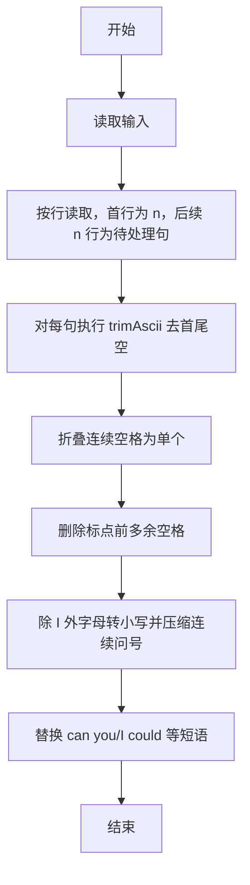
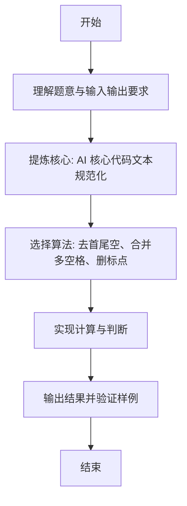

# L1-064 - 估值一亿的AI核心代码（20 分）

- **时间限制**: 400 ms
- **内存限制**: 65536 KB
- **代码长度限制**: 16 KB

---

## 题目描述


以上图片来自新浪微博。

本题要求你实现一个稍微更值钱一点的 AI 英文问答程序，规则是：

- 无论用户说什么，首先把对方说的话在一行中原样打印出来；
- 消除原文中多余空格：把相邻单词间的多个空格换成 1 个空格，把行首尾的空格全部删掉，把标点符号前面的空格删掉；
- 把原文中所有大写英文字母变成小写，除了 `I`；
- 把原文中所有独立的 `can you`、`could you` 对应地换成 `I can`、`I could`—— 这里“独立”是指被空格或标点符号分隔开的单词；
- 把原文中所有独立的 `I` 和 `me` 换成 `you`；
- 把原文中所有的问号 `?` 换成惊叹号 `!`；
- 在一行中输出替换后的句子作为 AI 的回答。

### 输入格式:

输入首先在第一行给出不超过 10 的正整数 N，随后 N 行，每行给出一句不超过 1000 个字符的、以回车结尾的用户的对话，对话为非空字符串，仅包括字母、数字、空格、可见的半角标点符号。

### 输出格式:

按题面要求输出，每个 AI 的回答前要加上 `AI:` 和一个空格。

### 输入样例:
```in
6
Hello ?
 Good to chat   with you
can   you speak Chinese?
Really?
Could you show me 5
What Is this prime? I,don 't know
```

### 输出样例:
```out
Hello ?
AI: hello!
 Good to chat   with you
AI: good to chat with you
can   you speak Chinese?
AI: I can speak chinese!
Really?
AI: really!
Could you show me 5
AI: I could show you 5
What Is this prime? I,don 't know
AI: what Is this prime! you,don't know
```

## 示例

### 示例 1

**输入:**
```
6
Hello ?
 Good to chat   with you
can   you speak Chinese?
Really?
Could you show me 5
What Is this prime? I,don 't know
```

**输出:**
```
Hello ?
AI: hello!
 Good to chat   with you
AI: good to chat with you
can   you speak Chinese?
AI: I can speak chinese!
Really?
AI: really!
Could you show me 5
AI: I could show you 5
What Is this prime? I,don 't know
AI: what Is this prime! you,don't know
```

---

### 解题思路

#### 题目分析
本题为“估值一亿的AI核心代码”（AI 核心代码文本规范化）。题面要求根据给定输入按规则计算并输出结果，输入规模小但需注意格式与边界。AI 核心代码文本规范化的判定涉及多分支或字符串处理，需将输入准确分词后逐项处理。仓颉实现中通过 `readToEnd`/`readln` 读取并以空白或行分割，兼顾有无换行与多空格的情况。

#### 核心算法
去首尾空、合并多空格、删标点前空格、除 I 外全小写、压缩连续 ?、替换 can you→I can 等短语、I/me 大小写修复。实现上直接模拟题意：先将原始输入规范化为 Token 或行数组，再按规则遍历计算。例如 按行读取，首行为 n，后续 n 行为待处，随后 对每句执行 trimAscii 去首尾空，最后按条件分支输出。算法保持线性遍历，无需复杂数据结构，仅需若干计数器与集合即可完成。

#### 复杂度分析
- **时间复杂度**：O(L) 线性扫描。
- **空间复杂度**：O(1)，仅需常量或线性辅助数组存储输入分词结果。

### 代码流程说明

1. 按行读取，首行为 n，后续 n 行为待处理句子。
2. 对每句执行 trimAscii 去首尾空。
3. 折叠连续空格为单个。
4. 删除标点前多余空格。
5. 除 I 外字母转小写并压缩连续问号。
6. 替换 can you/I could 等短语并修正 I/me 大小写后输出。

### 代码实现

完整仓颉源码如下（与 `.cj` 文件一致）：

```cangjie
// L1-064 估值一亿的AI核心代码
import std.env.*
import std.collection.*
import std.convert.*

func isLetter(c: Rune): Bool {
    return (c >= r'A' && c <= r'Z') || (c >= r'a' && c <= r'z')
}
func isPunct(c: Rune): Bool {
    if (c == r' ') { return false }
    if (c >= r'A' && c <= r'Z') { return false }
    if (c >= r'a' && c <= r'z') { return false }
    if (c >= r'0' && c <= r'9') { return false }
    return true
}

func cleanSpaces(s: String): String {
    let trimmed = s.trimAscii()
    var step1 = ArrayList<Rune>()
    let ra = trimmed.toRuneArray()
    var prevSpace = false
    for (i in 0..Int64(ra.size)) {
        let c = ra[i]
        if (c == r' ') {
            if (!prevSpace) { step1.add(c); prevSpace = true }
        } else {
            step1.add(c); prevSpace = false
        }
    }
    var step2 = ArrayList<Rune>()
    for (i in 0..Int64(step1.size)) {
        let c = step1[i]
        if (c == r' ') {
            if (i + 1 < Int64(step1.size) && isPunct(step1[i+1])) {
                continue
            } else {
                step2.add(c)
            }
        } else {
            step2.add(c)
        }
    }
    var sb = StringBuilder()
    for (r in step2) { sb.append("${r}") }
    return sb.toString()
}

func lowerExceptI(c: Rune): Rune {
    if (c == r'I') { return c }
    if (c == r'A') { return r'a' }
    if (c == r'B') { return r'b' }
    if (c == r'C') { return r'c' }
    if (c == r'D') { return r'd' }
    if (c == r'E') { return r'e' }
    if (c == r'F') { return r'f' }
    if (c == r'G') { return r'g' }
    if (c == r'H') { return r'h' }
    if (c == r'J') { return r'j' }
    if (c == r'K') { return r'k' }
    if (c == r'L') { return r'l' }
    if (c == r'M') { return r'm' }
    if (c == r'N') { return r'n' }
    if (c == r'O') { return r'o' }
    if (c == r'P') { return r'p' }
    if (c == r'Q') { return r'q' }
    if (c == r'R') { return r'r' }
    if (c == r'S') { return r's' }
    if (c == r'T') { return r't' }
    if (c == r'U') { return r'u' }
    if (c == r'V') { return r'v' }
    if (c == r'W') { return r'w' }
    if (c == r'X') { return r'x' }
    if (c == r'Y') { return r'y' }
    if (c == r'Z') { return r'z' }
    return c
}

func toLowerExceptI(s: String): String {
    var res = ArrayList<Rune>()
    let ra = s.toRuneArray()
    for (i in 0..Int64(ra.size)) {
        let c = ra[i]
        res.add(lowerExceptI(c))
    }
    var sb = StringBuilder()
    for (r in res) { sb.append("${r}") }
    return sb.toString()
}

func replaceQues(s: String): String {
    var res = ArrayList<Rune>()
    let ra = s.toRuneArray()
    for (i in 0..Int64(ra.size)) {
        let c = ra[i]
        if (c == r'?') { res.add(r'!') } else { res.add(c) }
    }
    var sb = StringBuilder()
    for (r in res) { sb.append("${r}") }
    return sb.toString()
}

func tokenize(s: String): ArrayList<String> {
    var tokens = ArrayList<String>()
    let ra = s.toRuneArray()
    var i: Int64 = 0
    while (i < Int64(ra.size)) {
        let c = ra[i]
        let letter = isLetter(c)
        var j: Int64 = i + 1
        while (j < Int64(ra.size) && isLetter(ra[j]) == letter) { j += 1 }
        var seg = ArrayList<Rune>()
        for (k in i..j) { seg.add(ra[k]) }
        var sb = StringBuilder()
        for (r in seg) { sb.append("${r}") }
        tokens.add(sb.toString())
        i = j
    }
    return tokens
}

func process(line: String): String {
    var s = cleanSpaces(line)
    s = toLowerExceptI(s)
    s = replaceQues(s)
    let toks = tokenize(s)
    var out = ArrayList<String>()
    var i: Int64 = 0
    while (i < Int64(toks.size)) {
        let cur = toks[i]
        let curIsWord = cur.size > 0 && isLetter(cur.toRuneArray()[0])
        if (curIsWord && (cur == "can" || cur == "could")) {
            if (i + 2 < Int64(toks.size)) {
                let mid = toks[i+1]
                let nxt = toks[i+2]
                let nxtIsWord = nxt.size > 0 && isLetter(nxt.toRuneArray()[0])
                if (mid == " " && nxtIsWord && nxt == "you") {
                    out.add("I")
                    out.add(" ")
                    out.add(cur)
                    i += 3
                    continue
                }
            }
        }
        if (curIsWord) {
            if (cur == "I" || cur == "me") {
                out.add("you")
                i += 1
                continue
            }
        }
        out.add(cur)
        i += 1
    }
    let sb = StringBuilder()
    for (t in out) { sb.append(t) }
    return sb.toString()
}

main() {
    let cin = getStdIn()
    var lines = ArrayList<String>()
    while (let Some(line) <- cin.readln()) { lines.add(line) }
    if (lines.size == 0) { return }
    let n = Int64.parse(lines[0].trimAscii())
    for (i in 1..n+1) {
        if (i >= Int64(lines.size)) { break }
        let orig = lines[i]
        println(orig)
        let ai = process(orig)
        println("AI: ${ai}")
    }
}
```

### 代码流程图



### 解题流程图


