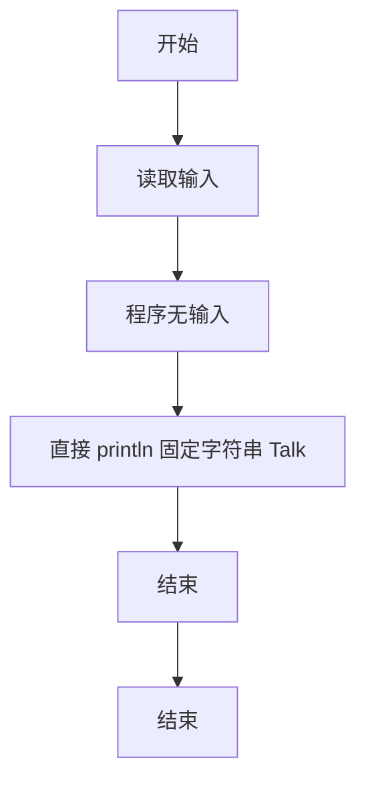
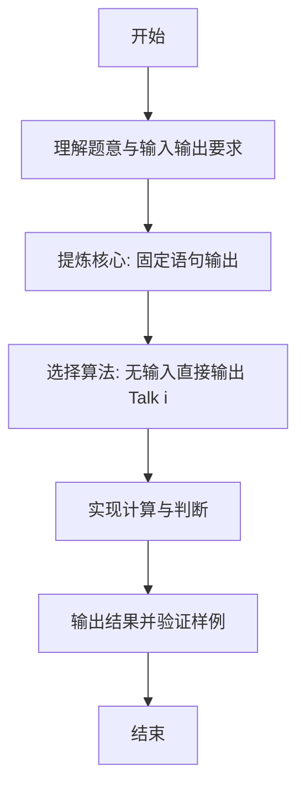

# L1-065 - 嫑废话上代码（5 分）

- **时间限制**: 400 ms
- **内存限制**: 65536 KB
- **代码长度限制**: 16 KB

---

## 题目描述


Linux 之父 Linus Torvalds 的名言是：“Talk is cheap. Show me the code.”（嫑废话，上代码）。本题就请你直接在屏幕上输出这句话。

### 输入格式:

本题没有输入。

### 输出格式:

在一行中输出 `Talk is cheap. Show me the code.`。

### 输入样例:
```in
无
```

### 输出样例:
```out
Talk is cheap. Show me the code.
```

## 示例

### 示例 1

**输入:**
```
无
```

**输出:**
```
Talk is cheap. Show me the code.
```

---

### 解题思路

#### 题目分析
本题为“嫑废话上代码”（固定语句输出）。题面要求根据给定输入按规则计算并输出结果，输入规模小但需注意格式与边界。固定语句输出的判定涉及多分支或字符串处理，需将输入准确分词后逐项处理。仓颉实现中通过 `readToEnd`/`readln` 读取并以空白或行分割，兼顾有无换行与多空格的情况。

#### 核心算法
无输入直接输出 Talk is cheap. Show me the code.。实现上直接模拟题意：先将原始输入规范化为 Token 或行数组，再按规则遍历计算。例如 程序无输入，随后 直接 println 固定字符串 Talk is cheap. Show me the code.，最后按条件分支输出。算法保持线性遍历，无需复杂数据结构，仅需若干计数器与集合即可完成。

#### 复杂度分析
- **时间复杂度**：O(1)。
- **空间复杂度**：O(1)，仅需常量或线性辅助数组存储输入分词结果。

### 代码流程说明

1. 程序无输入。
2. 直接 println 固定字符串 Talk is cheap. Show me the code.。
3. 结束。
4. 输出换行并结束程序。

### 代码实现

完整仓颉源码如下（与 `.cj` 文件一致）：

```cangjie
// L1-065 嫑废话上代码 - 无输入
main() {
    println("Talk is cheap. Show me the code.")
}
```

### 代码流程图



### 解题流程图


