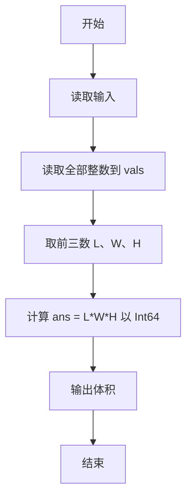
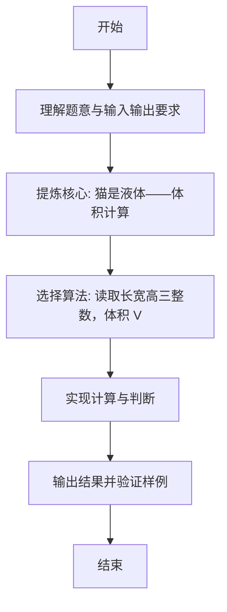

# L1-066 - 猫是液体（5 分）

- **时间限制**: 400 ms
- **内存限制**: 65536 KB
- **代码长度限制**: 16 KB

---

## 题目描述


测量一个人的体积是很难的，但猫就不一样了。因为猫是液体，所以可以很容易地通过测量一个长方体容器的容积来得到容器里猫的体积。本题就请你完成这个计算。

### 输入格式:

输入在第一行中给出 3 个不超过 100 的正整数，分别对应容器的长、宽、高。

### 输出格式:

在一行中输出猫的体积。

### 输入样例:
```in
23 15 20
```

### 输出样例:
```out
6900
```

## 示例

### 示例 1

**输入:**
```
23 15 20
```

**输出:**
```
6900
```

---

### 解题思路

#### 题目分析
本题为“猫是液体”（猫是液体——体积计算）。题面要求根据给定输入按规则计算并输出结果，输入规模小但需注意格式与边界。猫是液体——体积计算的判定涉及多分支或字符串处理，需将输入准确分词后逐项处理。仓颉实现中通过 `readToEnd`/`readln` 读取并以空白或行分割，兼顾有无换行与多空格的情况。

#### 核心算法
读取长宽高三整数，体积 V = L×W×H。实现上直接模拟题意：先将原始输入规范化为 Token 或行数组，再按规则遍历计算。例如 读取全部整数到 vals，随后 取前三数 L、W、H，最后按条件分支输出。算法保持线性遍历，无需复杂数据结构，仅需若干计数器与集合即可完成。

#### 复杂度分析
- **时间复杂度**：O(1)。
- **空间复杂度**：O(1)，仅需常量或线性辅助数组存储输入分词结果。

### 代码流程说明

1. 读取全部整数到 vals。
2. 取前三数 L、W、H。
3. 计算 ans = L*W*H 以 Int64 可能溢出范围内。
4. 输出体积。
5. 输出换行并结束程序。

### 代码实现

完整仓颉源码如下（与 `.cj` 文件一致）：

```cangjie
// L1-066 猫是液体 - 长方体体积
import std.env.*
import std.collection.*
import std.convert.*

main() {
    let all = (getStdIn().readToEnd() ?? "")
    var vals = ArrayList<Int64>()
    var cur = StringBuilder()
    var has = false
    var neg = false
    let ra = all.toRuneArray()
    for (i in 0..Int64(ra.size)) {
        let c = ra[i]
        if (c == r'-') { neg = true }
        else if (c >= r'0' && c <= r'9') { cur.append("${c}"); has = true }
        else {
            if (has) {
                var v = Int64.parse(cur.toString())
                if (neg) { v = -v }
                vals.add(v)
                cur = StringBuilder(); has = false; neg = false
            } else { neg = false }
        }
    }
    if (has) {
        var v = Int64.parse(cur.toString())
        if (neg) { v = -v }
        vals.add(v)
    }
    if (vals.size < 3) { return }
    let ans = vals[0] * vals[1] * vals[2]
    println(ans)
}
```

### 代码流程图



### 解题流程图


